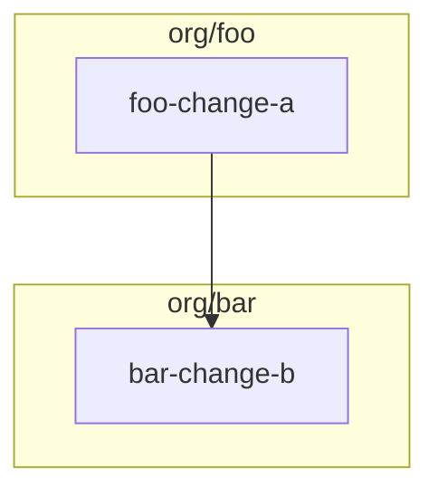

# RDD Workflow

> ⚠️ **v3.0+ (2026-08-26): 工作流采用五阶段架构 (arch → design → plan → ship → verify)**
>
> 提案管理（创建、审查、批准/拒绝/延迟）已从 `guide-arch` Phase 5.5 迁移到独立的 `guide-design` 阶段。
> AC 验证从 archive 内嵌 ac-verifier 升级为独立的 `rdd-verifier` 阶段（per ADR-0034）。
> 存量项目请先运行 `skill_use("guide-design")` 审查提案，再运行 `skill_use("rdd-verifier")` 补做验证。

[](https://www.npmjs.com/package/rdd-workflow)

## Install

```bash
# Latest stable (v1.x)
npm install rdd-workflow

# v2.0 beta
npm install rdd-workflow@2.0.0-beta
```

OpenSpec 工作流技能包 - manage changes via propose → plan → execute → status → archive lifecycle.

## 安装

### 全局安装（跨项目可用，推荐）

```bash
git clone https://github.com/chisuhua/rdd-workflow.git ~/.agents/skills/rdd-workflow
bash ~/.agents/skills/rdd-workflow/install.sh --global
```

安装后：
- **27 个子技能** symlink 到 `~/.agents/skills/` → OpenCode 在任何项目下自动发现
- **Python 依赖** 自动安装（`pip install --user -r requirements.txt`）
- **`_lib` Python 路径** 写入 `.pth` 文件 → 任何项目 `from _lib.xxx import yyy`（`from skills._lib.xxx import yyy` 仍通过向后兼容 shim 工作）
- **`rddf` CLI** 创建到 `~/.local/bin/rddf` → 终端直接 `rddf status`

> 全局安装后**不需要**在每个项目执行 `skill_use("INSTALL")`。技能即时生效。

### 项目安装（单项目隔离）

#### 通过 npx skills

```bash
npx skills add chisuhua/rdd-workflow -g -y
```

安装后只显示 `INSTALL` 技能。执行 `INSTALL` 后，子技能才会出现在项目中。

#### 手动安装

```bash
git clone https://github.com/chisuhua/rdd-workflow.git
bash install.sh /path/to/project
```

## 使用流程

1. **安装到项目**：执行 `skill_use("INSTALL")` 将技能复制到项目目录
2. **使用子技能**：
   - `skill_use("guide")` - 推荐器入口(扫描状态,建议调 arch、plan 或 ship)
   - `skill_use("guide-arch")` - Arch 端状态机(setup → roadmap → arch-done)
   - `skill_use("guide-plan")` - Plan 端状态机(scan → propose → deps → plan-done)
   - `skill_use("guide-ship")` - Ship 端状态机(plan → execute → archive → cleanup)
   - `skill_use("feature")` - feature 管理(summary/graph/status/order)
   - `skill_use("propose")` - 子技能(被 guide-plan 调用)
   - `skill_use("execute")` - 子技能(被 guide-ship 调用)
   - `skill_use("status")` - 子技能(被 guide-ship 调用或独立使用)
   - `skill_use("rdd-workflow-writing-plans")` - 实施计划生成器(被 guide-ship 调用,v2.0 自包含 TDD 5 步结构)

## v3.0 新特性

### 五阶段架构 (arch → design → plan → ship → verify)

| 阶段 | 技能 | 职责 | 人工介入 |
|------|------|------|---------|
| **Arch** | `guide-arch` | 架构定义（ADR、roadmap、差距分析） | 高 |
| **Design** | `guide-design` | 设计管理 + 内容审查（提案创建、审查、批准/拒绝/延迟；approve 即落盘 + 两层内容审查） | 中 |
| **Plan** | `guide-plan` | 变更生成（scan、propose、deps） | 中 |
| **Ship** | `guide-ship` | 变更执行（worktree、execute、archive） | 低 |
| **Verify** | `rdd-verifier` | 验证回环（批量 AC 验证 + 启发式分类 + 失败回 plan/ship，per ADR-0034） | 低 |

> **v3.0+ 变更**: 从四阶段扩展为五阶段架构。AC 验证从 `archive_gate_check` 内嵌 ac-verifier 升级为独立的 `rdd-verifier` 阶段（per ADR-0034）。
> **v2.1 历史**: 提案管理（创建、审查、批准/拒绝/延迟）从 `guide-arch` Phase 5.5 迁移到独立的 `guide-design` 阶段。
> `guide-spec` 别名已在 v2.0 移除。请直接使用 `guide-arch` → `guide-design` → `guide-plan` → `guide-ship` → `rdd-verifier`。

### Guide-Ship 执行契约 (v2.0.7+)

`tasks.md` 是 OpenSpec 的范围与完成清单;`.rddf/plans/<change>.md` 是 **唯一** 可执行实现契约;`execute` 消费 plan 并把进度回写到 `tasks.md`;`guide-ship` 不直接执行 `tasks.md`。

详细契约见 [`docs/superpowers/specs/2026-08-05-guide-ship-execution-contract.md`](docs/superpowers/specs/2026-08-05-guide-ship-execution-contract.md)。要点:

- `guide-ship` Phase 1 通过 `rddf discover-ship-changes` 统一发现候选,单 change 自动选择;多 change 显示菜单。
- `guide-ship::setup_execution_workspace` 通过 `$RDDF_EXECUTION_ROOT` 把选定工作区交给 `execute`,`execute` 不再自行探测。
- `SKIP_PROMETHEUS_PLANNING=yes` 必须配 `QUICK_FINISH_DETECTED=yes` 才能跳过 plan 生成(否则 fail closed)。
- `archive_gate_check` 在 worktree 和 lightweight 两种模式都生效;lightweight 模式 0 新提交是硬阻断;`archive_change` 路径调用 `check_worktree_commits` 作为 worktree merge 前置 gate。

### 推荐器升级

`guide` 推荐器现在支持五阶段扫描：

```
💡 Recommended: skill_use("guide-plan")
   Reason: 架构定义已完成 → 进入变更生成
```

### Feature 管理

- `skill_use("feature")` - 查看和管理 feature groups（summary、dependency graph、per-feature status、execution order）

### 测试基础设施

- **57 个 Python 单元测试**：覆盖状态向量、事件日志、门控机制、Loop 引擎等
- **10 个 Python 集成测试**：覆盖 Loop 流程、门控切换、阶段切换
- **测试框架**：pytest (Python) + bats (shell)

### 跨项目协同 (ADR-0030)

rdd-workflow 支持 Hub-and-Spoke 联邦架构。3 个新命令启用双向协同通道:

#### 上行:`rddf report-issue --category=rfc`

在 Hub 创建 `[RFC]` Issue,关联 RDD Cross-Repo Sync Project V2,记录到 `.rddf/state/.cross-repo-pending.json`。

```bash
RDDF_REPORT_GH_REPO=org/rdd-hub rddf report-issue \
  --category=rfc \
  --title "[RFC] 重构用户鉴权流程 (Auth V2)" \
  --stakeholders "org/repo-backend,org/repo-data" \
  --gate "Design-Gate" \
  --contract-impact "Breaking-Change"
```

#### 下行:`rddf sync-hub --contract <path>`

从 Hub `rdd-hub/contracts/` 拉取契约到本地 `openspec/specs/<name>/spec.md`。

```bash
RDDF_HUB_REPO=org/rdd-hub rddf sync-hub --contract auth-v2.yaml
```

#### 监听:`rddf watch-hub --once`

一次性轮询 Hub Issue 状态;由 cron/CI 以 ≤5 分钟间隔调度(不在 CLI 内维护长驻 daemon)。

```bash
RDDF_HUB_REPO=org/rdd-hub rddf watch-hub --once --owner=org/rdd-hub
```

#### 挂起状态文件

`.rddf/state/.cross-repo-pending.json` 记录所有本地等待 Hub 端审批的 RFC Issue。结构遵循 `_lib/schemas/cross_repo_pending_schema.json` v1(SSOT)。

#### 紧急跳过

`SKIP_HUB_CHECK=true` 环境变量可在 Hub 网络故障时跳过 design-done 门控的 Hub 检查(不推荐,仅 hotfix)。

**语义**: 默认 **OFF**(未设置即严格检查,design-done gate 会调用 `check_hub_pending` / `check_cross_repo_approvals`);仅在紧急 hotfix 时显式设为 `true`(**ON**)临时绕过。绕过会留 audit trail,事后用 `rdd-doctor --check orphan-gates` 巡检确认 gate 未被静默拆除。

### 跨项目审批(ADR-0031)

`category: cross-repo-federation` 的提案**不可** `--auto-accept`,必须:

```bash
bash skills/guide-design/scripts/approve_proposal.sh <proposal> \
  --manual --hub-issue "org/rdd-hub#N"
```

会 prompt 输入 GitHub 用户名,实时 fetch Hub Issue 状态确认 `approved` 才写入 audit log。`SKIP_HUB_CHECK=true` 仅紧急 hotfix 使用(留 audit trail)。

#### Spoke AI 接入指南

rdd-workflow 支持将 Hub-and-Spoke 协议注入到各种 AI 编程助手的配置文件中,使其能够参与联邦协作:

```bash
# 部署到所有支持的 AI 工具
bash skills/spoke-system-prompt-injection/scripts/deploy.sh --tools all

# 部署到特定工具
bash skills/spoke-system-prompt-injection/scripts/deploy.sh --tools cursor

# 检查注入状态
bash skills/spoke-system-prompt-injection/scripts/deploy.sh --status

# 卸载（从备份恢复）
bash skills/spoke-system-prompt-injection/scripts/deploy.sh --uninstall --tools all
```

支持的工具和配置文件:

| 工具 | 配置文件 |
|------|----------|
| Cursor | `.cursorrules` |
| Cline | `.clinerules` |
| Continue | `.continue/rules/cross-repo-hub.md` |
| GitHub Copilot | `.github/copilot-instructions.md` |
| Claude Code | `CLAUDE.md` |

也可以通过 `install.sh --spoke-init` 快速安装:

```bash
# 安装所有工具的协议
bash install.sh --spoke-init

# 安装特定工具
bash install.sh --spoke-init --tools cursor,cline
```

详情见 [`docs/spoke-system-prompt.md`](docs/spoke-system-prompt.md)。

#### CI 集成示例

将 `rddf contract-check` 嵌入 CI 流水线,确保 Hub 契约与 Spoke 实现保持一致。提供 GitHub Actions 与 GitLab CI 两套配置,任选其一。

**GitHub Actions** (`.github/workflows/contract-check.yml`):

```yaml
name: contract-check
on:
  push:
    branches: [main]
  pull_request:

jobs:
  contract-lint:
    runs-on: ubuntu-latest
    steps:
      - uses: actions/checkout@v4
      - uses: actions/setup-python@v5
        with:
          python-version: "3.11"
      - run: pip install -r requirements.txt
      - name: contract-check (push = warning)
        if: github.event_name == 'push'
        run: rddf contract-check --hub contracts/openapi.yaml --local impl/api.py
        env:
          SKIP_CONTRACT_GATE: "yes"
      - name: contract-check (PR = strict)
        if: github.event_name == 'pull_request'
        run: rddf contract-check --hub contracts/openapi.yaml --local impl/api.py
        env:
          STRICT_CONTRACT_GATE: "yes"
```

**GitLab CI** (`.gitlab-ci.yml` 片段):

```yaml
contract-lint:
  stage: test
  image: python:3.11
  before_script:
    - pip install -r requirements.txt
  script:
    - |
      if [ "$CI_PIPELINE_SOURCE" = "merge_request_event" ]; then
        export STRICT_CONTRACT_GATE=yes
      else
        export SKIP_CONTRACT_GATE=yes
      fi
      rddf contract-check --hub contracts/openapi.yaml --local impl/api.py
  rules:
    - if: $CI_PIPELINE_SOURCE == "push"
    - if: $CI_PIPELINE_SOURCE == "merge_request_event"
```

> PR / merge_request 阶段设 `STRICT_CONTRACT_GATE=yes` 触发严格阻断(breaking-change 退出码 1 即失败流水线);push 阶段设 `SKIP_CONTRACT_GATE=yes` 仅 warning,不阻断主线提交。如需 push 也阻断,把 `SKIP_CONTRACT_GATE` 替换为 `STRICT_CONTRACT_GATE`。

#### 跨仓库依赖示例

使用 `rddf deps cross-repo` 分析多个 Spoke 的跨仓库依赖,生成 Mermaid 图 + 推荐执行顺序。

```bash
rddf deps cross-repo --spokes org/foo,org/bar,org/baz
```

输出包含 4 个 section:依赖图(Mermaid)、每个 change 的 `cross_repo_dependencies` 列表、推荐执行顺序(按 wave 分组)、冲突检测。



| change | status | parallel_group | blocker |
|--------|--------|---------------|---------|
| bar-change-b | proposed | 0 | — |
| foo-change-a | proposed | 1 | bar-change-b |

启用严格门控(任何 cross-repo blocker 都阻断 plan-done):

```bash
export STRICT_DEPS_GATE=yes
skill_use("guide-plan")  # 触发 plan_done_gate
# 遇到跨仓库 blocker 时 plan-done 被阻断,stderr 输出 ❌ STRICT_DEPS_GATE
```

紧急跳过(完全 bypass cross-repo gate):

```bash
export SKIP_DEPS_GATE=yes  # plan-done 跳过 gate 5
```

依赖分析使用 24h TTL 缓存(`.rddf/state/.cross-repo-deps-cache.json`),同一 plan-done 流程内多次 gate 调用只计算一次。

### Roadmap Incremental Update (v2.2+)

`guide-arch` Phase 6 自动调用 `roadmap_incremental_update.sh`，基于 git HEAD + ADR file hash + reverse index 三源判定增量更新模式：

- **skip** (零变更) — `< 0.1s`
- **adr_only** (仅 ADR 改) — `< 1s`，仅重写受影响 phase fragment
- **code_only** (仅代码改) — `< 1.5s`，仅重验证受影响 ADR
- **full** (两方皆改 / 无 baseline / 陈旧) — `~4s`

State 文件：`.rddf/state/.populate-state.json`（gitignored，独立于 v1.1 `.populate-supplementary.json`）

Reset 命令：`rm .rddf/state/.populate-state.json`

`populate-roadmap-from-arch` skill 已 v1.2 标记 deprecated（thin wrapper），新项目直接用 `skill_use("guide-arch")`。

### Roadmap feature fragments (v2.2+)

Create a feature fragment spanning multiple phases via the `rddf roadmap add-feature` primitive:

```bash
rddf roadmap add-feature auth-v2 \
    --phase-refs phase-2,phase-3 \
    --theme "RBAC 权限模型"
```

This creates `.rddf/roadmap/features/feat-auth-v2.md` with valid frontmatter + 3-section body skeleton, and refreshes `.rddf/roadmap.md` AUTO-INDEX atomically. Closes the operation gap from `add-hierarchical-roadmap-structure` (scenario 3). Reachable from `guide-arch` Phase 4 menu option 5. See `skills/roadmap/SKILL.md` for full CLI reference.

## 目录结构

```
rdd-workflow/
├── package.json
├── README.md
├── USAGE.md
├── install.sh           # 手动安装脚本
└── skills/
    ├── INSTALL.md                       # 安装程序（第一入口）
    ├── guide/SKILL.md                   # 推荐器入口
    ├── guide-arch/SKILL.md              # Arch 阶段状态机(v2.0+)
    ├── guide-design/SKILL.md            # Design 阶段状态机(v2.1+, 提案管理)
    ├── guide-plan/SKILL.md              # Plan 阶段状态机(v2.0+)
    ├── guide-ship/SKILL.md              # Ship 端状态机
    ├── rdd-verifier/SKILL.md            # Verify 阶段状态机(v3.0+, 批量 AC 验证, ADR-0034)
    ├── ac-verifier/SKILL.md             # AC 验证底层(被 rdd-verifier 调用)
    ├── feature/SKILL.md                 # feature 管理 (v2.0+)
    ├── rddf-session/SKILL.md            # 跨 OpenCode session 恢复 (ADR-0017)
    ├── propose/SKILL.md                 # 子技能(被 guide-plan 调用)
    ├── execute/SKILL.md                 # 子技能(被 guide-ship 调用, TDD 5 步)
    ├── roadmap/SKILL.md                 # 子技能(被 guide-arch 调用)
    ├── deps/SKILL.md                    # 子技能(被 guide-plan 调用)
    ├── status/SKILL.md                  # 子技能(被 guide-ship 调用或独立使用)
    ├── add-improve/SKILL.md             # 提案创建入口(被 guide-design 调用)
    ├── rdd-workflow-writing-plans/SKILL.md  # 实施计划生成器(v2.0 自包含)
    ├── rdd-workflow-brainstorm/SKILL.md # 提案头脑风暴 helper
    ├── rdd-env-check/SKILL.md           # 独立环境健康检查(各 phase 首屏)
    ├── rdd-doctor/SKILL.md              # 手动只读诊断(5 类结构化文件)
    ├── rdd-hub-bootstrap/SKILL.md       # Hub 仓库引导式初始化
    ├── openspec-gate/SKILL.md           # staged 文件→active change 关联守卫
    ├── contract-check/SKILL.md          # Spoke vs Hub OpenAPI 一致性校验
    ├── cross-repo-protocol/SKILL.md     # MCP client for Hub-Spoke 联邦
    ├── spoke-system-prompt-injection/SKILL.md  # Hub-Spoke 协议注入 AI 助手
    ├── report-issue/SKILL.md            # Hub-Spoke 上行 [RFC] issue 命令
    ├── sync-hub/SKILL.md                # Hub-Spoke 下行 contract 拉取
    ├── watch-hub/SKILL.md               # Hub-Spoke 一次性轮询
    ├── loop_engine.py                   # v2.0 Loop 引擎入口(向后兼容 shim)
    ├── <skill>/scripts/                 # per-skill 辅助脚本
    └── _lib/                            # 共享辅助函数库(19 .sh + 100 .py + 20 schema)
```

## 工作原理

### 全局安装模式（`--global`）

1. 每个子技能 symlink 到 `~/.agents/skills/<name>/` 
2. OpenCode 自动发现所有子技能（无需 `INSTALL` 步骤）
3. 技能代码即时同步源码变更
4. `_lib/` Python 模块通过 `.pth` 文件全局可导入
5. `rddf` CLI 通过 `~/.local/bin/rddf` 在任何目录可用

### 项目安装模式（`skill_use("INSTALL")`）

1. 全局安装后，只显示 `INSTALL` 技能
2. 执行 `INSTALL` 将子技能复制到项目的 `.opencode/skills/rdd-workflow/`
3. 子技能通过 `PROJECT_ROOT=$(git rev-parse --show-toplevel)` 自动检测项目根目录

### 第三方项目使用（全局安装模式）

全局安装后，在任何第三方项目（非 rdd-workflow 仓库）下可直接使用：

```bash
# 查看工作流状态
rddf status

# Replay trace：从项目子目录恢复并查看
cd /path/to/third-party-project/subdir
rddf orchestrate show

# 本地 issue 缓冲：查看自动生成的 flow-bug issue
ls .rddf/issues/

# Issue 上报命令（手动，opt-in）
RDDF_REPORT_ENABLED=yes RDDF_REPORT_AUTO_SUBMIT=yes rddf report-issue --no-submit

# 指定上游仓库（默认：chisuhua/rdd-workflow）
RDDF_REPORT_GH_REPO=my-org/my-fork rddf report-issue --no-submit
```

**路径约定（全局安装模式）：**

| 路径 | 含义 |
|------|------|
| `.rddf/state/trace/` | 跟踪记录目录（位于第三方项目根） |
| `.rddf/issues/` | 本地 issue 缓冲（flow-bug/gate-failure/phase-crash） |
| `~/.agents/skills/` | 全局安装的工具根（与项目根分离） |

**L2 上报 opt-in（默认关闭）：**

```bash
# 启用 L2 GitHub issue 提交（三重 opt-in）
export RDDF_REPORT_ENABLED=yes
export RDDF_REPORT_AUTO_SUBMIT=yes
export RDDF_REPORT_SUBMIT_CATEGORIES=flow-bug,gate-failure,phase-crash
```

CI 环境自动禁用 L2 提交（检测到 `CI/GITHUB_ACTIONS/JENKINS_URL` 等标记）。

**上游目标仓库：**

- 默认：`chisuhua/rdd-workflow`
- 覆盖：`RDDF_REPORT_GH_REPO=owner/repo`
- 也可通过 `.rddf.json` 配置：`{"reporting": {"gh_repo": "owner/repo"}}`

## 其他 AI 助手安装

其他 AI 编程助手可以使用：

```bash
# 全局安装（所有项目可用，推荐）
bash ~/.agents/skills/rdd-workflow/install.sh --global

# 项目安装
bash ~/.agents/skills/rdd-workflow/install.sh /path/to/project

# 或直接复制
cp -r ~/.agents/skills/rdd-workflow/skills /path/to/project/.opencode/skills/rdd-workflow/
```

## 前置条件

### 必需

- `openspec` CLI v1.3.1+
- `git` 2.25+
- `cmake` 3.16+
- **bats-core 1.10+** (测试基础设施,可选用 `bats tests/`)

### 实施计划生成器(v2.0 自包含)

v2.0 重构后,实施计划生成器**完全自包含**于 rdd-workflow,**无任何外部 skill 依赖**:

- ✅ `rdd-workflow-writing-plans` — 内置 TDD 5 步结构 plan 生成器(fork 自 superpowers/writing-plans,适配 OpenSpec change 上下文)
- ✅ `execute` — 内置 plan 执行器,强制 TDD 5 步纪律(整合原 rdd-workflow/executing-plans)

**调用流程**(`guide-ship` Phase 1):

```bash
cd "$WT_PATH"
skill_use("rdd-workflow-writing-plans")  # 直接调用内置 skill
# 生成 .rddf/plans/<CHANGE_NAME>.md
# 含 TDD 5 步结构: Write failing test → Verify fail → Implement → Verify pass → Commit
```

**架构简化**:
- **删除**: `prometheus-planning.md` (481 行间接层 + 检测链 + 路径桥接 + 混合 TDD)
    *(README 仅作为变更说明保留提及,代码本身已删除)*
- **替换**: `rdd-workflow-writing-plans.md` (~250 行,自包含)
- **零外部依赖**: 不需要 oh-my-opencode、不需要 superpowers 套件
    *(同上,变更说明保留提及)*
- **零路径桥接**: 单一路径 `.rddf/plans/<name>.md`(执行契约)
- **零运行时检测**: 任何 AI 编程助手(opencode / Claude Code / Cursor / Aider 等)都能用

**跳过后备** (不推荐,仅紧急时使用):
```bash
export SKIP_PROMETHEUS_PLANNING=yes  # 跳过计划生成,execute.md 阶段将无详细计划
```

**架构变更说明** (v1.0 → v2.0):
- **v1.1 (已废弃)**: 解决了 P0-6 缺陷:`prometheus-start-work` 不再是隐式黑盒依赖
- **v1.2 (已废弃)**: skills 隔离 + 路径独占 + 混合 TDD
- **v1.3 (已废弃)**: standalone 模式 + 跨 7 个 AI 工具路径探测
- **v2.0 (当前)**: 完全自包含 — 删除所有间接层,直接调用内置 skill

## Skill 版本语义

所有 skill 文件的前置元数据使用：
- `version: X.Y` (X = 主版本, Y = 次版本, semver 风格)
- `evolved-from: "..."` (历史来源,用于重构追溯)

历史版本(2026-06-04 之前)使用 `generatedBy: X.Y`,现已重命名为 `evolved-from`。
