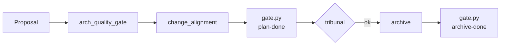

# Gates and Quality

Four quality mechanisms, each with a different scope and severity model.

| Mechanism | Scope | Severity | Where |
|-----------|-------|----------|-------|
| `gate.py` | Single phase transition | error / warning | `_lib/gate.py` |
| `tribunal.py` | Cross-agent validation of a single artefact | error / warning | `_lib/tribunal.py` |
| `arch_quality_gate.py` | Architecture proposals (ADRs, gap analyses) | warning only | `_lib/arch_quality_gate.py` |
| `change_alignment.py` | A change vs the architecture | warning only | `_lib/change_alignment.py` |

## Core Invariant

**Warning = soft prompt.** The user sees the warning and chooses to proceed.
**Error = hard block.** The operation cannot continue without resolving.

No quality mechanism silently swallows issues. If a check cannot run (e.g. file missing, schema invalid), it fails as an error — never as a silent pass.

## `gate.py` (ADR-0007)

The general-purpose phase-transition gate. Plugins register checks; each check returns `(level, message)`. Aggregation produces an error/warning report.

Use cases:
- plan-done gate: are all spec deltas + tasks.md + deps-analysis in place?
- archive-done gate: did worktree have commits? are tasks.md checkboxes all done?
- ship-lightweight-mode gate: are there any commits to merge? (blocks archive if 0 commits)

Plugin extension: drop a Python module under `_lib/plugins/` and the loader picks it up automatically.

## `tribunal.py` (ADR-0008)

Multi-agent cross-validation. Given an artefact (proposal, design.md, etc.), it runs N reviewer agents and aggregates weighted scores. Sensitive content (paths, env vars, secrets) is sanitised via `_lib/sanitizer.py` before review.

Use cases:
- Verifying an improvement proposal's quality before it enters `proposal-approved.md`.
- Cross-checking a generated implementation plan against its source design.md.

Tribunal scores are advisory unless explicitly wired into a hard gate.

## `arch_quality_gate.py` (ADR-0018)

Four warning-level checks run on architecture artefacts (ADRs, gap analyses):

1. **alignment** — does the proposal reference existing ADRs (when relevant)?
2. **debt** — does it acknowledge trade-offs or technical debt?
3. **clarity** — is the rationale unambiguous?
4. **actionable** — does it produce a concrete next step?

Default: warnings are soft prompts. Set `STRICT_ARCH_GATE=yes` in env to upgrade warnings to errors (CI mode).

## `change_alignment.py` (ADR-0019)

Three warning-level checks run on a change proposal against the current architecture:

1. **refs_valid** — every ADR reference in `proposal.md` actually exists in `docs/adr/`.
2. **no_contradiction** — the change does not contradict an active ADR.
3. **task_traceability** — every `- [ ]` in `tasks.md` traces back to a `##` section in `proposal.md`.

Default: warnings. Set `STRICT_CHANGE_GATE=yes` for CI.

## How the Four Mechanisms Compose

Each phase transition may invoke multiple gates. The phase only advances if all **error-level** checks pass.

## Adding a New Gate

1. Decide scope: phase-transition (`gate.py`), artefact validation (`tribunal.py`), or domain-specific (`*_quality_gate.py`).
2. Implement check as a function returning `(level, message)`.
3. Register in the corresponding registry (`gate.py:check_registry`, or a plugin file under `_lib/plugins/`).
4. Add a test in `tests/unit/` (TDD — write the test first).
5. Document the check name in this file (so future readers know what `STRICT_*_GATE=yes` actually enables).

See [extension-points.md](extension-points.md) for the full pattern.

## Cross-references

- State model: [state-and-events.md](state-and-events.md)
- ADR index: `../adr/README.md`
