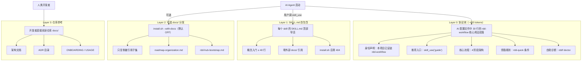

# Layer 0 渐进式上下文注入架构

> 本文档详细说明 rdd-workflow 的渐进式上下文架构，供开发者参考。**不通过 install.sh 分发**。

## 四层架构概览

rdd-workflow 采用**四层渐进式上下文注入架构**，确保 AI 编程助手在任何项目启动时都能自动发现 rdd-workflow，并在用户深入使用时逐步获得更详细的上下文。

## 加载时序

| 步骤 | 层 | 触发 | tokens | 响应时间 |
|------|----|------|--------|----------|
| 1 | Layer 0 | AI Agent 启动，自动加载 AGENTS.md | ~400-600 | 即时（系统提示） |
| 2 | Layer 1 | 用户调用 `skill_use("xxx")` | ~200-400 | ~100ms（skill 加载） |
| 3 | Layer 2 | 用户运行 `install.sh --with-docs` | ~200-400 | 安装时一次性 |
| 4 | Layer 3 | 开发者主动阅读仓库 docs/ | 不限 | 按需 |

## 多重保险机制

| 机制 | 层 | 触发 | 效果 |
|------|----|------|------|
| Layer 0 sentinel | 0 | AI 启动 | 自动加载 rdd-workflow 核心用法 |
| `rddf doctor --category ai-context-bootstrap` | 0 | 手动 | 诊断 Layer 0 部署状态 |
| SKILL.md 外部引用 grep | 1 | `rddf doctor --category docs-consistency` | 拦截新外部引用 |
| `STRICT_DOCS_CONSISTENCY_GATE=yes` | 1 | CI 配置 | 升级为硬阻断 |
| `--with-docs` sentinel | 2 | install.sh | 幂等防重复复制 |

## 上下文窗口预算

| 场景 | Layer 0 tokens | 总占用 | 占 128K context |
|------|---------------|--------|-----------------|
| 单项目单工具 | ~500 | ~500 | <0.4% |
| 多工具并存（5 个） | ~500 × 5 | ~2,500 | ~2% |
| + Hub 协议块 | +~300 | ~2,800 | ~2.2% |

## 扩展性约定

- **层数封顶 3**：不增加 Layer 4/5/6
- 超越 3 层的需求走"新 sentinel 块"维度，如 `RDD-WORKFLOW-HUB-USAGE`
- Layer 0 永远 ≤30 行
- 各 sentinel 块互不干扰，顺序稳定性由测试保障

---

*本文档由 fix-skill-post-install-discoverability 提案创建
（2026-09-21 Oracle 评审设计，per ADR-0052）*