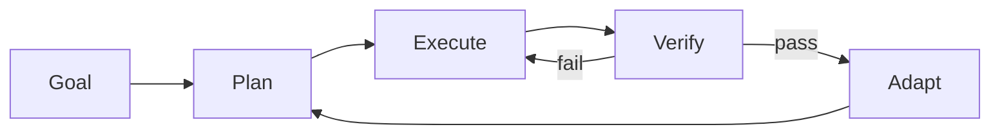
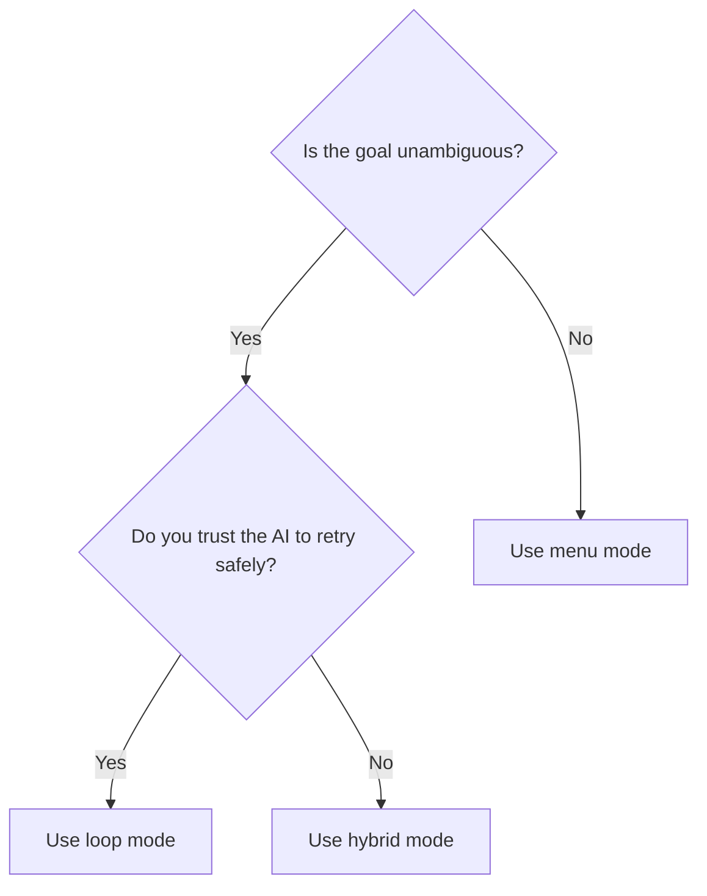

# Loop Engine

## What the Loop Engine Is

The Loop engine (ADR-0004) is the runtime that turns a **goal** into a sequence of **plan → execute → verify → adapt** cycles, with optional human-in-the-loop checkpoints. It is the difference between "the AI does whatever the menu says" (v1.x) and "the AI works toward a goal until it can verify completion" (v2.0).

The engine is implemented in `_lib/loop_engine.py` (entry-point shim) backed by the `_lib/loop/` package (16 modules: `loop_state`, `agents`, `actions`, `detectors`, `tribunal`, `gate`, `human_nodes`, `event_queue`, `interaction_modes`, `flow_customizer`, `step_pipeline`, `plugin_loader`, `sanitizer`, `memory`, `flowchart`, `design_phase`).

## Five Building Blocks

| Block | What it does | Module |
|-------|--------------|--------|
| **Goal** | The user-declared objective (e.g. "ship change `fix-foo`"). Backs `state_vector.goal`. | `loop_state.py` |
| **Plan** | Decomposes goal into ordered steps; reads/writes `.rddf/plans/<name>.md`. | `agents.py`, `step_pipeline.py` |
| **Execute** | Runs each step; emits events to `event_log`. | `actions.py`, `agents.py` |
| **Verify** | Runs gates (gate.py) and optionally tribunal (tribunal.py). | `gate.py`, `tribunal.py` |
| **Adapt** | On verify-fail: re-plan or escalate to a human node. | `human_nodes.py`, `interaction_modes.py` |

## Interaction Modes (ADR-0002)

Three modes; default is `hybrid`.

| Mode | Behaviour | When to use |
|------|-----------|-------------|
| `loop` | Run autonomously until goal met or a hard gate fails. | User trusts the AI; goal is unambiguous. |
| `menu` | v1.x-style: AI presents options at each decision point. | Goal is exploratory; user wants explicit control. |
| `hybrid` | Loop tries first; falls back to menu at configurable checkpoints (e.g. before any merge). | Default. Best of both. |

Mode is set per-session via `rddf session set-mode` or the env var `RDD_INTERACTION_MODE`. See [multi-session.md](multi-session.md) for session lifecycle.

## Human-in-Loop Nodes (ADR-0005)

Some actions are *always* human, regardless of mode:

- **Approval gates** — e.g. arch-done, design-done, plan-done, archive-done.
- **Destructive operations** — `git push --force`, `openspec archive --yes`, branch deletion.
- **Conflict resolution** — when `rddf-session` detects a cross-session conflict (4-option soft prompt).
- **Quality overrides** — when a gate warning is acknowledged but the user wants to proceed anyway.

These are configured declaratively via `_lib/loop/human_nodes.py`; a node's policy is "always ask", "ask on warning", or "ask on error".

## When to Use Loop vs Menu

Practical rule of thumb:
- **Loop mode** for: small bug fixes, doc edits, mechanical refactors, dependency bumps.
- **Menu mode** for: architecture changes, anything that touches `_lib/` or a gate, anything that creates a new skill.
- **Hybrid mode** (default) for: most change work — let the AI drive but checkpoint at gates.

## How the Loop Engine Stops

It doesn't. It runs until:
1. The goal is verified (goal-met gate passes).
2. A hard gate fails and no retry budget remains (max_retries: 3, configurable).
3. A human-in-loop node aborts (user picks the "stop" option from the soft prompt).
4. Max iterations reached (default: 100, configurable in `interaction` mode config).

On stop, state is fully persisted in `state_vector` and `event_log`; the session can be resumed later via `rddf session resume`.

## Cross-references

- State model: [state-and-events.md](state-and-events.md)
- Quality verification: [gates-and-quality.md](gates-and-quality.md)
- Session lifecycle: [multi-session.md](multi-session.md)
