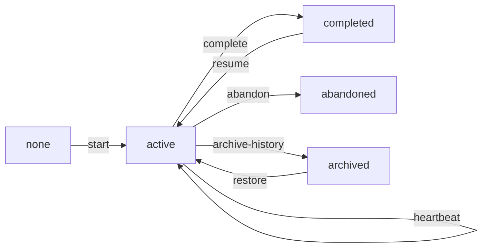
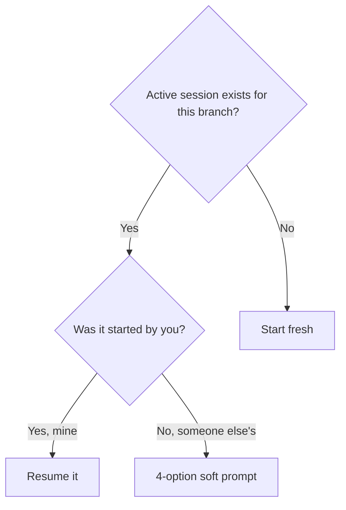

# Multi-Session Management

A **session** in rdd-workflow is the user's perspective on a single workflow run: which change they're working on, which phase they're in, which worktree is active. Sessions are **persistent** (survive close-and-reopen of the AI assistant) and **recoverable** (a fresh opencode session can resume an in-flight session via `rddf session resume`).

The mechanism is `rddf-session` (ADR-0017), backed by `skills/rddf-session/SKILL.md` and `_lib/session.py` / `_lib/session_manager.py`.

## Why Sessions, Not Just State

v1.x had no concept of a session — when the user closed the AI assistant, all in-flight context vanished. v2.0 added a state vector + event log, but there was no **identifier** tying events to "the thing I'm doing right now". Multiple parallel worktrees or skipped phases became indistinguishable in the log.

`rddf-session` adds:
- A **session id** (UUID-ish) attached to every state-vector write and event-log line.
- A **project-level `sessions.json`** under `.rddf/state/`, listing all known sessions.
- **Heartbeat** writes so a stale session can be detected and surfaced.

## Session Lifecycle

| State | Meaning |
|-------|---------|
| `none` | Project has no active session. |
| `active` | Session is open; worktree + phase are set. |
| `completed` | Change archived; session is read-only. |
| `abandoned` | User explicitly stopped; session preserved for reference. |
| `archived` | Session moved to `archived_sessions/` (long-term storage). |

## Five Subcommands

| Subcommand | Purpose |
|------------|---------|
| `rddf session list` | Show all known sessions (active + completed + abandoned). |
| `rddf session show <id>` | Detail: phase, change, worktree, last heartbeat. |
| `rddf session resume <id>` | Re-bind a fresh AI session to an existing in-flight session. |
| `rddf session abandon <id>` | Mark as abandoned; state preserved but worktree may be cleaned up. |
| `rddf session archive-history <id>` | Move to long-term storage. Idempotent. |

## Cross-Session Conflicts

When a fresh session starts and the project already has an `active` session on a different branch, the user gets a **4-option soft prompt** (ADR-0017 §3):

1. **Resume the existing session** — bind to it; abandon the fresh start.
2. **Start a new session in a new worktree** — parallel branch.
3. **Abandon the existing session** — mark it abandoned; start fresh here.
4. **Detach the worktree** — keep the existing session but don't bind to it.

The default is option 1 (resume) — safest.

## Session Binding Policy (ADR-0017)

Every workflow session generated by `guide-arch` / `guide-design` / `guide-plan` / `guide-ship` **MUST** bind to an `rddf-session` via `owner_opencode_session_id`. Manual skill invocation without binding is allowed, but the user is responsible for resolving any cross-session conflicts.

The `guide` recommender surfaces the binding via `BINDING_LINES` (no state mutation); users running raw skills can check their binding via `skill_use("rddf-session current")`.

## v2.0 Lightweight vs v2.1 Full (ADR-0010)

| Aspect | v2.0 lightweight | v2.1 full |
|--------|------------------|-----------|
| Concurrency model | One active session at a time | Multiple parallel sessions via dependency graph scheduler |
| Storage | Single `sessions.json` | Per-session subdirs under `.rddf/state/sessions/<id>/` |
| Resume | Manual `rddf session resume` | Auto-resume on session-start via session-id match |
| Cleanup | Manual | `rddf session gc` with configurable TTL |
| **Status** | **Shipped (v2.0.1+)** | Adopted in ADR; not implemented |

Until v2.1 ships, treat the lightweight model as the production behaviour and the v2.1 column as future work.

## When to Start a New Session vs Resume

Practical rule:
- **Resume** if you closed and reopened opencode mid-change.
- **New session** if you're starting a new change in a new worktree.
- **Prompt** if you see "active session detected" message on entry — read the 4 options, don't auto-pick.

## Cross-references

- State persistence: [state-and-events.md](state-and-events.md)
- Workflow phases: [workflow-phases.md](workflow-phases.md)
