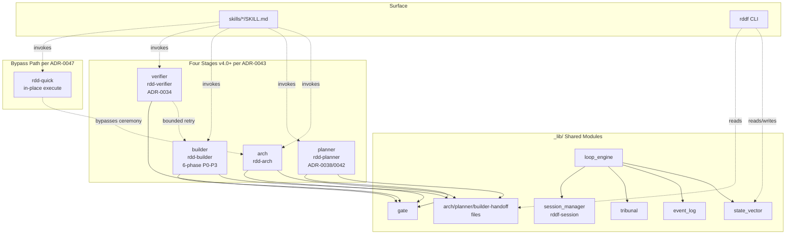

# Overview

## What rdd-workflow Is

rdd-workflow is an **OpenSpec-compatible AI development workflow package**. It manages changes via a 5-stage lifecycle (`propose → plan → execute → status → archive`), wrapped in a **four-stage v4 architecture** (`rdd-arch → rdd-planner → rdd-builder → rdd-verifier`, per ADR-0043), with a `rdd-quick` small-change bypass path (per ADR-0047). It runs on any OpenSpec-aware AI coding assistant (opencode, Claude Code, Cursor, Aider, etc.) via the Skill discovery mechanism, with no runtime dependency on a specific vendor.

The package ships:
- **5 stage skills** (`rdd-arch`, `rdd-planner`, `rdd-builder`, `rdd-verifier` + `rdd-quick` bypass) + **22 sub-skills** = 27 user-invocable skills total, each a `SKILL.md` with structured frontmatter.
- A **shared `_lib/`** of 60+ Python modules and bash helpers implementing state, gate, tribunal, session, loop engine, etc.
- A **`rddf` CLI** (`rddf status`, `rddf session ...`, `rddf discover-ship-changes`, etc.) for scripting and dashboards.

## Top-Level Architecture

## Module Map

### Stage skills (skills/)

| Skill | Stage | One-liner |
|-------|-------|-----------|
| `rdd-arch` | Stage 1 — arch | Define architecture: ADR creation, gap analysis, roadmap. |
| `rdd-planner` | Stage 2 — planner | Roadmap + proposal authoring orchestrator (per ADR-0038/0042); v3.0 design+plan merged. |
| `rdd-builder` | Stage 3 — builder | Approval + plan + execute + archive; 6-phase internal state machine (per ADR-0043). |
| `rdd-verifier` | Stage 4 — verifier | Batch AC verification before archive; routes failures back to builder (per ADR-0034); v2.0 self-contained LLM verification (per ADR-0045). |
| `rdd-quick` | Bypass (ADR-0047) | Small-change in-place execute; skips openspec change + worktree ceremony. |

### Sub-skills (called by phase guides)

| Skill | One-liner | Called by |
|-------|-----------|-----------|
| `guide` | Recommender; scans project state, suggests next step. | (entry point) |
| `add-improve` | Create an improvement proposal via brainstorming. | guide-design |
| `propose` | Analyse doc/code gap, propose changes. | guide-plan |
| `deps` | Compute change dependency graph + execution order. | guide-plan |
| `feature` | View/manage feature groups (summary, graph, status, order). | (standalone) |
| `execute` | Run the .rddf/plans/<name>.md plan in a worktree. | guide-ship |
| `rdd-workflow-writing-plans` | Generate TDD 5-step plan for a change. | guide-ship |
| `status` | View/change status; archive completed changes. | guide-ship |
| `roadmap` | Init / edit / validate / advance the project roadmap. | guide-arch |
| `rddf-session` | User-perspective workflow session mgmt. | (all phases) |
| `rdd-env-check` | Health snapshot of openspec CLI, git, branch. | (all phases Phase 1) |
| `rdd-workflow-brainstorm` | Structured brainstorm for improvements. | add-improve |
| `openspec-gate` | Pre-commit gate: warn if staged files aren't linked to a change. | (standalone) |

### Core _lib/ modules

| Module | One-liner |
|--------|-----------|
| `_lib/core/state_vector.py` | Atomic JSON state, schema-versioned, <10ms read/write. |
| `_lib/core/event_log.py` | Append-only event log; <100ms replay over 10k events. |
| `_lib/gate.py` | Plugin-style quality gate; error/warning levels. |
| `_lib/loop/tribunal.py` | Multi-agent cross-validation; weighted scoring + sanitization. |
| `_lib/loop_engine.py` | Goal → Plan → Execute → Verify → Adapt orchestrator. |
| `_lib/session.py` / `session_manager.py` | rddf-session lifecycle (ADR-0017). |
| `_lib/arch_quality_gate.py` | 4 warning checks on architecture proposals. |
| `_lib/change_alignment.py` | 3 warning checks on change-vs-architecture alignment. |
| `_lib/validate_delta_targets.py` | Validates spec delta `## ADDED/MODIFIED/REMOVED` paths. |
| `_lib/discover-arch-artifacts.sh` | ADR/roadmap/architecture dir discovery (ADR-0016). |

### rddf CLI subcommands

| Subcommand | One-liner |
|------------|-----------|
| `rddf status` | Concise project status (worktrees, active changes, sessions). |
| `rddf session list/show/resume/abandon/archive-history` | rddf-session lifecycle. |
| `rddf discover-ship-changes` | List committed changes ready to ship. |
| `rddf discover-arch-artifacts` | Re-scan ADR/roadmap/architecture dirs. |
| `rddf env-check` | Print env snapshot (CLI / git / branch). |

## Why Four Stages, Not Three or Five

v1.x used a single `guide.md` with 10 phases (ADR-0001 refactored this into two phases: spec/ship). v2.0 (ADR-0003) refactored again into **three** phases (arch / plan / ship) — splitting at the natural break between "what we want to build" (plan) and "how we build it" (ship).

In practice, **arch** accumulated two distinct responsibilities: defining the **architecture itself** (ADRs, roadmap) and **managing improvement proposals** against that architecture. By v2.0.6 the proposal-review load was heavy enough that a second gate, a content review pass, and a defer mechanism all crowded into arch's Phase 5.5. **ADR-0025** split those responsibilities: `rdd-arch` keeps architecture definition; `rdd-planner` (formerly `guide-design`) owns proposal lifecycle (create → review → approve/reject/defer → two-tier content review). In v4.0 this became a full second stage (per ADR-0038/0042/0043).

In v3.0, AC verification was extracted from the inline `archive_gate_check` (which embedded `ac-verifier`) into a separate fifth phase. **ADR-0034** elevates `rdd-verifier` to its own phase (`discover → batch-verify → classify → route`), giving bounded retry (max 3) and heuristic failure classification (implementation_gap vs proposal_drift) before archive. v2.0 further inlined the LLM verification protocol into the agent itself (per ADR-0045), removing the external `ac-verifier` subprocess.

In v4.0, the design + plan + ship stages were merged into a single `rdd-builder` 6-phase internal state machine (per **ADR-0043** §3.4): approval → plan → deps → execute → review → archive. This collapsed the 5-stage pipeline to 4 stages and added `rdd-quick` as a parallel bypass path (per **ADR-0047**).

This is why the current architecture is **four stages** (`rdd-arch → rdd-planner → rdd-builder → rdd-verifier`) plus a `rdd-quick` bypass path. Any doc that still says "three stages" (the v2.0 model) or "five stages" (the v3.0 model) is stale.

## Why a Loop Engine

In v1.x, the user picked from a fixed menu at each step. This worked for small changes but forced the human to make every routing decision. v2.0 introduced a **Loop engine** (ADR-0004) that runs the cycle Goal → Plan → Execute → Verify → Adapt autonomously when a goal is set, and falls back to a menu when the goal is ambiguous.

ADR-0002 then added **three interaction modes**: `loop` (autonomous until goal met), `menu` (v1-style), `hybrid` (loop tries first, falls back to menu at configurable checkpoints). The mode is per-session; the default is `hybrid`.

See [loop-engine.md](loop-engine.md) for the building-block breakdown.

## Key Design Principles

These are the rules the project holds itself to. When a change seems to violate one, the burden is on the change author to justify it.

1. **Self-contained.** A single skill (with its `scripts/` dir and `_lib/` deps) is enough to do its job. No implicit cross-vendor dependencies (no `~/.claude/...` paths, no hard reliance on a specific AI vendor).
2. **Explicit contract.** Cross-skill data flows through versioned handoff files (`.rddf/state/.arch-handoff.json`, `.plan-handoff.json`, etc.) with declared schemas. No hidden state-passing via globals.
3. **Idempotent.** Re-running a phase is safe: state-vector writes are atomic, gates re-evaluate, plans re-generate deterministically from inputs.
4. **Single source of truth.** Each fact lives in exactly one place: skill metadata is in `SKILL.md` frontmatter only; state is in `state_vector.py` only; handoffs are in their JSON files only.
5. **No silent failure.** Every error path either surfaces a stderr message + non-zero exit code, or — for recoverable cases — emits a warning gate. Never swallow.
6. **TDD discipline.** Public helpers in `_lib/` are written test-first; the test suite (`./test.sh --full`) gates merges via the regression script.
7. **Skill frontmatter immutability.** The YAML frontmatter of a `SKILL.md` (name, version, evolved-from, user-invocable, etc.) is read-only at runtime. Skill authors do not edit frontmatter to "rebrand"; instead they bump `version` semver.
