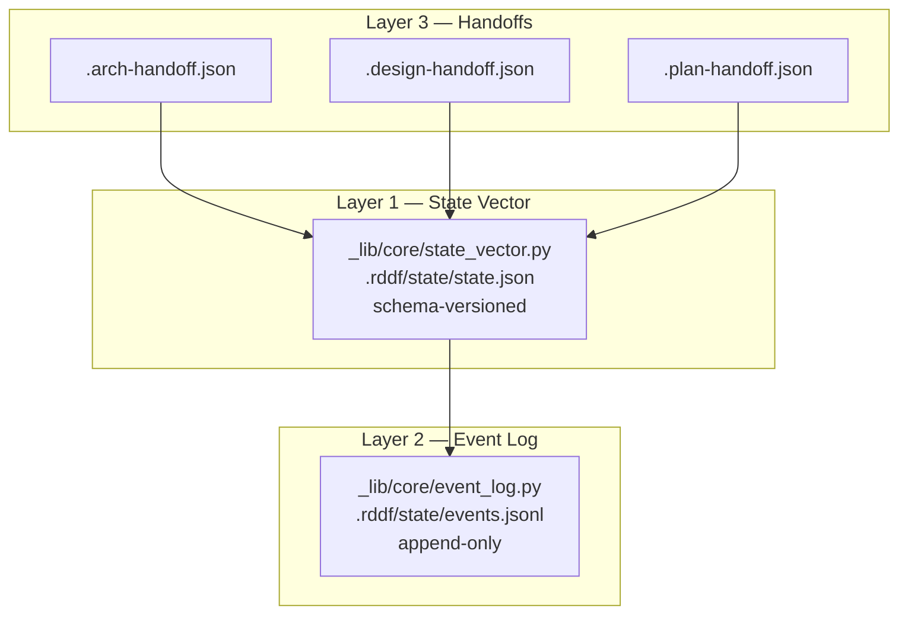

# State and Events

rdd-workflow runs without a database. Instead, state lives in **three distinct layers**, each with a different read/write pattern and lifetime.

## Layer 1 — State Vector (`_lib/core/state_vector.py`, imported as `skills._lib.core.state_vector`)

The **current snapshot** of project state. Schema-versioned JSON; writes are atomic (temp-file + rename). Read/write < 10 ms.

What it holds:
- `goal`, `interaction_mode`, `current_phase`, `current_step`
- Active worktree path + branch
- rddf-session id + last heartbeat
- counters (iterations, retries, gate failures)

When to use: any code path that needs to **query** current state fast. The Loop engine reads from here on every step.

## Layer 2 — Event Log (`_lib/core/event_log.py`, imported as `skills._lib.core.event_log`)

The **history**. Append-only newline-delimited JSON. Each line is an event (`step_started`, `gate_failed`, `human_approved`, `archive_completed`, etc.) with a timestamp + payload.

What it gives you:
- **Replay**: reconstruct state-vector from events up to time T.
- **Audit**: every gate + every human approval is on disk.
- **Debugging**: when a change misbehaves, the log shows what happened step-by-step.

Querying 10k events is < 100 ms (linear scan over small payloads).

## Layer 3 — Handoff Files

**Cross-skill contracts** written to `.rddf/state/`. Each phase writes one handoff on completion; the next phase reads it on entry.

| File | Written by | Read by | Schema version |
|------|-----------|---------|----------------|
| `.arch-handoff.json` | `guide-arch` (arch-done) | `guide-design`, `guide-plan` | v1 (ADR-0016) |
| `.design-handoff.json` | `guide-design` (design-done) | `guide-plan` | v1 |
| `.plan-handoff.json` | `guide-plan` (plan-done) | `guide-ship` | v1 + `execution_mode_decisions` (ADR-0024) |

Each handoff file is JSON with a `version` field at the top. **Consumers reject version=0 payloads** (forces explicit schema migration).

ADR-0016 also standardised the fields inside `.arch-handoff.json`: `adr_dir`, `roadmap_path`, `architecture_dir`, `adr_pattern`, `discovered`, `version`. These let downstream phases find ADR / roadmap / architecture directories without hardcoded paths.

## Why Three Layers

Each layer answers a different question:

| Question | Answer lives in |
|----------|-----------------|
| "What is the current state?" | State vector |
| "How did we get here?" | Event log |
| "What did the previous phase promise me?" | Handoff files |

If you collapse them, you lose either speed (vector = query speed), history (log = audit), or contract clarity (handoff = cross-phase promise).

## Reading vs Writing

- **Read-heavy**: state vector (queried every step).
- **Write-heavy**: event log (one event per action, but never rewritten).
- **Write-once-then-read-once**: handoff files (phase transition).

Handoff files are the only layer that **must** be read by a different phase than the one that wrote it — they exist to break the implicit coupling of "phase N needs to know what phase N-1 decided".

## Failure Modes

| Failure | Recovery |
|---------|----------|
| State vector write fails (disk full) | Atomic temp-file + rename prevents partial writes; on rename failure, state stays at last-good value. |
| Event log corruption (truncated) | Detect on read (line parse error), reset to last good offset, log warning. |
| Handoff file missing on phase entry | Treat as phase-not-yet-completed; fall through to entry phase (e.g. `guide-plan` → `guide-arch`). |
| Handoff file version mismatch | Consumer rejects; user must re-run prior phase (or run `--force` to override — explicitly opt-in). |

## Cross-references

- Handoff schema: [skills-and-handoff.md](skills-and-handoff.md)
- Loop engine reads state: [loop-engine.md](loop-engine.md)
