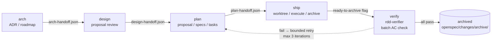

# Workflow Phases

rdd-workflow v3.0+ runs every change through **five phases** in order (per [ADR-0034](../adr/ADR-0034-rdd-verifier-verify-phase-architecture.md)):

Each phase:
- Has **one entry skill** (`guide-*` or `rdd-verifier`).
- Writes a **handoff file** that the next phase reads.
- Has a **gate** at its exit (warnings + errors per [gates-and-quality.md](gates-and-quality.md)).

## Phase 1 — `arch`

**Purpose**: define the architecture.

**Entry skill**: `guide-arch`.

**Inputs**: project state (`.rddf/state/`), `roadmap.md`, current ADRs.

**Outputs**:
- New / updated ADRs in `docs/adr/`.
- Updated `roadmap.md`.
- Gap analysis if requested.
- `.rddf/state/.arch-handoff.json` (ADR-0016 v1 schema).

**Human load**: high. ADR creation is a deliberate authoring task; arch-done is a hard human gate.

**Sub-skills**: `roadmap` (init / edit / validate / advance), `rdd-env-check` (Phase 1 health snapshot).

## Phase 2 — `design`

**Purpose**: manage improvement proposals (create, review, approve/reject/defer).

**Entry skill**: `guide-design`.

**Why split from arch** (ADR-0025): proposal-review load grew heavy enough that a second gate, content review, and defer mechanism all crowded into arch's Phase 5.5. Splitting these responsibilities makes each phase single-purpose.

**Inputs**: `proposal-suggestions.md`, `proposal-approved.md`, current `roadmap-meta.yaml` files for context.

**Outputs**:
- New `.rddf/improvements/<name>.md` files.
- Updated `proposal-suggestions.md` / `proposal-approved.md`.
- `.rddf/state/.design-handoff.json`.

**Two-tier content review**:
- **Tier 1**: `arch_quality_gate.py` — alignment / debt / clarity / actionable.
- **Tier 2**: `change_alignment.py` — refs_valid / no_contradiction / task_traceability.

**Sub-skills**: `add-improve`, `rdd-workflow-brainstorm`, `rdd-env-check`.

## Phase 3 — `plan`

**Purpose**: generate change artefacts (`proposal.md`, `specs/*.md`, `tasks.md`) and analyse dependencies.

**Entry skill**: `guide-plan`.

**Inputs**: `.arch-handoff.json` + `.design-handoff.json`.

**Outputs**:
- `openspec/changes/<name>/proposal.md`.
- `openspec/changes/<name>/specs/*.md` (delta specs with `## ADDED/MODIFIED/REMOVED Requirements`).
- `openspec/changes/<name>/design.md`.
- `openspec/changes/<name>/tasks.md`.
- `.rddf/state/.plan-handoff.json` (includes `execution_mode_decisions` per ADR-0024).

**Sub-skills**: `propose` (gap analysis + skeleton), `deps` (dependency graph + execution order), `rdd-env-check`.

**Execution mode decision** (ADR-0024): plan-done gate writes the recommended execution mode (worktree vs lightweight) into `.plan-handoff.json` based on file count, task count, risk keywords, and file-conflict analysis. `guide-ship` reads this on entry instead of re-detecting from disk.

## Phase 4 — `ship`

**Purpose**: execute the change in an isolated worktree, run the implementation plan, archive on completion.

**Entry skill**: `guide-ship`.

**Inputs**: `.plan-handoff.json` + `openspec/changes/<name>/`.

**Outputs**:
- Worktree at `.rddf/wt/<name>/` (worktree mode) or commits directly on branch (lightweight mode).
- Implementation plan at `.rddf/plans/<name>.md`.
- Tasks.md checkboxes marked complete.
- Archive: `openspec/changes/archive/<date>-<name>/`.
- Updated `iteration.json`, `roadmap-state.json`.

**Sub-skills**: `rdd-workflow-writing-plans` (plan generation), `execute` (plan execution), `status` (archive), `feature` (per-feature view), `rddf-session` (binding).

**Hard gates**:
- `archive_gate_check`: worktree branch must have commits; lightweight mode must have ≥1 new commit.
- Post-archive cleanup hook (idempotent).

## Phase 5 — `verify` (v3.0+, per [ADR-0034](../adr/ADR-0034-rdd-verifier-verify-phase-architecture.md))

**Purpose**: before archive, batch-verify all implemented, task-complete, non-archived changes against their acceptance criteria. Classify failures heuristically (`implementation_gap` vs `proposal_drift`). Route failures back to plan or ship with a bounded retry loop (max 3 iterations per change). Replaces the previous inline `archive_gate_check` ac-verifier with a first-class fifth phase.

**Entry skill**: `rdd-verifier`.

**Inputs**: scan of `openspec/changes/` for `status=implemented + tasks complete + not archived`, plus `.rddf/state/iteration.json` for cycle context.

**Outputs**:
- Per-change `ac-verifier` JSON reports.
- Failure classification (`implementation_gap` → guide-ship retry; `proposal_drift` → guide-plan re-evaluate).
- Bounded retry counter in `.rddf/state/.rdd-verifier-state.json` (TTL-bounded, max 3 iterations).
- Final `pass` flag enables archive; `fail` flag blocks archive.

**Why split from ship**: by v2.0.8, AC verification was a hidden second loop inside `archive_gate_check` — running after every commit, with no retry semantics, no failure classification, and no clear ownership. Elevating it to a phase (ADR-0034) gives it first-class gates, retry semantics, and routing decisions.

**Human load**: low. LLM-as-judge (ac-verifier) handles most cases; human only intervenes when classification is ambiguous or retry budget exhausted.

**Sub-skills**: `ac-verifier` (the underlying LLM-as-judge), `rdd-doctor --category state` (cross-check handoff consistency).

## Phase Recap

| Phase | Entry | Handoff out | Hard gate | Human load |
|-------|-------|-------------|-----------|------------|
| arch | `guide-arch` | `.arch-handoff.json` | arch-done | high |
| design | `guide-design` | `.design-handoff.json` | design-done | medium |
| plan | `guide-plan` | `.plan-handoff.json` | plan-done | medium |
| ship | `guide-ship` | archive event | archive-done | low |
| verify | `rdd-verifier` | (no handoff out — gate to archive) | verify-done | low |

## Why This Order

Each phase **consumes a contract** the previous phase wrote. A phase cannot start until its predecessor wrote the handoff file (or it falls through to the entry skill to bootstrap the missing phase). This is why a fresh project starts with `guide` (the recommender), which inspects which handoff files exist and routes the user to the earliest missing phase.

## Cross-references

- Loop engine: [loop-engine.md](loop-engine.md) — explains how phases are orchestrated.
- State and events: [state-and-events.md](state-and-events.md) — handoff file format.
- Skills + handoff protocol: [skills-and-handoff.md](skills-and-handoff.md).
