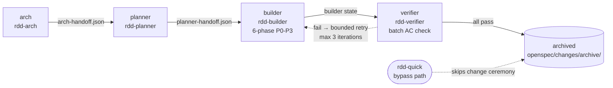

# Workflow Stages

rdd-workflow v4.0+ runs every change through **four stages** in order (per [ADR-0043](../adr/ADR-0043-rdd-workflow-v4-stage-merge.md), superseding the v3.0 five-phase model from [ADR-0034](../adr/ADR-0034-rdd-verifier-verify-phase-architecture.md)):

Each stage:
- Has **one entry skill** (a `rdd-*` skill in v4; the deprecated `guide-*` skills were hard-removed in Wave 3 per [ADR-0044](../adr/ADR-0044-v4-stage-merge-wave3-hard-removal.md)).
- Writes a **handoff file** that the next stage reads.
- Has a **gate** at its exit (warnings + errors per [gates-and-quality.md](gates-and-quality.md)).

`rdd-quick` is a parallel **bypass path** for small, well-scoped changes (per [ADR-0047](../adr/ADR-0047-rdd-quick-bypass-path.md)) — it skips the full 4-stage ceremony and executes in-place on the current branch with self-contained TDD + AC verification.

## Stage 1 — `arch`

**Purpose**: define the architecture.

**Entry skill**: `rdd-arch`.

**Inputs**: project state (`.rddf/state/`), `roadmap.md`, current ADRs.

**Outputs**:
- New / updated ADRs in `docs/adr/`.
- Updated `roadmap.md`.
- Gap analysis if requested.
- `.rddf/state/.arch-handoff.json` (ADR-0016 v1 schema).

**Human load**: high. ADR creation is a deliberate authoring task; arch-done is a hard human gate.

**Sub-skills**: `roadmap` (init / edit / validate / advance), `rdd-env-check` (Phase 1 health snapshot).

## Stage 2 — `planner`

**Purpose**: roadmap + proposal authoring orchestrator. Merges the v3.0 design + plan stages (per [ADR-0025](../adr/ADR-0025-design-proposal-creation.md) and [ADR-0043](../adr/ADR-0043-rdd-workflow-v4-stage-merge.md)). Owns proposal lifecycle (create → review → approve/reject/defer → design-done) plus roadmap CRUD.

**Entry skill**: `rdd-planner`.

**Why split from arch** (ADR-0025): proposal-review load grew heavy enough that a second gate, content review, and defer mechanism all crowded into arch's Phase 5.5. Splitting these responsibilities makes each stage single-purpose. In v4, planner is a full stage wrapping `_lib/planner_*.py` (per ADR-0038/0042).

**Inputs**: `.arch-handoff.json` + `proposal-suggestions.md` / `proposal-approved.md`.

**Outputs**:
- New `.rddf/improvements/<name>.md` files.
- Updated `proposal-suggestions.md` / `proposal-approved.md`.
- `.rddf/state/.planner-handoff.json` (schema v1).
- (Optional) feedback channel to arch: `.rddf/state/.planner-feedback.json` (advisory, per ADR-0042).

**Two-tier content review** (inherited from v3.0 design):
- **Tier 1**: `arch_quality_gate.py` — alignment / debt / clarity / actionable.
- **Tier 2**: `change_alignment.py` — refs_valid / no_contradiction / task_traceability.

**Sub-skills**: `add-improve`, `rdd-workflow-brainstorm`, `rdd-env-check`.

## Stage 3 — `builder`

**Purpose**: proposal approval + plan generation + execution + archive. In v4, this stage merges the v3.0 plan + ship + design-approval stages into a single 6-phase internal state machine (per [ADR-0043](../adr/ADR-0043-rdd-workflow-v4-stage-merge.md) §3.4).

**Entry skill**: `rdd-builder`.

**Inputs**: `.planner-handoff.json` + `openspec/changes/<name>/` (created during planner approval, per Path A).

**Outputs**:
- 6-phase internal transitions: P0 (approval) → P1 (plan) → P1.5 (deps + execution_mode) → P2 (execute) → P2.5 (review) → P3 (archive with verifier retry loop).
- `.rddf/state/builder/<name>.json` (per-change state).
- `.rddf/plans/<name>.md` (TDD 5-step plan; per spec §3.4 P1).
- Worktree at `.rddf/wt/<name>/` (worktree mode) or commits directly on branch (lightweight mode).
- `openspec/specs/<name>/spec.md` (when approved proposal includes it).
- `openspec/changes/archive/<date>-<name>/` on P3 archive.

**Hard gates**:
- `archive_gate_check`: worktree branch must have commits; lightweight mode must have ≥1 new commit.
- Post-archive cleanup hook (idempotent).

**Sub-skills**: `rdd-workflow-writing-plans` (plan generation, P1), `execute` (plan execution, P2), `status` (archive, P3), `feature` (per-feature view), `rddf-session` (binding).

## Stage 4 — `verifier` (per [ADR-0034](../adr/ADR-0034-rdd-verifier-verify-phase-architecture.md), v2.0 self-contained per [ADR-0045](../adr/ADR-0045-inline-ac-verifier-into-rdd-verifier.md))

**Purpose**: before archive, batch-verify all implemented, task-complete, non-archived changes against their acceptance criteria. Classify failures heuristically (`implementation_gap` vs `proposal_drift`). Route failures back to builder with a bounded retry loop (max 3 iterations per change). Replaces the v1.0 inline `ac-verifier` (which was deprecated in v2.0 per ADR-0045) with a first-class fourth stage.

**Entry skill**: `rdd-verifier`.

**Inputs**: scan of `openspec/changes/` for `status=implemented + tasks complete + not archived`, plus `.rddf/state/iteration.json` for cycle context.

**Outputs**:
- Per-change `.rddf/state/verifier/<change>.json` (loop state, classification history, route, halt reason).
- Verdict cache at `.rddf/state/.ac-verdict-<name>.json` (SHA-fingerprint, prevents double LLM calls).
- Audit log at `.rddf/state/verifier/<change>.audit.jsonl` (append-only).
- Failure classification (`implementation_gap` → builder retry; `proposal_drift` → planner re-evaluate via feedback channel, per ADR-0042).
- Bounded retry counter, max 3 iterations per change.
- Final `pass` flag enables archive; `fail` or `halted` flag blocks archive.

**Why a stage (not inline)**: by v2.0.8, AC verification was a hidden second loop inside `archive_gate_check` — running after every commit, with no retry semantics, no failure classification, and no clear ownership. Elevating it to a stage (ADR-0034) gives it first-class gates, retry semantics, and routing decisions. The v2.0 self-contained pattern (ADR-0045) removed the external `ac-verifier` subprocess and inlined the LLM verification protocol into the AI agent's own reasoning.

**Human load**: low. The executing AI agent is the LLM verifier (per ADR-0045). Human only intervenes when classification is ambiguous or retry budget exhausted.

**Sub-skills**: `rdd-doctor --category state` (cross-check handoff consistency). The deprecated `ac-verifier` skill is gone (removed 2026-09-07 per ADR-0045).

## Bypass — `rdd-quick` (per [ADR-0047](../adr/ADR-0047-rdd-quick-bypass-path.md))

**Purpose**: parallel bypass path for small, well-scoped changes that don't warrant the full 4-stage ceremony. Skips `openspec/changes/<name>/` creation and `.rddf/wt/<name>/` worktrees.

**Entry skill**: `rdd-quick`.

**State machine** (P0-P4 prose, modeled on `rdd-verifier` v2.0 self-contained pattern):
- P0 — plan generation: produces `.rddf/plans/quick-<name>.md` (TDD 5-step + `## Acceptance` checkboxes)
- P1 — complexity triage: AI agent judges simple vs complex; complex branch triggers Metis + Oracle review
- P2 — in-place execution: runs on current branch, no worktree
- P3 — AC verification: from plan `## Acceptance` section, emits verdict JSON matching `rdd-verifier`'s `VERDICT_ITEM_SCHEMA`
- P4 — completion / retry / escalation: 3-retry cap, then stdout upgrade summary suggesting `rdd-planner` re-frame

**Hard invariants** (enforced by `test_rdd_quick_isolation.bats` sha256 locks):
- MUST NOT create `openspec/changes/<name>/` or `openspec/specs/<name>/`
- MUST NOT create `.rddf/wt/<name>/`
- MUST NOT invoke `git worktree add` or `openspec archive`
- MUST NOT write to `iteration.json` / `sessions.json` / `roadmap-state.json`
- MUST NOT read `openspec/changes/<name>/proposal.md` for AC extraction
- MUST NOT read or write the rdd-builder-reserved env vars (`QUICK_FINISH_DETECTED`, `SKIP_PROMETHEUS_PLANNING`)

**Audit log**: `.rddf/state/.quick-history.jsonl` (11-field atomic append).

## Stage Recap

| Stage | Entry | Handoff out | Hard gate | Human load |
|-------|-------|-------------|-----------|------------|
| arch | `rdd-arch` | `.arch-handoff.json` | arch-done | high |
| planner | `rdd-planner` | `.planner-handoff.json` | design-done (inherited) | medium |
| builder | `rdd-builder` | archive event | archive-done | medium → low |
| verifier | `rdd-verifier` | (no handoff out — gate to archive) | verify-done | low |
| _bypass_ | `rdd-quick` | `.quick-history.jsonl` (audit only) | n/a (in-place) | medium |

## Why This Order

Each stage **consumes a contract** the previous stage wrote. A stage cannot start until its predecessor wrote the handoff file (or it falls through to the entry skill to bootstrap the missing stage). This is why a fresh project starts with `guide` (the recommender), which inspects which handoff files exist and routes the user to the earliest missing stage.

The `rdd-quick` bypass deliberately skips the stage chain — it has its own entry contract (P0 plan file) and its own audit log (`.quick-history.jsonl`), distinct from the main 4-stage pipeline.

## Cross-references

- Loop engine: [loop-engine.md](loop-engine.md) — explains how stages are orchestrated.
- State and events: [state-and-events.md](state-and-events.md) — handoff file format.
- Skills + handoff protocol: [skills-and-handoff.md](skills-and-handoff.md).
- v3 → v4 migration: [../migration-v3-to-v4.md](../migration-v3-to-v4.md) — the full v3 5-phase → v4 4-stage migration map.
