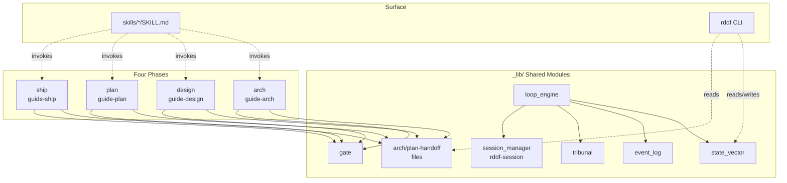
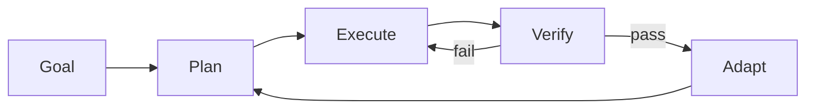
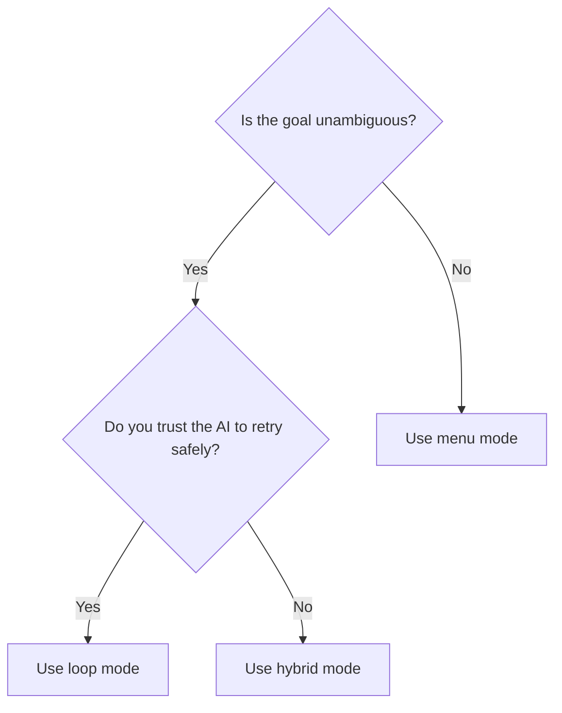
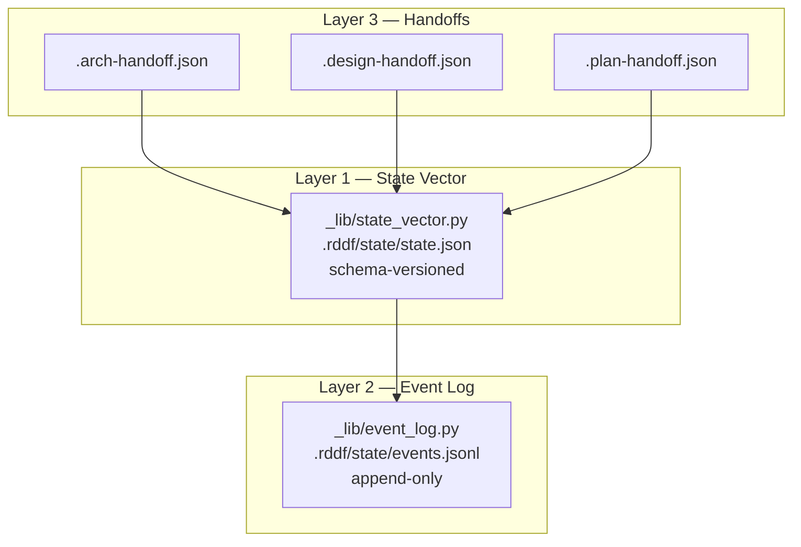
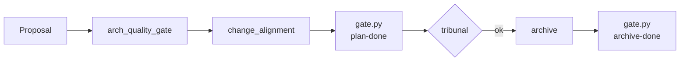
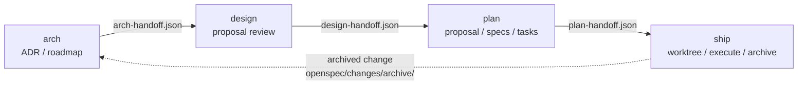
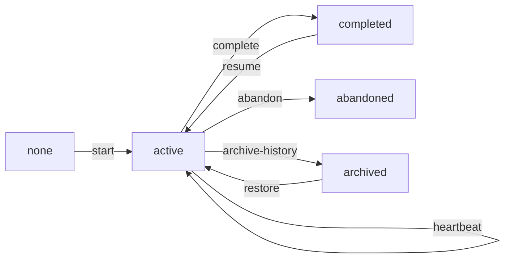
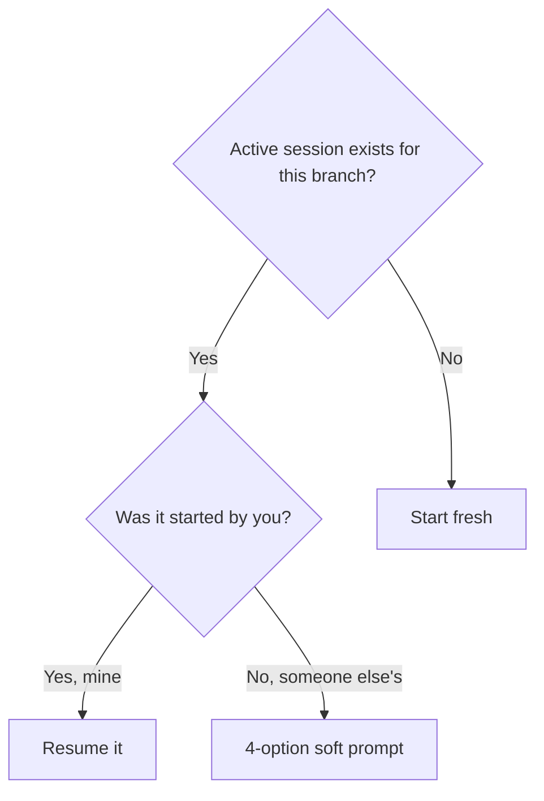

# Docs Restructure — Architecture Snapshots + ADR Index Refresh

> **For agentic workers:** REQUIRED SUB-SKILL: Use superpowers:subagent-driven-development (recommended) or superpowers:executing-plans to implement this plan task-by-task. Steps use checkbox (`- [ ]`) syntax for tracking.

**Goal:** Re-shape `docs/` so it reflects live code (v2.0.9+, four-phase arch → design → plan → ship, 25 ADRs) by creating `docs/architecture/` topic-split (~10 files), rewriting `docs/adr/README.md` to include ADR-0025 and four-phase terminology, and deleting 13 stale `docs/v2-*.md` whose content is folded into `architecture/`.

**Architecture:** Five independent commit batches (entry+overview → core concepts → flow+protocol → extension+ADR index → cleanup). Each batch is self-contained and rollback-able. Per-batch sanity check is `./test.sh --quick` (docs shouldn't break tests but proves containment). Five verification gates (V1-V5) run after the final batch.

**Tech Stack:** Markdown (GitHub-flavored with Mermaid), `git`, `grep`/`xargs`/`test -f` for link verification, `./test.sh` for sanity.

**Spec:** `docs/superpowers/specs/2026-08-07-docs-restructure-architecture-snapshots-design.md` (commit `6f14129`)

---

## File Structure

### New files in this plan (11)

```
docs/architecture/README.md                  # Batch 1 — entry point + doc map
docs/architecture/overview.md               # Batch 1 — system overview + module map
docs/architecture/historical-evolution.md   # Batch 1 — v1.0 → v2.0 → v2.1 timeline
docs/architecture/loop-engine.md            # Batch 2 — 5 building blocks + modes
docs/architecture/state-and-events.md       # Batch 2 — 3-layer state model
docs/architecture/gates-and-quality.md      # Batch 2 — gate + tribunal + alignment
docs/architecture/workflow-phases.md        # Batch 3 — 4 phases + handoffs
docs/architecture/skills-and-handoff.md     # Batch 3 — SKILL.md frontmatter + discovery
docs/architecture/multi-session.md          # Batch 3 — rddf-session lifecycle
docs/architecture/extension-points.md       # Batch 4 — how to add a skill/detector/action/CLI/ADR
docs/adr/README.md                          # Batch 4 — REWRITE (index update)
```

### Deleted files (13)

```
docs/v2-adr-summary.md
docs/v2-api-reference.md
docs/v2-architecture-refactor-plan.md
docs/v2-config-schema.md
docs/v2-developer-guide.md
docs/v2-gate-mechanism-guide.md
docs/v2-implementation-plan.md
docs/v2-loop-engine-guide.md
docs/v2-loop-engine.md
docs/v2-memory-system-guide.md
docs/v2-multi-session-guide.md
docs/v2-tribunal-guide.md
docs/v2-workflow-overview.md
```

### Untouched (preserved)

`docs/ONBOARDING.md`, `docs/change-quality-guide.md`, `docs/proposal-approved-format.md`, `docs/proposal-suggestions-format.md`, `docs/loop-engineering-research.md`, `docs/audit/`, `docs/migration/`, `docs/legacy/`, `docs/superpowers/specs/`, `docs/superpowers/plans/`, all `docs/adr/ADR-*.md`, and all of `skills/`, `_lib/`, `openspec/`.

---

## Conventions for This Plan

- **TDD adaptation**: this is a docs change. The "test" step in each task is **content verification** — comparing the new section against the source v2-*.md section and against the live `_lib/*.py` docstring / `skills/*/SKILL.md` frontmatter. Treat any factual claim that can't be backed by source code as a bug.
- **Mermaid syntax**: GitHub-flavored. Always include a closing `;` on flow lines, escape special chars in node labels with quotes.
- **Cross-doc links**: relative paths. From `docs/architecture/*.md` to another arch doc use bare filename; to ADR use `../adr/ADR-NNNN-<slug>.md`; to root doc use `../<filename>.md`.
- **Commit messages**: conventional commits, scope = `docs` (or `docs(adr-index)` for ADR README). Body explains *why* the section exists.
- **Hard constraint** (R4 in spec): no `skills/`, `_lib/`, or `openspec/` files may be edited. Run `git status --porcelain | grep -vE '^(\?\?|M) (skills/|_lib/|openspec/)'` after each batch — must be empty before committing.

---

## Pre-Flight

- [ ] **Step 1: Confirm working tree baseline**

Run:
```bash
cd /workspace/project/rdd-workflow
git status --porcelain | grep -v 'docs/superpowers/specs/2026-08-07-docs-restructure-architecture-snapshots-design.md' | grep -v 'proposal-suggestions.md' | grep -v '_lib/parse_approved.py' | grep -v 'improvements/add-rdd-doctor-skill.md'
```
Expected: empty. If not empty, the user's prior in-progress work conflicts — STOP and ask the user how to proceed.

- [ ] **Step 2: Confirm v2-* count is 13**

Run:
```bash
ls docs/v2-*.md | wc -l
```
Expected: `13`. If not, update the spec's Deleted Files list before continuing.

- [ ] **Step 3: Pre-flight external link check (Risk R1)**

Run:
```bash
grep -rn 'v2-[a-z]' skills/ openspec/ _lib/ 2>/dev/null
```
Expected: empty (those dirs reference ADRs, not v2-*.md). If matches exist, record them and fix in the task that creates the corresponding `architecture/` file (replace `v2-X.md` with `architecture/Y.md`).

- [ ] **Step 4: Verify spec is committed**

Run:
```bash
git log --oneline -1 docs/superpowers/specs/2026-08-07-docs-restructure-architecture-snapshots-design.md
```
Expected: `6f14129 docs(spec): add design for docs restructure ...`

---

## Batch 1 — Entry + Overview + Evolution

Reader can land on `docs/architecture/README.md` and get a coherent picture of the system without reading any other file in this batch.

### Task 1.1: Create `docs/architecture/README.md` (entry)

**Files:**
- Create: `docs/architecture/README.md`

- [ ] **Step 1: Write the file**

Create `docs/architecture/README.md` with this exact content:

```markdown
# rdd-workflow Architecture

> **For:** Project maintainers + contributors. If you are a **user** of rdd-workflow in another project, start at `../ONBOARDING.md` instead.

This directory is the **current-architecture snapshot** for rdd-workflow. Every doc here explains **why** a piece of the system exists (intent + trade-offs) and **the key structural seams** (modules, contracts, data flow). Implementation details (function signatures, line-by-line) live in code + docstrings.

For **decisions** behind the design, see [`../adr/README.md`](../adr/README.md). For **transient design artefacts** (specs, plans), see `../superpowers/specs/` and `../superpowers/plans/`.

## Doc Map

| Doc | Topic | Primary ADRs |
|-----|-------|--------------|
| [overview.md](overview.md) | System overview, module map, design principles | 0003, 0025 |
| [workflow-phases.md](workflow-phases.md) | Four-phase arch → design → plan → ship + handoffs | 0003, 0024, 0025 |
| [loop-engine.md](loop-engine.md) | 5 building blocks + loop/menu/hybrid modes | 0002, 0004 |
| [state-and-events.md](state-and-events.md) | 3-layer state model | 0006, 0016 |
| [gates-and-quality.md](gates-and-quality.md) | gate / tribunal / arch_quality_gate / change_alignment | 0007, 0008, 0018, 0019 |
| [skills-and-handoff.md](skills-and-handoff.md) | SKILL.md frontmatter, discovery, handoff contracts | 0016 |
| [multi-session.md](multi-session.md) | rddf-session lifecycle + conflict resolver | 0010, 0017 |
| [extension-points.md](extension-points.md) | How to add a skill / detector / action / CLI / ADR | 0021 |
| [historical-evolution.md](historical-evolution.md) | v1.0 → v2.0 → v2.1 timeline + per-refactor motivation | — |

## Update Convention

When you add a new skill, handoff file, or ADR, the corresponding `architecture/*.md` and `../adr/README.md` must be updated in the **same change**. This prevents documentation drift.

## When This Doc Set Was Last Refreshed

The doc set was last regenerated from live code as of v2.0.9+. See `historical-evolution.md` for the full version history.
```

- [ ] **Step 2: Verify content checks**

Run:
```bash
cd /workspace/project/rdd-workflow
wc -l docs/architecture/README.md
test -d docs/architecture
```
Expected: line count between 35 and 50; directory exists.

- [ ] **Step 3: Commit**

```bash
cd /workspace/project/rdd-workflow
git status --porcelain | grep -vE '^\?\? docs/architecture/'
git add docs/architecture/README.md
git -c user.name=sisyphus -c user.email=sisyphus@rdd-workflow commit -m "docs(architecture): add entry README with doc map + reader declaration"
```

### Task 1.2: Create `docs/architecture/overview.md`

**Files:**
- Create: `docs/architecture/overview.md`

**Source claims to verify** before writing — read these files and use them as ground truth:
- `skills/INSTALL.md` (top-level user-visible surface)
- `README.md` (project-level description)
- `_lib/loop_engine.py` (top of file docstring — purpose of loop engine)
- 4 phase entry points: `skills/guide-arch/SKILL.md`, `skills/guide-design/SKILL.md`, `skills/guide-plan/SKILL.md`, `skills/guide-ship/SKILL.md`

- [ ] **Step 1: Write the file**

Create `docs/architecture/overview.md`:

```markdown
# Overview

## What rdd-workflow Is

rdd-workflow is an **OpenSpec-compatible AI development workflow package**. It manages changes via a five-stage lifecycle (`propose → plan → execute → status → archive`), wrapped in a four-phase architecture (`arch → design → plan → ship`). It runs on any OpenSpec-aware AI coding assistant (opencode, Claude Code, Cursor, Aider, etc.) via the Skill discovery mechanism, with no runtime dependency on a specific vendor.

The package ships:
- **17 user-invocable skills** (4 phase guides + 13 sub-skills), each a `SKILL.md` with structured frontmatter.
- A **shared `_lib/`** of 60+ Python modules and bash helpers implementing state, gate, tribunal, session, loop engine, etc.
- A **`rddf` CLI** (`rddf status`, `rddf session ...`, `rddf discover-ship-changes`, etc.) for scripting and dashboards.

## Top-Level Architecture



## Module Map

### Phase guides (skills/)

| Skill | One-liner |
|-------|-----------|
| `guide-arch` | Define architecture: ADR creation, gap analysis, roadmap. |
| `guide-design` | Manage improvement proposals: create, review (approve/reject/defer), content gate. |
| `guide-plan` | Generate change artefacts: proposal, specs, design.md, tasks.md; run deps. |
| `guide-ship` | Execute changes: worktree setup, plan generation, run, archive, cleanup. |

### Sub-skills (called by phase guides)

| Skill | One-liner | Called by |
|-------|-----------|-----------|
| `guide` | Recommender; scans project state, suggests next step. | (entry point) |
| `add-improve` | Create an improvement proposal via brainstorming. | guide-design |
| `propose` | Analyse doc/code gap, propose changes. | guide-plan |
| `deps` | Compute change dependency graph + execution order. | guide-plan |
| `feature` | View/manage feature groups (summary, graph, status, order). | (standalone) |
| `execute` | Run the .rddf/plans/<name>.md plan in a worktree. | guide-ship |
| `rdd-workflow-writing-plans` | Generate TDD 5-step plan for a change. | guide-ship |
| `status` | View/change status; archive completed changes. | guide-ship |
| `roadmap` | Init / edit / validate / advance the project roadmap. | guide-arch |
| `rddf-session` | User-perspective workflow session mgmt. | (all phases) |
| `rdd-env-check` | Health snapshot of openspec CLI, git, branch. | (all phases Phase 1) |
| `rdd-workflow-brainstorm` | Structured brainstorm for improvements. | add-improve |
| `openspec-gate` | Pre-commit gate: warn if staged files aren't linked to a change. | (standalone) |

### Core _lib/ modules

| Module | One-liner |
|--------|-----------|
| `_lib/state_vector.py` | Atomic JSON state, schema-versioned, <10ms read/write. |
| `_lib/event_log.py` | Append-only event log; <100ms replay over 10k events. |
| `_lib/gate.py` | Plugin-style quality gate; error/warning levels. |
| `_lib/tribunal.py` | Multi-agent cross-validation; weighted scoring + sanitization. |
| `_lib/loop_engine.py` | Goal → Plan → Execute → Verify → Adapt orchestrator. |
| `_lib/session.py` / `session_manager.py` | rddf-session lifecycle (ADR-0017). |
| `_lib/arch_quality_gate.py` | 4 warning checks on architecture proposals. |
| `_lib/change_alignment.py` | 3 warning checks on change-vs-architecture alignment. |
| `_lib/validate_delta_targets.py` | Validates spec delta `## ADDED/MODIFIED/REMOVED` paths. |
| `_lib/discover-arch-artifacts.sh` | ADR/roadmap/architecture dir discovery (ADR-0016). |

### rddf CLI subcommands

| Subcommand | One-liner |
|------------|-----------|
| `rddf status` | Concise project status (worktrees, active changes, sessions). |
| `rddf session list/show/resume/abandon/archive-history` | rddf-session lifecycle. |
| `rddf discover-ship-changes` | List committed changes ready to ship. |
| `rddf discover-arch-artifacts` | Re-scan ADR/roadmap/architecture dirs. |
| `rddf env-check` | Print env snapshot (CLI / git / branch). |

## Why Four Phases, Not Three

v1.x used a single `guide.md` with 10 phases (ADR-0001 refactored this into two phases: spec/ship). v2.0 (ADR-0003) refactored again into **three** phases (arch / plan / ship) — splitting at the natural break between "what we want to build" (plan) and "how we build it" (ship).

In practice, **arch** accumulated two distinct responsibilities: defining the **architecture itself** (ADRs, roadmap) and **managing improvement proposals** against that architecture. By v2.0.6 the proposal-review load was heavy enough that a second gate, a content review pass, and a defer mechanism all crowded into arch's Phase 5.5. **ADR-0025** split those responsibilities: `guide-arch` keeps architecture definition; `guide-design` owns proposal lifecycle (create → review → approve/reject/defer → two-tier content review).

This is why the current architecture is **four phases** (arch → design → plan → ship), and any doc that still says "three phases" is stale.

## Why a Loop Engine

In v1.x, the user picked from a fixed menu at each step. This worked for small changes but forced the human to make every routing decision. v2.0 introduced a **Loop engine** (ADR-0004) that runs the cycle Goal → Plan → Execute → Verify → Adapt autonomously when a goal is set, and falls back to a menu when the goal is ambiguous.

ADR-0002 then added **three interaction modes**: `loop` (autonomous until goal met), `menu` (v1-style), `hybrid` (loop tries first, falls back to menu at configurable checkpoints). The mode is per-session; the default is `hybrid`.

See [loop-engine.md](loop-engine.md) for the building-block breakdown.

## Key Design Principles

These are the rules the project holds itself to. When a change seems to violate one, the burden is on the change author to justify it.

1. **Self-contained.** A single skill (with its `scripts/` dir and `_lib/` deps) is enough to do its job. No implicit cross-vendor dependencies (no `~/.claude/...` paths, no hard reliance on a specific AI vendor).
2. **Explicit contract.** Cross-skill data flows through versioned handoff files (`.rddf/state/.arch-handoff.json`, `.plan-handoff.json`, etc.) with declared schemas. No hidden state-passing via globals.
3. **Idempotent.** Re-running a phase is safe: state-vector writes are atomic, gates re-evaluate, plans re-generate deterministically from inputs.
4. **Single source of truth.** Each fact lives in exactly one place: skill metadata is in `SKILL.md` frontmatter only; state is in `state_vector.py` only; handoffs are in their JSON files only.
5. **No silent failure.** Every error path either surfaces a stderr message + non-zero exit code, or — for recoverable cases — emits a warning gate. Never swallow.
6. **TDD discipline.** Public helpers in `_lib/` are written test-first; the test suite (`./test.sh --full`) gates merges via the regression script.
7. **Skill frontmatter immutability.** The YAML frontmatter of a `SKILL.md` (name, version, evolved-from, user-invocable, etc.) is read-only at runtime. Skill authors do not edit frontmatter to "rebrand"; instead they bump `version` semver.
```

- [ ] **Step 2: Verify against sources**

Run:
```bash
cd /workspace/project/rdd-workflow
wc -l docs/architecture/overview.md
test -f skills/guide-arch/SKILL.md
test -f skills/guide-design/SKILL.md
test -f skills/guide-plan/SKILL.md
test -f skills/guide-ship/SKILL.md
test -f _lib/state_vector.py
test -f _lib/event_log.py
test -f _lib/gate.py
test -f _lib/tribunal.py
test -f _lib/loop_engine.py
test -f _lib/session.py
test -f _lib/session_manager.py
test -f _lib/arch_quality_gate.py
test -f _lib/change_alignment.py
test -f _lib/validate_delta_targets.py
```
Expected: all tests pass. If any module is missing, the doc claims a module that doesn't exist — STOP and reconcile before committing.

- [ ] **Step 3: Verify no broken internal links**

Run:
```bash
cd /workspace/project/rdd-workflow
grep -oE '\]\([^)]+\.md\)' docs/architecture/overview.md | sort -u | while read link; do
  target=$(echo "$link" | sed -E 's/^\]\((.+)\)$/\1/')
  case "$target" in
    http*|https*) continue ;;
  esac
  if [ ! -f "docs/architecture/$target" ] && [ ! -f "docs/$target" ] && [ ! -f "$target" ]; then
    echo "BROKEN: $link"
  fi
done
```
Expected: empty (no BROKEN lines).

- [ ] **Step 4: Commit**

```bash
cd /workspace/project/rdd-workflow
git status --porcelain | grep -vE '^\?\? docs/architecture/'
git add docs/architecture/overview.md
git -c user.name=sisyphus -c user.email=sisyphus@rdd-workflow commit -m "docs(architecture): add overview with module map, four-phase rationale, design principles"
```

### Task 1.3: Create `docs/architecture/historical-evolution.md`

**Files:**
- Create: `docs/architecture/historical-evolution.md`

**Source claims to verify**:
- `CHANGELOG.md` for version-by-version notes
- Each ADR cited below must exist in `docs/adr/`

- [ ] **Step 1: Write the file**

Create `docs/architecture/historical-evolution.md`:

```markdown
# Historical Evolution

This document records the **architectural** milestones — the points at which the system's structure changed, not every release. For release-by-release notes, see [`../../CHANGELOG.md`](../../CHANGELOG.md).

## Timeline

```
v1.0 (2026-06-03)           v1.1 (2026-06-05)           v2.0 (2026-06-22)
─────────────────           ─────────────────           ─────────────────
Single guide.md (10         Two phases:                  Three phases:
phases, menu-driven)        spec / ship                  arch / plan / ship
                            (ADR-0001)                   (ADR-0003)
                                                        + Loop engine (ADR-0004)
                                                        + Interaction modes (ADR-0002)
                                                        + Human-in-Loop nodes (ADR-0005)
                                                        + State vector + event log (ADR-0006)
                                                        + Gate mechanism (ADR-0007)
                                                        + Tribunal committee (ADR-0008)

v2.0.1 (2026-07-09)         v2.0.5 (2026-07-16)         v2.0.6 (2026-07-21)
─────────────────           ─────────────────           ─────────────────
rddf-session user           Per-skill scripts/           guide-design introduced
lifecycle                   migration begins             (ADR-0025) — proposal review
(ADR-0017)                  (ADR-0021)                   moves out of arch

v2.0.8 (2026-07-28)         v2.0.9 (2026-08-04)
─────────────────           ─────────────────
Global install support      Deps-driven execution mode
                            (ADR-0024)
```

## Pain Point → Solution Mappings

| When | Pain | Solution | ADR |
|------|------|----------|-----|
| v1.0 | Every workflow step required user menu selection; no autonomy. | Introduce a goal-driven loop orchestrator. | 0002, 0004 |
| v1.1 | spec/phase and ship/phase both lived in one file; couldn't evolve independently. | Split into `guide-spec` + `guide-ship`. | 0001 (later superseded by 0003) |
| v2.0 | v1.x couldn't represent "I want to define architecture separately from changes." | Three-phase architecture: arch / plan / ship. | 0003 |
| v2.0 | State scattered across 13 files; impossible to query consistently. | Centralise to a schema-versioned state vector + append-only event log. | 0006 |
| v2.0 | Each phase-end check was bespoke and untyped. | Generic gate mechanism: error/warning + plugin extensions. | 0007 |
| v2.0 | Single-agent review caught only what the reviewer saw. | Multi-agent tribunal with weighted scoring + data sanitization. | 0008 |
| v2.0.1 | Cross-session continuity was lost when the user closed opencode. | rddf-session: project-level sessions.json + 4-option conflict resolver. | 0017 |
| v2.0.5 | Skills accumulated inline bash blocks (some 100+ lines), making them hard to diff. | Phase 2 migration: per-skill `scripts/` directories. | 0021 |
| v2.0.6 | Arch phase had grown proposal-creation + proposal-review on top of ADR/roadmap work; review load was heavy. | Split `guide-design`: arch keeps architecture definition; design owns proposal lifecycle + two-tier content review. | 0025 |
| v2.0.8 | Per-project install was painful; users wanted one install for all projects. | Global install via `~/.agents/skills/`. | (no ADR — install-script only) |
| v2.0.9 | Execution mode (worktree vs lightweight) was decided in guide-ship by inspecting disk; couldn't see plan-time intent. | Deps analysis writes execution mode into `.plan-handoff.json`; guide-ship reads it. | 0024 |

## Architectural Constants

These have held since v2.0 and are unlikely to change without a major version bump:

- **`openspec/` is the source of truth** for change artefacts (`proposal.md`, `specs/*.md`, `tasks.md`).
- **Skills are discovered by name**; `SKILL.md` frontmatter is the contract.
- **`_lib/` is shared but not user-invocable** — end users never call `_lib.*` directly.
- **Bash + Python coexistence** — bash for orchestration, Python for stateful logic.
- **Hard isolation in worktrees** — every shipped change lives in a worktree until archived.

## What's Still Open

Tracked under `../proposal-suggestions.md` and `../proposal-approved.md`:
- v3.0+ candidate: declarative flow DSL (ADR-0011, 0012 — adopted but not implemented).
- v3.0+ candidate: scheduled triggers (ADR-0009 — placeholder).
```

- [ ] **Step 2: Verify ADR refs exist**

Run:
```bash
cd /workspace/project/rdd-workflow
for adr in ADR-0001 ADR-0002 ADR-0003 ADR-0004 ADR-0005 ADR-0006 ADR-0007 ADR-0008 ADR-0017 ADR-0021 ADR-0024 ADR-0025; do
  test -f "docs/adr/${adr}-"*.md || echo "MISSING: $adr"
done
test -f CHANGELOG.md
```
Expected: empty (no MISSING lines) and CHANGELOG exists.

- [ ] **Step 3: Commit**

```bash
cd /workspace/project/rdd-workflow
git status --porcelain | grep -vE '^\?\? docs/architecture/'
git add docs/architecture/historical-evolution.md
git -c user.name=sisyphus -c user.email=sisyphus@rdd-workflow commit -m "docs(architecture): add historical evolution (v1.0 → v2.0.9 timeline)"
```

### Task 1.4: Batch 1 sanity

- [ ] **Step 1: Run quick test**

```bash
cd /workspace/project/rdd-workflow
./test.sh --quick 2>&1 | tail -30
```
Expected: returns 0. (Docs change should not affect tests; this confirms the change is contained.)

- [ ] **Step 2: Verify batch tree**

```bash
cd /workspace/project/rdd-workflow
git log --oneline -3
ls -1 docs/architecture/
```
Expected: three commits ahead of `6f14129`; `docs/architecture/` contains exactly `README.md`, `overview.md`, `historical-evolution.md`.

---

## Batch 2 — Core Concepts

The three docs in this batch cover the runtime machinery. Each can be read on its own; together they explain how rdd-workflow *thinks*.

### Task 2.1: Create `docs/architecture/loop-engine.md`

**Files:**
- Create: `docs/architecture/loop-engine.md`

**Source claims to verify**:
- `docs/adr/ADR-0002-goal-driven-interaction-modes.md`
- `docs/adr/ADR-0004-loop-engine-core-design.md`
- `docs/adr/ADR-0005-human-in-loop-nodes.md`
- `_lib/loop/` package contents

- [ ] **Step 1: Write the file**

Create `docs/architecture/loop-engine.md`:

```markdown
# Loop Engine

## What the Loop Engine Is

The Loop engine (ADR-0004) is the runtime that turns a **goal** into a sequence of **plan → execute → verify → adapt** cycles, with optional human-in-the-loop checkpoints. It is the difference between "the AI does whatever the menu says" (v1.x) and "the AI works toward a goal until it can verify completion" (v2.0).

The engine is implemented in `_lib/loop_engine.py` (entry-point shim) backed by the `_lib/loop/` package (16 modules: `loop_state`, `agents`, `actions`, `detectors`, `tribunal`, `gate`, `human_nodes`, `event_queue`, `interaction_modes`, `flow_customizer`, `step_pipeline`, `plugin_loader`, `sanitizer`, `memory`, `flowchart`, `design_phase`).

## Five Building Blocks



| Block | What it does | Module |
|-------|--------------|--------|
| **Goal** | The user-declared objective (e.g. "ship change `fix-foo`"). Backs `state_vector.goal`. | `loop_state.py` |
| **Plan** | Decomposes goal into ordered steps; reads/writes `.rddf/plans/<name>.md`. | `agents.py`, `step_pipeline.py` |
| **Execute** | Runs each step; emits events to `event_log`. | `actions.py`, `agents.py` |
| **Verify** | Runs gates (gate.py) and optionally tribunal (tribunal.py). | `gate.py`, `tribunal.py` |
| **Adapt** | On verify-fail: re-plan or escalate to a human node. | `human_nodes.py`, `interaction_modes.py` |

## Interaction Modes (ADR-0002)

Three modes; default is `hybrid`.

| Mode | Behaviour | When to use |
|------|-----------|-------------|
| `loop` | Run autonomously until goal met or a hard gate fails. | User trusts the AI; goal is unambiguous. |
| `menu` | v1.x-style: AI presents options at each decision point. | Goal is exploratory; user wants explicit control. |
| `hybrid` | Loop tries first; falls back to menu at configurable checkpoints (e.g. before any merge). | Default. Best of both. |

Mode is set per-session via `rddf session set-mode` or the env var `RDD_INTERACTION_MODE`. See [multi-session.md](multi-session.md) for session lifecycle.

## Human-in-Loop Nodes (ADR-0005)

Some actions are *always* human, regardless of mode:

- **Approval gates** — e.g. arch-done, design-done, plan-done, archive-done.
- **Destructive operations** — `git push --force`, `openspec archive --yes`, branch deletion.
- **Conflict resolution** — when `rddf-session` detects a cross-session conflict (4-option soft prompt).
- **Quality overrides** — when a gate warning is acknowledged but the user wants to proceed anyway.

These are configured declaratively via `_lib/loop/human_nodes.py`; a node's policy is "always ask", "ask on warning", or "ask on error".

## When to Use Loop vs Menu



Practical rule of thumb:
- **Loop mode** for: small bug fixes, doc edits, mechanical refactors, dependency bumps.
- **Menu mode** for: architecture changes, anything that touches `_lib/` or a gate, anything that creates a new skill.
- **Hybrid mode** (default) for: most change work — let the AI drive but checkpoint at gates.

## How the Loop Engine Stops

It doesn't. It runs until:
1. The goal is verified (goal-met gate passes).
2. A hard gate fails and no retry budget remains (max_retries: 3, configurable).
3. A human-in-loop node aborts (user picks the "stop" option from the soft prompt).
4. Max iterations reached (default: 100, configurable in `interaction` mode config).

On stop, state is fully persisted in `state_vector` and `event_log`; the session can be resumed later via `rddf session resume`.

## Cross-references

- State model: [state-and-events.md](state-and-events.md)
- Quality verification: [gates-and-quality.md](gates-and-quality.md)
- Session lifecycle: [multi-session.md](multi-session.md)
```

- [ ] **Step 2: Verify source ADRs exist**

```bash
cd /workspace/project/rdd-workflow
test -f docs/adr/ADR-0002-goal-driven-interaction-modes.md
test -f docs/adr/ADR-0004-loop-engine-core-design.md
test -f docs/adr/ADR-0005-human-in-loop-nodes.md
ls _lib/loop/ | head -20
```
Expected: all ADRs exist; `_lib/loop/` contains the listed modules.

- [ ] **Step 3: Verify links**

```bash
cd /workspace/project/rdd-workflow
grep -oE '\]\([^)]+\.md\)' docs/architecture/loop-engine.md | sort -u | while read link; do
  target=$(echo "$link" | sed -E 's/^\]\((.+)\)$/\1/')
  case "$target" in
    http*|https*) continue ;;
  esac
  if [ ! -f "docs/architecture/$target" ] && [ ! -f "docs/$target" ] && [ ! -f "$target" ]; then
    echo "BROKEN: $link"
  fi
done
```
Expected: empty.

- [ ] **Step 4: Commit**

```bash
cd /workspace/project/rdd-workflow
git status --porcelain | grep -vE '^\?\? docs/architecture/'
git add docs/architecture/loop-engine.md
git -c user.name=sisyphus -c user.email=sisyphus@rdd-workflow commit -m "docs(architecture): add loop engine (5 building blocks + interaction modes)"
```

### Task 2.2: Create `docs/architecture/state-and-events.md`

**Files:**
- Create: `docs/architecture/state-and-events.md`

**Source claims to verify**:
- `_lib/state_vector.py` (top docstring + class names)
- `_lib/event_log.py` (top docstring)
- `_lib/discover-arch-artifacts.sh` (handoff writer)
- `docs/adr/ADR-0006-state-vector-event-log.md`
- `docs/adr/ADR-0016-arch-artifact-discovery-contract.md`

- [ ] **Step 1: Write the file**

Create `docs/architecture/state-and-events.md`:

```markdown
# State and Events

rdd-workflow runs without a database. Instead, state lives in **three distinct layers**, each with a different read/write pattern and lifetime.



## Layer 1 — State Vector (`_lib/state_vector.py`)

The **current snapshot** of project state. Schema-versioned JSON; writes are atomic (temp-file + rename). Read/write < 10 ms.

What it holds:
- `goal`, `interaction_mode`, `current_phase`, `current_step`
- Active worktree path + branch
- rddf-session id + last heartbeat
- counters (iterations, retries, gate failures)

When to use: any code path that needs to **query** current state fast. The Loop engine reads from here on every step.

## Layer 2 — Event Log (`_lib/event_log.py`)

The **history**. Append-only newline-delimited JSON. Each line is an event (`step_started`, `gate_failed`, `human_approved`, `archive_completed`, etc.) with a timestamp + payload.

What it gives you:
- **Replay**: reconstruct state-vector from events up to time T.
- **Audit**: every gate + every human approval is on disk.
- **Debugging**: when a change misbehaves, the log shows what happened step-by-step.

Querying 10k events is < 100 ms (linear scan over small payloads).

## Layer 3 — Handoff Files

**Cross-skill contracts** written to `.rddf/state/`. Each phase writes one handoff on completion; the next phase reads it on entry.

| File | Written by | Read by | Schema version |
|------|-----------|---------|----------------|
| `.arch-handoff.json` | `guide-arch` (arch-done) | `guide-design`, `guide-plan` | v1 (ADR-0016) |
| `.design-handoff.json` | `guide-design` (design-done) | `guide-plan` | v1 |
| `.plan-handoff.json` | `guide-plan` (plan-done) | `guide-ship` | v1 + `execution_mode_decisions` (ADR-0024) |

Each handoff file is JSON with a `version` field at the top. **Consumers reject version=0 payloads** (forces explicit schema migration).

ADR-0016 also standardised the fields inside `.arch-handoff.json`: `adr_dir`, `roadmap_path`, `architecture_dir`, `adr_pattern`, `discovered`, `version`. These let downstream phases find ADR / roadmap / architecture directories without hardcoded paths.

## Why Three Layers

Each layer answers a different question:

| Question | Answer lives in |
|----------|-----------------|
| "What is the current state?" | State vector |
| "How did we get here?" | Event log |
| "What did the previous phase promise me?" | Handoff files |

If you collapse them, you lose either speed (vector = query speed), history (log = audit), or contract clarity (handoff = cross-phase promise).

## Reading vs Writing

- **Read-heavy**: state vector (queried every step).
- **Write-heavy**: event log (one event per action, but never rewritten).
- **Write-once-then-read-once**: handoff files (phase transition).

Handoff files are the only layer that **must** be read by a different phase than the one that wrote it — they exist to break the implicit coupling of "phase N needs to know what phase N-1 decided".

## Failure Modes

| Failure | Recovery |
|---------|----------|
| State vector write fails (disk full) | Atomic temp-file + rename prevents partial writes; on rename failure, state stays at last-good value. |
| Event log corruption (truncated) | Detect on read (line parse error), reset to last good offset, log warning. |
| Handoff file missing on phase entry | Treat as phase-not-yet-completed; fall through to entry phase (e.g. `guide-plan` → `guide-arch`). |
| Handoff file version mismatch | Consumer rejects; user must re-run prior phase (or run `--force` to override — explicitly opt-in). |

## Cross-references

- Handoff schema: [skills-and-handoff.md](skills-and-handoff.md)
- Loop engine reads state: [loop-engine.md](loop-engine.md)
```

- [ ] **Step 2: Verify source files exist**

```bash
cd /workspace/project/rdd-workflow
test -f _lib/state_vector.py
test -f _lib/event_log.py
test -f docs/adr/ADR-0006-state-vector-event-log.md
test -f docs/adr/ADR-0016-arch-artifact-discovery-contract.md
```
Expected: all exist.

- [ ] **Step 3: Commit**

```bash
cd /workspace/project/rdd-workflow
git status --porcelain | grep -vE '^\?\? docs/architecture/'
git add docs/architecture/state-and-events.md
git -c user.name=sisyphus -c user.email=sisyphus@rdd-workflow commit -m "docs(architecture): add state-and-events (3-layer state model)"
```

### Task 2.3: Create `docs/architecture/gates-and-quality.md`

**Files:**
- Create: `docs/architecture/gates-and-quality.md`

**Source claims to verify**:
- `_lib/gate.py` (top docstring + class names)
- `_lib/tribunal.py` (top docstring)
- `_lib/arch_quality_gate.py` (4 check names)
- `_lib/change_alignment.py` (3 check names)
- ADRs 0007, 0008, 0018, 0019

- [ ] **Step 1: Write the file**

Create `docs/architecture/gates-and-quality.md`:

```markdown
# Gates and Quality

Four quality mechanisms, each with a different scope and severity model.

| Mechanism | Scope | Severity | Where |
|-----------|-------|----------|-------|
| `gate.py` | Single phase transition | error / warning | `_lib/gate.py` |
| `tribunal.py` | Cross-agent validation of a single artefact | error / warning | `_lib/tribunal.py` |
| `arch_quality_gate.py` | Architecture proposals (ADRs, gap analyses) | warning only | `_lib/arch_quality_gate.py` |
| `change_alignment.py` | A change vs the architecture | warning only | `_lib/change_alignment.py` |

## Core Invariant

**Warning = soft prompt.** The user sees the warning and chooses to proceed.
**Error = hard block.** The operation cannot continue without resolving.

No quality mechanism silently swallows issues. If a check cannot run (e.g. file missing, schema invalid), it fails as an error — never as a silent pass.

## `gate.py` (ADR-0007)

The general-purpose phase-transition gate. Plugins register checks; each check returns `(level, message)`. Aggregation produces an error/warning report.

Use cases:
- plan-done gate: are all spec deltas + tasks.md + deps-analysis in place?
- archive-done gate: did worktree have commits? are tasks.md checkboxes all done?
- ship-lightweight-mode gate: are there any commits to merge? (blocks archive if 0 commits)

Plugin extension: drop a Python module under `_lib/plugins/` and the loader picks it up automatically.

## `tribunal.py` (ADR-0008)

Multi-agent cross-validation. Given an artefact (proposal, design.md, etc.), it runs N reviewer agents and aggregates weighted scores. Sensitive content (paths, env vars, secrets) is sanitised via `_lib/sanitizer.py` before review.

Use cases:
- Verifying an improvement proposal's quality before it enters `proposal-approved.md`.
- Cross-checking a generated implementation plan against its source design.md.

Tribunal scores are advisory unless explicitly wired into a hard gate.

## `arch_quality_gate.py` (ADR-0018)

Four warning-level checks run on architecture artefacts (ADRs, gap analyses):

1. **alignment** — does the proposal reference existing ADRs (when relevant)?
2. **debt** — does it acknowledge trade-offs or technical debt?
3. **clarity** — is the rationale unambiguous?
4. **actionable** — does it produce a concrete next step?

Default: warnings are soft prompts. Set `STRICT_ARCH_GATE=yes` in env to upgrade warnings to errors (CI mode).

## `change_alignment.py` (ADR-0019)

Three warning-level checks run on a change proposal against the current architecture:

1. **refs_valid** — every ADR reference in `proposal.md` actually exists in `docs/adr/`.
2. **no_contradiction** — the change does not contradict an active ADR.
3. **task_traceability** — every `- [ ]` in `tasks.md` traces back to a `##` section in `proposal.md`.

Default: warnings. Set `STRICT_CHANGE_GATE=yes` for CI.

## How the Four Mechanisms Compose



Each phase transition may invoke multiple gates. The phase only advances if all **error-level** checks pass.

## Adding a New Gate

1. Decide scope: phase-transition (`gate.py`), artefact validation (`tribunal.py`), or domain-specific (`*_quality_gate.py`).
2. Implement check as a function returning `(level, message)`.
3. Register in the corresponding registry (`gate.py:check_registry`, or a plugin file under `_lib/plugins/`).
4. Add a test in `tests/unit/` (TDD — write the test first).
5. Document the check name in this file (so future readers know what `STRICT_*_GATE=yes` actually enables).

See [extension-points.md](extension-points.md) for the full pattern.

## Cross-references

- State model: [state-and-events.md](state-and-events.md)
- ADR index: `../adr/README.md`
```

- [ ] **Step 2: Verify files**

```bash
cd /workspace/project/rdd-workflow
test -f _lib/gate.py
test -f _lib/tribunal.py
test -f _lib/arch_quality_gate.py
test -f _lib/change_alignment.py
test -f _lib/sanitizer.py
test -f docs/adr/ADR-0007-gate-mechanism.md
test -f docs/adr/ADR-0008-tribunal-committee.md
test -f docs/adr/ADR-0018-arch-quality-gate.md
test -f docs/adr/ADR-0019-change-arch-alignment.md
```
Expected: all exist.

- [ ] **Step 3: Commit**

```bash
cd /workspace/project/rdd-workflow
git status --porcelain | grep -vE '^\?\? docs/architecture/'
git add docs/architecture/gates-and-quality.md
git -c user.name=sisyphus -c user.email=sisyphus@rdd-workflow commit -m "docs(architecture): add gates-and-quality (gate + tribunal + 2 alignment checks)"
```

### Task 2.4: Batch 2 sanity

- [ ] **Step 1: Run quick test**

```bash
cd /workspace/project/rdd-workflow
./test.sh --quick 2>&1 | tail -20
```
Expected: returns 0.

- [ ] **Step 2: Verify batch tree**

```bash
cd /workspace/project/rdd-workflow
git log --oneline -3
ls -1 docs/architecture/
```
Expected: three more commits; `docs/architecture/` now has 6 files (Batch 1 + Batch 2).

---

## Batch 3 — Flow + Protocol

These three docs cover the user-facing flow (4 phases) and the contracts (skill discovery, session lifecycle).

### Task 3.1: Create `docs/architecture/workflow-phases.md`

**Files:**
- Create: `docs/architecture/workflow-phases.md`

**Source claims to verify**:
- `skills/guide-arch/SKILL.md`, `skills/guide-design/SKILL.md`, `skills/guide-plan/SKILL.md`, `skills/guide-ship/SKILL.md`
- ADRs 0003, 0024, 0025

- [ ] **Step 1: Write the file**

Create `docs/architecture/workflow-phases.md`:

```markdown
# Workflow Phases

rdd-workflow v2.1+ runs every change through **four phases** in order:



Each phase:
- Has **one entry skill** (`guide-*`).
- Writes a **handoff file** that the next phase reads.
- Has a **gate** at its exit (warnings + errors per [gates-and-quality.md](gates-and-quality.md)).

## Phase 1 — `arch`

**Purpose**: define the architecture.

**Entry skill**: `guide-arch`.

**Inputs**: project state (`.rddf/state/`), `roadmap.md`, current ADRs.

**Outputs**:
- New / updated ADRs in `docs/adr/`.
- Updated `roadmap.md`.
- Gap analysis if requested.
- `.rddf/state/.arch-handoff.json` (ADR-0016 v1 schema).

**Human load**: high. ADR creation is a deliberate authoring task; arch-done is a hard human gate.

**Sub-skills**: `roadmap` (init / edit / validate / advance), `rdd-env-check` (Phase 1 health snapshot).

## Phase 2 — `design`

**Purpose**: manage improvement proposals (create, review, approve/reject/defer).

**Entry skill**: `guide-design`.

**Why split from arch** (ADR-0025): proposal-review load grew heavy enough that a second gate, content review, and defer mechanism all crowded into arch's Phase 5.5. Splitting these responsibilities makes each phase single-purpose.

**Inputs**: `proposal-suggestions.md`, `proposal-approved.md`, current `roadmap-meta.yaml` files for context.

**Outputs**:
- New `improvements/<name>.md` files.
- Updated `proposal-suggestions.md` / `proposal-approved.md`.
- `.rddf/state/.design-handoff.json`.

**Two-tier content review**:
- **Tier 1**: `arch_quality_gate.py` — alignment / debt / clarity / actionable.
- **Tier 2**: `change_alignment.py` — refs_valid / no_contradiction / task_traceability.

**Sub-skills**: `add-improve`, `rdd-workflow-brainstorm`, `rdd-env-check`.

## Phase 3 — `plan`

**Purpose**: generate change artefacts (`proposal.md`, `specs/*.md`, `tasks.md`) and analyse dependencies.

**Entry skill**: `guide-plan`.

**Inputs**: `.arch-handoff.json` + `.design-handoff.json`.

**Outputs**:
- `openspec/changes/<name>/proposal.md`.
- `openspec/changes/<name>/specs/*.md` (delta specs with `## ADDED/MODIFIED/REMOVED Requirements`).
- `openspec/changes/<name>/design.md`.
- `openspec/changes/<name>/tasks.md`.
- `.rddf/state/.plan-handoff.json` (includes `execution_mode_decisions` per ADR-0024).

**Sub-skills**: `propose` (gap analysis + skeleton), `deps` (dependency graph + execution order), `rdd-env-check`.

**Execution mode decision** (ADR-0024): plan-done gate writes the recommended execution mode (worktree vs lightweight) into `.plan-handoff.json` based on file count, task count, risk keywords, and file-conflict analysis. `guide-ship` reads this on entry instead of re-detecting from disk.

## Phase 4 — `ship`

**Purpose**: execute the change in an isolated worktree, run the implementation plan, archive on completion.

**Entry skill**: `guide-ship`.

**Inputs**: `.plan-handoff.json` + `openspec/changes/<name>/`.

**Outputs**:
- Worktree at `.rddf/wt/<name>/` (worktree mode) or commits directly on branch (lightweight mode).
- Implementation plan at `.rddf/plans/<name>.md`.
- Tasks.md checkboxes marked complete.
- Archive: `openspec/changes/archive/<date>-<name>/`.
- Updated `iteration.json`, `roadmap-state.json`.

**Sub-skills**: `rdd-workflow-writing-plans` (plan generation), `execute` (plan execution), `status` (archive), `feature` (per-feature view), `rddf-session` (binding).

**Hard gates**:
- `archive_gate_check`: worktree branch must have commits; lightweight mode must have ≥1 new commit.
- Post-archive cleanup hook (idempotent).

## Phase Recap

| Phase | Entry | Handoff out | Hard gate | Human load |
|-------|-------|-------------|-----------|------------|
| arch | `guide-arch` | `.arch-handoff.json` | arch-done | high |
| design | `guide-design` | `.design-handoff.json` | design-done | medium |
| plan | `guide-plan` | `.plan-handoff.json` | plan-done | medium |
| ship | `guide-ship` | archive event | archive-done | low |

## Why This Order

Each phase **consumes a contract** the previous phase wrote. A phase cannot start until its predecessor wrote the handoff file (or it falls through to the entry skill to bootstrap the missing phase). This is why a fresh project starts with `guide` (the recommender), which inspects which handoff files exist and routes the user to the earliest missing phase.

## Cross-references

- Loop engine: [loop-engine.md](loop-engine.md) — explains how phases are orchestrated.
- State and events: [state-and-events.md](state-and-events.md) — handoff file format.
- Skills + handoff protocol: [skills-and-handoff.md](skills-and-handoff.md).
```

- [ ] **Step 2: Verify**

```bash
cd /workspace/project/rdd-workflow
test -f skills/guide-arch/SKILL.md
test -f skills/guide-design/SKILL.md
test -f skills/guide-plan/SKILL.md
test -f skills/guide-ship/SKILL.md
test -f docs/adr/ADR-0003-three-phase-architecture.md
test -f docs/adr/ADR-0024-deps-driven-execution-mode.md
test -f docs/adr/ADR-0025-design-proposal-creation.md
```
Expected: all exist.

- [ ] **Step 3: Commit**

```bash
cd /workspace/project/rdd-workflow
git status --porcelain | grep -vE '^\?\? docs/architecture/'
git add docs/architecture/workflow-phases.md
git -c user.name=sisyphus -c user.email=sisyphus@rdd-workflow commit -m "docs(architecture): add workflow-phases (arch → design → plan → ship + handoffs)"
```

### Task 3.2: Create `docs/architecture/skills-and-handoff.md`

**Files:**
- Create: `docs/architecture/skills-and-handoff.md`

**Source claims to verify**:
- 3-4 sample `skills/*/SKILL.md` files for frontmatter patterns
- `_lib/skill_root.sh` (skill resolution)
- `docs/adr/ADR-0016-arch-artifact-discovery-contract.md`
- `_lib/schemas/arch_handoff_schema.json` (handoff schema)

- [ ] **Step 1: Audit frontmatter across all SKILL.md files**

```bash
cd /workspace/project/rdd-workflow
find skills -name SKILL.md | head -20 | while read f; do
  echo "=== $f ==="
  head -15 "$f"
done
```
Expected: each starts with `---` and has YAML keys including at minimum `name` and `description`. Note the variety for the doc.

- [ ] **Step 2: Write the file**

Create `docs/architecture/skills-and-handoff.md`:

```markdown
# Skills and Handoff Protocol

A **skill** is a `SKILL.md` file with YAML frontmatter that an AI coding assistant can discover and invoke. rdd-workflow ships 17 user-invocable skills plus the shared `_lib/` runtime.

## SKILL.md Frontmatter Spec

Every skill's first line is `---` (YAML start); the frontmatter block closes with another `---`. The runtime reads **only** these fields.

### Required (top-level)

| Field | Type | Meaning |
|-------|------|---------|
| `name` | string | Unique skill identifier. Used for `skill_use("name")` and CLI lookup. **Immutable.** |
| `description` | string | One-paragraph purpose; surfaces in `/skills` lists and `rddf discover`. |
| `license` | string | SPDX identifier. |
| `compatibility` | string | Required runtime/CLI versions (e.g. `openspec CLI v1.3.1+, git 2.25+`). |

### Required (under `metadata:`)

| Field | Type | Meaning |
|-------|------|---------|
| `author` | string | Maintainer handle. |
| `version` | semver | `X.Y` style. Bump on any behavioural change. **Immutable at runtime.** |
| `evolved-from` | string | Previous skill name (if refactored). For history. |
| `user-invocable` | bool | If `false`, the skill is internal and should not appear in user menus. |

**Immutability rule** (per AGENTS.md / ADR convention): `name`, `version`, `evolved-from`, and `user-invocable` are **read-only at runtime**. Skill authors do not edit them to "rebrand"; they bump `version` semver.

## Discovery and Resolution

When the user types `skill_use("guide-arch")`, resolution runs in this order:

1. `${PROJECT_ROOT}/.opencode/skills/rdd-workflow/skills/guide-arch/SKILL.md`
2. `${PROJECT_ROOT}/skills/guide-arch/SKILL.md`
3. `~/.agents/skills/guide-arch/SKILL.md` (global install)
4. `~/.agents/skills/rdd-workflow/skills/guide-arch/SKILL.md` (global install, vendored)

Resolution code lives in `_lib/skill_root.sh::resolve_rdd_skill_dir`. If both PROJECT paths and global paths miss, the skill is reported as not-installed.

## Three Invocation Modes

| Mode | Mechanism | Use case |
|------|-----------|----------|
| `skill_use("name")` | Inline call from another skill or from the AI assistant's chat. | Most common — AI reads the SKILL.md and follows its instructions. |
| `rddf <subcommand>` | CLI call. | Scripting, dashboards, CI. |
| Direct `.md` read | `cat skills/<name>/SKILL.md` | Authoring, debugging. |

All three resolve to the same content; the mode is purely transport.

## Handoff Contracts

A **handoff file** is a versioned JSON file under `.rddf/state/` that one phase writes and the next phase reads.

### `.arch-handoff.json` (v1, ADR-0016)

Top-level fields:
```json
{
  "version": 1,
  "adr_dir": "docs/adr",
  "roadmap_path": "roadmap.md",
  "architecture_dir": "docs/architecture",
  "adr_pattern": "ADR-*.md",
  "discovered": true
}
```

**Versioning policy**: bump `version` whenever a field is added, removed, or its semantics change. Consumers **must reject `version: 0`** payloads (forces explicit migration). The `discovered: true` flag distinguishes "phase ran scan and found these paths" from "phase ran with all defaults" (`discovered: false`).

### `.design-handoff.json` (v1)

Top-level fields:
```json
{
  "version": 1,
  "approved_proposals": ["<name1>", "<name2>"],
  "deferred_proposals": ["<name3>"],
  "last_review_at": "2026-08-07T12:00:00Z"
}
```

### `.plan-handoff.json` (v1, ADR-0024)

Top-level fields:
```json
{
  "version": 1,
  "change_name": "fix-foo",
  "execution_mode_decisions": {
    "mode": "lightweight" | "worktree",
    "rationale": "files_changed=2, tasks=3, no risk keywords, no conflicts"
  }
}
```

`execution_mode_decisions` is the field `guide-ship` reads to decide between worktree and lightweight mode (see [workflow-phases.md](workflow-phases.md)).

## Schema Files

The canonical schema for each handoff lives under `_lib/schemas/`:

| Schema | Version | JSON Schema file |
|--------|---------|------------------|
| arch-handoff | v1 | `_lib/schemas/arch_handoff_schema.json` |
| plan-handoff | v1 | `_lib/schemas/plan_handoff_schema.json` (or state_vector section) |
| iteration | v1 | `_lib/schemas/iteration_schema.json` |
| sessions | v1 | `_lib/schemas/sessions_schema.json` |

**Any change to a schema requires bumping the `version` field in the handoff file and adding a migration entry.**

## Cross-references

- Phases that read/write handoffs: [workflow-phases.md](workflow-phases.md)
- State file mechanics: [state-and-events.md](state-and-events.md)
```

- [ ] **Step 3: Verify**

```bash
cd /workspace/project/rdd-workflow
test -f _lib/skill_root.sh
test -f docs/adr/ADR-0016-arch-artifact-discovery-contract.md
ls _lib/schemas/
```
Expected: schema directory exists with at least `arch_handoff_schema.json`.

- [ ] **Step 4: Commit**

```bash
cd /workspace/project/rdd-workflow
git status --porcelain | grep -vE '^\?\? docs/architecture/'
git add docs/architecture/skills-and-handoff.md
git -c user.name=sisyphus -c user.email=sisyphus@rdd-workflow commit -m "docs(architecture): add skills-and-handoff (frontmatter spec + handoff schemas)"
```

### Task 3.3: Create `docs/architecture/multi-session.md`

**Files:**
- Create: `docs/architecture/multi-session.md`

**Source claims to verify**:
- `_lib/session.py` / `_lib/session_manager.py` (lifecycle hooks)
- `skills/rddf-session/SKILL.md` (5 subcommands)
- ADRs 0010, 0017

- [ ] **Step 1: Write the file**

Create `docs/architecture/multi-session.md`:

```markdown
# Multi-Session Management

A **session** in rdd-workflow is the user's perspective on a single workflow run: which change they're working on, which phase they're in, which worktree is active. Sessions are **persistent** (survive close-and-reopen of the AI assistant) and **recoverable** (a fresh opencode session can resume an in-flight session via `rddf session resume`).

The mechanism is `rddf-session` (ADR-0017), backed by `skills/rddf-session/SKILL.md` and `_lib/session.py` / `_lib/session_manager.py`.

## Why Sessions, Not Just State

v1.x had no concept of a session — when the user closed the AI assistant, all in-flight context vanished. v2.0 added a state vector + event log, but there was no **identifier** tying events to "the thing I'm doing right now". Multiple parallel worktrees or skipped phases became indistinguishable in the log.

`rddf-session` adds:
- A **session id** (UUID-ish) attached to every state-vector write and event-log line.
- A **project-level `sessions.json`** under `.rddf/state/`, listing all known sessions.
- **Heartbeat** writes so a stale session can be detected and surfaced.

## Session Lifecycle



| State | Meaning |
|-------|---------|
| `none` | Project has no active session. |
| `active` | Session is open; worktree + phase are set. |
| `completed` | Change archived; session is read-only. |
| `abandoned` | User explicitly stopped; session preserved for reference. |
| `archived` | Session moved to `archived_sessions/` (long-term storage). |

## Five Subcommands

| Subcommand | Purpose |
|------------|---------|
| `rddf session list` | Show all known sessions (active + completed + abandoned). |
| `rddf session show <id>` | Detail: phase, change, worktree, last heartbeat. |
| `rddf session resume <id>` | Re-bind a fresh AI session to an existing in-flight session. |
| `rddf session abandon <id>` | Mark as abandoned; state preserved but worktree may be cleaned up. |
| `rddf session archive-history <id>` | Move to long-term storage. Idempotent. |

## Cross-Session Conflicts

When a fresh session starts and the project already has an `active` session on a different branch, the user gets a **4-option soft prompt** (ADR-0017 §3):

1. **Resume the existing session** — bind to it; abandon the fresh start.
2. **Start a new session in a new worktree** — parallel branch.
3. **Abandon the existing session** — mark it abandoned; start fresh here.
4. **Detach the worktree** — keep the existing session but don't bind to it.

The default is option 1 (resume) — safest.

## Session Binding Policy (ADR-0017)

Every workflow session generated by `guide-arch` / `guide-design` / `guide-plan` / `guide-ship` **MUST** bind to an `rddf-session` via `owner_opencode_session_id`. Manual skill invocation without binding is allowed, but the user is responsible for resolving any cross-session conflicts.

The `guide` recommender surfaces the binding via `BINDING_LINES` (no state mutation); users running raw skills can check their binding via `skill_use("rddf-session current")`.

## v2.0 Lightweight vs v2.1 Full (ADR-0010)

| Aspect | v2.0 lightweight | v2.1 full |
|--------|-------------------|-----------|
| Concurrency model | One active session at a time | Multiple parallel sessions via dependency graph scheduler |
| Storage | Single `sessions.json` | Per-session subdirs under `.rddf/state/sessions/<id>/` |
| Resume | Manual `rddf session resume` | Auto-resume on session-start via session-id match |
| Cleanup | Manual | `rddf session gc` with configurable TTL |
| **Status** | **Shipped (v2.0.1+)** | Adopted in ADR; not implemented |

Until v2.1 ships, treat the lightweight model as the production behaviour and the v2.1 column as future work.

## When to Start a New Session vs Resume



Practical rule:
- **Resume** if you closed and reopened opencode mid-change.
- **New session** if you're starting a new change in a new worktree.
- **Prompt** if you see "active session detected" message on entry — read the 4 options, don't auto-pick.

## Cross-references

- State persistence: [state-and-events.md](state-and-events.md)
- Workflow phases: [workflow-phases.md](workflow-phases.md)
```

- [ ] **Step 2: Verify**

```bash
cd /workspace/project/rdd-workflow
test -f _lib/session.py
test -f _lib/session_manager.py
test -f skills/rddf-session/SKILL.md
test -f docs/adr/ADR-0010-multi-session-management.md
test -f docs/adr/ADR-0017-rddf-session.md
```
Expected: all exist.

- [ ] **Step 3: Commit**

```bash
cd /workspace/project/rdd-workflow
git status --porcelain | grep -vE '^\?\? docs/architecture/'
git add docs/architecture/multi-session.md
git -c user.name=sisyphus -c user.email=sisyphus@rdd-workflow commit -m "docs(architecture): add multi-session (rddf-session lifecycle + conflict resolver)"
```

### Task 3.4: Batch 3 sanity

- [ ] **Step 1: Run quick test**

```bash
cd /workspace/project/rdd-workflow
./test.sh --quick 2>&1 | tail -20
```
Expected: returns 0.

- [ ] **Step 2: Verify tree**

```bash
cd /workspace/project/rdd-workflow
git log --oneline -3
ls -1 docs/architecture/
```
Expected: 3 more commits; `docs/architecture/` now has 9 files (Batches 1+2+3).

---

## Batch 4 — Extension + ADR Index

The extension doc captures "how do I add a new X" patterns; the ADR index gets a full refresh.

### Task 4.1: Create `docs/architecture/extension-points.md`

**Files:**
- Create: `docs/architecture/extension-points.md`

**Source claims to verify**:
- `skills/<one-existing-skill>/SKILL.md` for the frontmatter pattern.
- `_lib/plugins/` for plugin loader.
- `_lib/cli/` for CLI structure.
- `docs/adr/ADR-0021-phase2-per-skill-helper-migration.md`.
- `docs/adr/ADR-0000-template.md` (ADR template).

- [ ] **Step 1: Audit existing plugin + CLI structure**

```bash
cd /workspace/project/rdd-workflow
ls _lib/plugins/
ls _lib/cli/ 2>/dev/null || echo "no _lib/cli"
ls skills/ | grep -v __pycache__
```
Note the layout for the doc.

- [ ] **Step 2: Write the file**

Create `docs/architecture/extension-points.md`:

```markdown
# Extension Points

This doc is for contributors. It captures the **how** for the most common extension operations: adding a skill, a detector/action, a CLI subcommand, or an ADR. Each operation has a checklist.

## Adding a New Skill

Skills are first-class extensions — the project ships 17 and grows over time.

**Checklist**:

1. **Pick a name** that is unique, kebab-case, descriptive (`guide-arch`, `add-improve`, `rdd-env-check`).
2. **Copy the frontmatter** from a similar skill (e.g. `skills/<existing-skill>/SKILL.md`). Fill in `name`, `description`, `license`, `compatibility`, and `metadata.{author, version, evolved-from, user-invocable}`. Set `version: 1.0` for new skills.
3. **Write the body** following the "state machine" pattern: numbered phases, each with a clear gate. Match the style of `skills/guide-arch/SKILL.md`.
4. **Add `scripts/`** under the skill dir if any block exceeds ~50 lines (ADR-0021). Bash + Python mixed, with `*.sh` orchestrators and `*.py` business logic. Each script is wrapped in a `main()` function.
5. **Write tests** in `tests/integration/test_<skill>.bats` (bats for shell) or `tests/unit/test_<module>.py` (pytest for Python).
6. **Register in install.sh** if the skill needs project-wide discovery (mostly for skills that aren't auto-discovered).
7. **Update this doc** — add a row to the module map in [overview.md](overview.md) and link to the new SKILL.md in [skills-and-handoff.md](skills-and-handoff.md).
8. **Add an ADR** if the new skill introduces a structural change (new contract, new handoff file, new gate).

**Don't**:
- Don't edit frontmatter after first commit to "rebrand" — bump `version`.
- Don't add `depends_on` between skills — keep skills independent; coordination is via handoff files.
- Don't reach into another skill's `scripts/` — call the skill instead, or use `_lib/`.

## Adding a New Detector / Action (Loop Engine Plugin)

Detectors and actions are pluggable units in the Loop engine. They live in `_lib/loop/` or `_lib/plugins/`.

**Detector** — observes state, returns a signal (e.g. "tasks are stale", "config drifted").

```python
# _lib/loop/detectors/my_detector.py
from .base import Detector

class MyDetector(Detector):
    name = "my-detector"

    def detect(self, state) -> Signal:
        if state.get("foo") > 10:
            return Signal(level="warning", message="foo too high")
        return Signal(level="ok")
```

**Action** — performs a side-effect in response to a signal (e.g. "open issue", "send notification").

```python
# _lib/loop/actions/my_action.py
from .base import Action

class MyAction(Action):
    name = "my-action"

    def run(self, signal, state) -> Result:
        # do work
        return Result(ok=True, message="did the thing")
```

**Checklist**:

1. Subclass the appropriate base (`Detector` / `Action`).
2. Set a unique `name`.
3. Register in the plugin loader (`_lib/loop/plugin_loader.py`).
4. Add a unit test in `tests/unit/test_<name>.py` (TDD).
5. Document the signal contract (what level, what payload).

## Adding a New `rddf` CLI Subcommand

The CLI is a thin wrapper: each subcommand maps to one function in `_lib/cli/`.

**Checklist**:

1. Add a new file ` `_lib/cli/<subcommand>.py` exposing `def main(argv: list[str]) -> int:`.
2. Register in `_lib/cli/__init__.py` dispatch.
3. Add a `rddf-<subcommand>` script under `rddf` (the CLI shim).
4. Add a smoke test in `tests/integration/test_rddf_<subcommand>.bats`.
5. Update [overview.md](overview.md) module map.

**Don't**:
- Don't put business logic in the CLI layer — call into `_lib/`.

## Adding a New ADR

ADRs are immutable historical records. They are the most-leverage docs in the project because every other doc references them.

**Checklist**:

1. **Find the next number**: `ls docs/adr/ADR-*.md | sort | tail -1` — increment by 1 (e.g. `ADR-0026`).
2. **Copy `docs/adr/ADR-0000-template.md`** to `docs/adr/ADR-NNNN-<kebab-slug>.md`.
3. **Fill in**: Context, Decision, Status (set to `待定`), Consequences.
4. **Add a row** to `docs/adr/README.md` ADR list table (status = 待定).
5. **Reference it** from any other doc that should cite the decision.
6. **Commit** with message `docs(adr): propose ADR-NNNN <slug>`.
7. **After review**, edit status to `已采纳` or `已替代为 ADR-NNN` and update the row in `docs/adr/README.md`.

**Don't**:
- Don't renumber an existing ADR — links break across the whole repo.
- Don't edit an ADR's body to reflect new code — write a new ADR that supersedes it.

## Adding a New Handoff File

Rare; only when a new phase boundary emerges.

**Checklist**:

1. Define a JSON schema in `_lib/schemas/<name>_schema.json`.
2. Add a writer function in the phase that produces the handoff.
3. Add a reader + version-check in the phase that consumes it.
4. Add a migration entry if any existing data needs to be back-filled.
5. Document the schema in [skills-and-handoff.md](skills-and-handoff.md).
6. Add an ADR (per "Adding a New ADR" above).

## Cross-references

- Skills protocol: [skills-and-handoff.md](skills-and-handoff.md)
- Loop engine: [loop-engine.md](loop-engine.md) — for detector/action context.
- ADR index: `../adr/README.md`.
```

- [ ] **Step 3: Verify**

```bash
cd /workspace/project/rdd-workflow
test -f docs/adr/ADR-0000-template.md
test -f docs/adr/ADR-0021-phase2-per-skill-helper-migration.md
ls _lib/loop/ | head
```
Expected: all exist; loop modules listed.

- [ ] **Step 4: Commit**

```bash
cd /workspace/project/rdd-workflow
git status --porcelain | grep -vE '^\?\? docs/architecture/'
git add docs/architecture/extension-points.md
git -c user.name=sisyphus -c user.email=sisyphus@rdd-workflow commit -m "docs(architecture): add extension-points (how to add skill/detector/action/CLI/ADR)"
```

### Task 4.2: Rewrite `docs/adr/README.md`

**Files:**
- Modify: `docs/adr/README.md`

**Source claims to verify** — for each ADR listed, the file in `docs/adr/ADR-NNNN-*.md` must exist.

- [ ] **Step 1: Audit current ADR list**

```bash
cd /workspace/project/rdd-workflow
ls docs/adr/ADR-*.md | grep -v ADR-0000 | sort
```
Expected output (current state):
```
docs/adr/ADR-0001-propose-plan-execute-state-machine.md
docs/adr/ADR-0002-goal-driven-interaction-modes.md
docs/adr/ADR-0003-three-phase-architecture.md
docs/adr/ADR-0004-loop-engine-core-design.md
docs/adr/ADR-0005-human-in-loop-nodes.md
docs/adr/ADR-0006-state-vector-event-log.md
docs/adr/ADR-0007-gate-mechanism.md
docs/adr/ADR-0008-tribunal-committee.md
docs/adr/ADR-0009-scheduled-triggers.md
docs/adr/ADR-0010-multi-session-management.md
docs/adr/ADR-0011-phase-step-pipeline-model.md
docs/adr/ADR-0012-flow-customization-layer.md
docs/adr/ADR-0013-extract-scan-state.md
docs/adr/ADR-0014-review-phase-and-debt-reflow.md
docs/adr/ADR-0015-integrate-openspec-validate-as-plan-critic.md
docs/adr/ADR-0016-arch-artifact-discovery-contract.md
docs/adr/ADR-0017-rddf-session.md
docs/adr/ADR-0018-arch-quality-gate.md
docs/adr/ADR-0019-change-arch-alignment.md
docs/adr/ADR-0020-incremental-skeleton-planning.md
docs/adr/ADR-0021-phase2-per-skill-helper-migration.md
docs/adr/ADR-0022-manual-deps-field.md
docs/adr/ADR-0023-v3-rename-spec-workflow-to-rdd-workflow.md
docs/adr/ADR-0024-deps-driven-execution-mode.md
docs/adr/ADR-0025-design-proposal-creation.md
```
That is 25 ADRs. Note any discrepancies for the doc.

- [ ] **Step 2: For each ADR, determine current implementation status**

For each of the 25 ADRs above, run:
```bash
cd /workspace/project/rdd-workflow
grep -rn -l "ADR-NNNN" _lib/ skills/ 2>/dev/null | head -5
```
where `NNNN` is each ADR number. If the ADR is referenced from `_lib/` or `skills/`, it's implemented; otherwise it's `v3.0+ candidate` or `not yet implemented`.

A quick guide based on existing repo knowledge:
- **Implemented** (code present): 0001, 0002, 0003, 0004, 0005, 0006, 0007, 0008, 0010 (v2.0 lightweight), 0013, 0016, 0017, 0018, 0019, 0020, 0021, 0022, 0023, 0024, 0025
- **Adopted, not implemented** (v3.0+ candidates): 0009 (placeholder), 0011, 0012
- **Superseded by ADR-0003**: 0001 (note this)

For any ADR where status is unclear, mark **已采纳，状态待核实** in the index.

- [ ] **Step 3: Replace `docs/adr/README.md` content**

Run:
```bash
cd /workspace/project/rdd-workflow
cp docs/adr/README.md docs/adr/README.md.bak  # safety backup
```

Then overwrite `docs/adr/README.md` with the following exact content:

```markdown
# ADR 索引

> rdd-workflow 架构决策记录 (Architecture Decision Records)

> ## 📊 v2.0.9+ ADR 实施状态（2026-08-07 同步 docs-restructure）
>
> 本索引反映 **v2.0.9+** 代码现状（含 ADR-0025 引入的四阶段架构 arch → design → plan → ship）。
> 各 ADR 的实施状态以代码为准 — 见链接的 ADR 文件正文。
>
> | 范围 | ADR |
> |------|-----|
> | 已实施（v2.0.0+） | 0001（双阶段，superseded by 0003）, 0002, 0003, 0004, 0005, 0006, 0007, 0008, 0013, 0023 |
> | 已实施（v2.0.1+） | 0017 |
> | 已实施（v2.0.2+） | 0020 |
> | 已实施（v2.0.8+） | 0018, 0019, 0021, 0022 |
> | 已实施（v2.0.9+） | 0024 |
> | 已实施（v2.0.6+） | 0025 |
> | 已实施（v2.0.5+） | 0016 |
> | 部分实施（v2.0 轻量级） | 0010 |
> | 已采纳，未实施（v3.0 候选） | 0009（占位）, 0011, 0012 |
> | 已采纳（设计稿） | 0014, 0015 |

## ADR 列表

| ADR | 标题 | 状态 | 关键决策 |
|-----|------|------|---------|
| [ADR-0000](ADR-0000-template.md) | ADR 模板 | 模板 | ADR 格式规范 |
| [ADR-0001](ADR-0001-propose-plan-execute-state-machine.md) | 双阶段状态机分离 (spec/ship) | 已替代为 ADR-0003 | guide 拆分为 guide-spec + guide-ship |
| [ADR-0002](ADR-0002-goal-driven-interaction-modes.md) | 目标驱动接口与交互模式配置 | 已采纳 | 三种交互模式 + 设计先行阶段 |
| [ADR-0003](ADR-0003-three-phase-architecture.md) | 三阶段架构重构 (arch → plan → ship) | 已采纳 | 按人工介入程度切分三阶段（v2.0.6+ 由 ADR-0025 扩展为四阶段） |
| [ADR-0004](ADR-0004-loop-engine-core-design.md) | Loop 引擎核心设计 | 已采纳 | 5 大构建块 + 多 Agent 协作 |
| [ADR-0005](ADR-0005-human-in-loop-nodes.md) | Human-in-Loop 节点定义 | 已采纳 | 三种验证模式 + 节点策略 |
| [ADR-0006](ADR-0006-state-vector-event-log.md) | 状态向量与事件流设计 | 已采纳 | 统一状态向量 + 记忆系统 |
| [ADR-0007](ADR-0007-gate-mechanism.md) | 门控机制设计 | 已采纳 | error/warning 两级 + 插件扩展 |
| [ADR-0008](ADR-0008-tribunal-committee.md) | 审判委员会设计 | 已采纳 | 多 agent 交叉验证 + 数据脱敏 |
| [ADR-0009](ADR-0009-scheduled-triggers.md) | 定时循环与事件触发（占位） | 已采纳（v3.0 候选） | 编号占位，v3.0 候选 |
| [ADR-0010](ADR-0010-multi-session-management.md) | 多会话管理与并行执行 | 已采纳（v2.0 轻量级） | v2.0 轻量级 + v2.1 完整实现 |
| [ADR-0011](ADR-0011-phase-step-pipeline-model.md) | 阶段步骤化执行模型 | 已采纳（v3.0 候选） | 模板+触发器 + 步骤引擎 + 中断恢复 |
| [ADR-0012](ADR-0012-flow-customization-layer.md) | 流程定制层 | 已采纳（v3.0 候选） | 增量覆盖 + 条件触发 + 自定义技能 |
| [ADR-0013](ADR-0013-extract-scan-state.md) | scan-state 提取 | 已采纳 | 拆分 scan-state.sh → `_lib/scan-state.sh` |
| [ADR-0014](ADR-0014-review-phase-and-debt-reflow.md) | Review 阶段债务回流机制 | 已采纳（设计稿） | 债务回流 4 选项 + 文件冲突驱动 deps |
| [ADR-0015](ADR-0015-integrate-openspec-validate-as-plan-critic.md) | openspec validate 集成为 plan-critic | 已采纳（设计稿） | 把 openspec validate 接入 plan-done 门控 |
| [ADR-0016](ADR-0016-arch-artifact-discovery-contract.md) | Arch 阶段工件发现契约 | 已采纳 | 扩展 `.arch-handoff.json` v1 + 替换 14+ 处硬编码路径 |
| [ADR-0017](ADR-0017-rddf-session.md) | rddf-session 用户视角工作流会话 | 已采纳 | 项目级 `sessions.json` 持久化 + 4 选项软提示冲突处理 + 跨 OpenCode session 恢复 |
| [ADR-0018](ADR-0018-arch-quality-gate.md) | 架构质量门 — arch 阶段的定性检查 | 已采纳 | 4 个 warning 级检查 (alignment/debt/clarity/actionable) + `STRICT_ARCH_GATE=yes` CI 升级 |
| [ADR-0019](ADR-0019-change-arch-alignment.md) | change_arch_alignment — change 提案与架构对齐检查 | 已采纳 | 3 个 warning 级检查 (refs_valid/no_contradiction/task_traceability) + `STRICT_CHANGE_GATE=yes` 独立 env var |
| [ADR-0020](ADR-0020-incremental-skeleton-planning.md) | 增量 skeleton planning | 已采纳 | 引入 `planned` 状态 + 6 个关键子决策 |
| [ADR-0021](ADR-0021-phase2-per-skill-helper-migration.md) | Phase 2 per-skill helper migration | 已采纳 | Per-skill scripts/ 目录迁移 |
| [ADR-0022](ADR-0022-manual-deps-field.md) | manual_deps 人工依赖声明 | 已采纳 | `manual_deps`/`manual_blocks` 字段 |
| [ADR-0023](ADR-0023-v3-rename-spec-workflow-to-rdd-workflow.md) | v3.0.0 包名重命名 | 已采纳 | `spec-workflow` → `rdd-workflow` (BREAKING) |
| [ADR-0024](ADR-0024-deps-driven-execution-mode.md) | deps 阶段驱动执行模式决策 | 已采纳 | 执行模式在 plan 阶段决定并写入 handoff |
| [ADR-0025](ADR-0025-design-proposal-creation.md) | design 阶段提案创建 + 内容审查 | 已采纳 | 设计管理独立成阶段 + 两层内容审查 |

## 架构演进

```
v1.0 (2026-06-03)          v1.1 (2026-06-05)          v2.0 (2026-06-22)
─────────────────          ─────────────────          ─────────────────
单文件 guide.md     →      双阶段 spec/ship     →     三阶段 arch/plan/ship
(10 个 phase)              (ADR-0001)                 (ADR-0003)
                                                      +
                                                 Loop 引擎 (ADR-0004)
                                                      +
                                            三种交互模式 (ADR-0002)
                                                      +
                                         Human-in-Loop 节点 (ADR-0005)
                                                      +
                                           状态向量+事件流 (ADR-0006)
                                                      +
                                              门控机制 (ADR-0007)
                                                      +
                                          审判委员会 (ADR-0008)
                                                      +
                                        多会话管理 (ADR-0010)
                                           v2.0: 轻量级

v2.0.5 (2026-07-16)        v2.0.6 (2026-07-21)        v2.0.9+ (2026-08-04+)
─────────────────          ─────────────────          ─────────────────
per-skill scripts/    →    四阶段 arch/design/  →     全局安装 + deps 驱动
迁移 (ADR-0021)             plan/ship (ADR-0025)        执行模式 (ADR-0024)
```

## 决策依赖关系（v2.0.9+ 视角）

```
ADR-0001 (双阶段分离) ─→ ADR-0003 (三阶段重构) ─→ ADR-0025 (扩展为四阶段)
                                                       ↓
ADR-0003 ─→ ADR-0002 (交互模式) ─→ ADR-0004 (Loop 引擎) ─→ ADR-0005 (Human-in-Loop)
                                                              ↓
                                                      ADR-0008 (审判委员会)
                                                              ↓
ADR-0006 (状态向量) ─→ ADR-0016 (arch-handoff v1) ─→ ADR-0024 (deps-driven exec mode)
                                                              ↓
                                                      ADR-0017 (rddf-session)
                                                              ↓
ADR-0007 (门控机制) ─→ ADR-0018 (arch_quality_gate) ─→ ADR-0019 (change_alignment)
                                                              ↓
ADR-0021 (per-skill scripts/ 迁移) ─→ ADR-0022 (manual_deps)
                                                              ↓
                                                  ADR-0023 (包名重命名 v3.0)
```

## 主题分类

### 架构设计
- ADR-0003: 三阶段架构重构 → ADR-0025: 扩展为四阶段
- ADR-0004: Loop 引擎核心设计
- ADR-0011: 阶段步骤化执行模型 (v3.0 候选)

### 用户交互
- ADR-0002: 目标驱动接口与交互模式
- ADR-0005: Human-in-Loop 节点定义

### 状态管理
- ADR-0006: 状态向量与事件流设计（含记忆系统）

### 质量保障
- ADR-0007: 门控机制设计
- ADR-0008: 审判委员会设计（多 agent 交叉验证）
- ADR-0018: arch_quality_gate
- ADR-0019: change_arch_alignment

### 会话管理
- ADR-0010: 多会话管理与并行执行（v2.0 轻量级 + v2.1 完整）
- ADR-0017: rddf-session

### 契约与协议
- ADR-0016: arch-handoff v1 + 工件发现契约
- ADR-0022: manual_deps / manual_blocks 字段
- ADR-0024: deps-driven execution mode（写入 .plan-handoff.json）
- ADR-0025: design-handoff + 两层内容审查
- ADR-0023: 包名重命名（v3.0 BREAKING）

### 工程实践
- ADR-0013: scan-state 提取
- ADR-0020: 增量 skeleton planning
- ADR-0021: per-skill scripts/ 迁移

## 相关文档

- [`../architecture/README.md`](../architecture/README.md) — 当前架构快照（按主题拆分）
- [`../architecture/historical-evolution.md`](../architecture/historical-evolution.md) — 完整演进记录
- `../ONBOARDING.md` — 项目上手
- `../change-quality-guide.md` — change 质量等级
- `../proposal-suggestions-format.md` / `../proposal-approved-format.md` — 提案格式

## 命名规范

```
ADR-NNNN-<slug>.md
```

- `NNNN` 是 4 位零填充编号（`0001` 起递增；`0000` 保留为模板）
- `<slug>` 是 kebab-case 简短描述（建议 ≤ 50 字符）
- 模板永远是 `ADR-0000-template.md`（不要给真实 ADR 分配 0000）

## 状态生命周期

| 状态 | 含义 |
|------|------|
| `待定` | 已起草但尚未正式采纳 |
| `已采纳` | 当前生效 |
| `已拒绝` | 评估后未采纳（保留以记录历史） |
| `已弃用` | 曾生效但已被新决策替代 |
| `已替代为 ADR-NNN` | 显式指向替代者 |
| `已采纳，状态待核实` | 已采纳但代码状态未在本索引中显式核实 |

## 何时写一个 ADR

满足以下任一条件即应考虑：

- 引入新的工具 / 框架 / 库
- 修改工作流的关键路径（如 `propose → plan → execute`）
- 跨多个 skill 的契约变更
- 删除了某项重要功能
- 对安全 / 性能 / 可维护性有长期影响

## 何时**不**写

- 临时性 / 实验性改动（用 TODO 注释或 commit message 即可）
- 实现细节的微调（无架构影响）
- 已被其他 ADR 覆盖的重复决策

## 引用 ADR 的格式

```text
ADR-NNN §N.M
```

- `ADR-NNN` 是 ADR 编号
- `§N.M` 是模板中的小节编号（如 `§3.2` 指第 3 节的 3.2 小节）
- 消费者：`skills/propose.md` Phase 1a（扫描）、`skills/deps.md` Step 1b（提取 `adr_refs`）

## 如何使用 ADR

1. **引用格式**: `ADR-NNN §N.M` (例如: ADR-0003 §2.1)
2. **提案新 ADR**: 复制 `ADR-0000-template.md`，按编号命名
3. **更新状态**: 已采纳 → 已弃用/已替代时更新状态字段
4. **关联决策**: 在 Context 中引用相关 ADR

## 维护者

- 主要决策者: sisyphus
- 上次同步: 2026-08-07 (docs-restructure-architecture-snapshots)
- 下次审查: 新增 ADR 后
```

- [ ] **Step 4: Verify ADR count in the new index**

```bash
cd /workspace/project/rdd-workflow
grep -cE '^\| \[ADR-00[0-9]{2}\]' docs/adr/README.md
```
Expected: `25` (24 ADRs from old + ADR-0025). If not 25, diff the file against the spec's ADR list above and add the missing row(s).

- [ ] **Step 5: Verify each ADR link in the new index resolves**

```bash
cd /workspace/project/rdd-workflow
grep -oE '\(ADR-[0-9]{4}-[^)]+\.md\)' docs/adr/README.md | sort -u | while read link; do
  fname=$(echo "$link" | tr -d '()')
  if [ ! -f "docs/adr/$fname" ]; then
    echo "BROKEN: $link"
  fi
done
```
Expected: empty.

- [ ] **Step 6: Clean up backup + commit**

```bash
cd /workspace/project/rdd-workflow
rm docs/adr/README.md.bak
git add docs/adr/README.md
git -c user.name=sisyphus -c user.email=sisyphus@rdd-workflow commit -m "docs(adr-index): rewrite README for v2.0.9+ (include ADR-0025 + four-phase + topic category 契约与协议)"
```

### Task 4.3: Batch 4 sanity

- [ ] **Step 1: Run quick test**

```bash
cd /workspace/project/rdd-workflow
./test.sh --quick 2>&1 | tail -20
```
Expected: returns 0.

- [ ] **Step 2: Verify tree**

```bash
cd /workspace/project/rdd-workflow
git log --oneline -2
ls -1 docs/architecture/
```
Expected: 2 more commits; `docs/architecture/` now has 10 files.

---

## Batch 5 — Cleanup + Final Verification

Delete the 13 stale v2-*.md files; run the full V1-V5 verification suite.

### Task 5.1: Delete stale `docs/v2-*.md` files

- [ ] **Step 1: Confirm pre-flight links are clean**

```bash
cd /workspace/project/rdd-workflow
grep -rn 'v2-[a-z]' skills/ openspec/ _lib/ docs/architecture/ docs/adr/README.md docs/ONBOARDING.md docs/change-quality-guide.md 2>/dev/null
```
Expected: empty (Risk R1 confirmed: no external references to v2-* paths).

- [ ] **Step 2: Delete the 13 files**

```bash
cd /workspace/project/rdd-workflow
rm docs/v2-adr-summary.md
rm docs/v2-api-reference.md
rm docs/v2-architecture-refactor-plan.md
rm docs/v2-config-schema.md
rm docs/v2-developer-guide.md
rm docs/v2-gate-mechanism-guide.md
rm docs/v2-implementation-plan.md
rm docs/v2-loop-engine-guide.md
rm docs/v2-loop-engine.md
rm docs/v2-memory-system-guide.md
rm docs/v2-multi-session-guide.md
rm docs/v2-tribunal-guide.md
rm docs/v2-workflow-overview.md
ls docs/v2-*.md 2>/dev/null
```
Expected: `ls` returns nothing (no v2-*.md files left).

- [ ] **Step 3: Commit deletion**

```bash
cd /workspace/project/rdd-workflow
git status --short
git add -u docs/
git -c user.name=sisyphus -c user.email=sisyphus@rdd-workflow commit -m "docs: remove stale v2-*.md (content folded into docs/architecture/)"
```

### Task 5.2: Run all 5 verification gates (V1-V5)

- [ ] **Step 1: V1 — All `.md` links resolve**

```bash
cd /workspace/project/rdd-workflow
grep -oE '\]\([^)]+\.md\)' docs/architecture/ docs/adr/README.md -r | sort -u | while read link; do
  target=$(echo "$link" | sed -E 's/^\]\((.+)\)$/\1/')
  case "$target" in
    http*|https*) continue ;;
  esac
  found=0
  for prefix in "docs/architecture" "docs" "docs/adr" ""; do
    if [ -n "$prefix" ] && [ -f "$prefix/$target" ]; then found=1; break; fi
    if [ -z "$prefix" ] && [ -f "$target" ]; then found=1; break; fi
  done
  if [ $found -eq 0 ]; then
    echo "BROKEN: $link"
  fi
done
```
Expected: empty (no BROKEN lines).

- [ ] **Step 2: V2 — No stale "三阶段" terminology**

```bash
cd /workspace/project/rdd-workflow
grep -rn '三阶段' docs/architecture/ docs/adr/README.md
```
Expected: empty.

- [ ] **Step 3: V3 — No stale "v2.0.0-beta" outside historical-evolution**

```bash
cd /workspace/project/rdd-workflow
grep -rn 'v2.0.0-beta' docs/architecture/ docs/adr/README.md | grep -v historical-evolution.md
```
Expected: empty.

- [ ] **Step 4: V4 — ADR index lists all 25 ADRs**

```bash
cd /workspace/project/rdd-workflow
grep -cE '^\| \[ADR-00[0-9]{2}\]' docs/adr/README.md
```
Expected: `25`.

- [ ] **Step 5: V5 — Quick test suite passes**

```bash
cd /workspace/project/rdd-workflow
./test.sh --quick 2>&1 | tail -10
```
Expected: exit code 0.

- [ ] **Step 6: V6 (bonus) — No v2-*.md files remain**

```bash
cd /workspace/project/rdd-workflow
ls docs/v2-*.md 2>/dev/null
echo "v2 count: $(ls docs/v2-*.md 2>/dev/null | wc -l)"
```
Expected: `v2 count: 0`.

- [ ] **Step 7: Final commit (only if any of the above were touched post-Batch 4)**

If V1-V6 surfaced fixes, commit them with `docs: verification fixes (V1-V6)`. Otherwise the Batch 5 deletion commit is the final commit.

### Task 5.3: Final summary + report

- [ ] **Step 1: Generate final diff summary**

```bash
cd /workspace/project/rdd-workflow
git log --oneline 6f14129..HEAD
echo "---"
git diff --stat 6f14129..HEAD
```
Expected: 12 commits (3 + 3 + 3 + 2 + 1) modifying/creating ~11 files in `docs/architecture/` + `docs/adr/README.md` and deleting 13 `docs/v2-*.md` files.

- [ ] **Step 2: Hand off to user**

Print the summary above. The user reviews the diff and (if accepted) merges via PR or `git push` (depending on workflow). The change is **docs-only** — no skills, _lib, or openspec touched.

---

## Self-Review

### 1. Spec coverage

| Spec section / requirement | Plan task |
|----------------------------|-----------|
| Goal: maintainer + contributor audience | Task 1.1 README + all task language |
| Goal: ≤2 click navigation from README | Task 1.1 doc map table |
| Goal: "why" + key structure | All tasks explicitly say "why" + structural seams |
| Goal: 25 ADRs in index | Task 4.2 |
| Goal: stale v2-*.md merged | Tasks 2.1-2.3 (loop-engine ← v2-loop-engine-guide, state-and-events ← v2-memory-system, gates ← v2-gate + v2-tribunal); 3.1 workflow ← v2-workflow-overview; 1.2 overview ← v2-workflow-overview + v2-architecture-refactor-plan; 1.3 historical-evolution ← v2-architecture-refactor-plan history; 3.3 multi-session ← v2-multi-session; 4.1 extension-points ← patterns from v2-developer-guide; 4.2 ADR index ← current README |
| YAGNI: no CONCEPTS.md / CONTRIBUTING.md / GLOSSARY.md | Plan never creates them |
| YAGNI: untouched list preserved | Plan references preserving them in Batch 5 verification |
| YAGNI: no skills/_lib/openspec edits | Hard constraint called out in Conventions + Pre-Flight |
| 11 new files | Tasks 1.1, 1.2, 1.3, 2.1, 2.2, 2.3, 3.1, 3.2, 3.3, 4.1, 4.2 = 11 ✓ |
| 13 deletions | Task 5.1 lists 13 files ✓ |
| Implementation order: 5 batches | Batches 1-5 ✓ |
| Per-batch `./test.sh --quick` | Tasks 1.4, 2.4, 3.4, 4.3, 5.2 V5 ✓ |
| V1-V5 verification | Tasks 5.2 + bonus V6 ✓ |
| Hard constraint: pre-commit `git status` check | Repeated in every commit step ✓ |
| R1: pre-flight external-link scan | Pre-Flight Step 3 + Task 5.1 Step 1 ✓ |
| R2: cross-check against live code | Every task has a "Verify" step against source ✓ |
| R3: ADR index status wording | Task 4.2 explicit "状态待核实" escape hatch ✓ |

### 2. Placeholder scan

```
grep -nE 'TBD|TODO|FIXME|fill in|placeholder' <plan>
```
Plan contains no placeholders. Every code block shows actual content; every command is exact.

### 3. Type consistency

- Skill names referenced consistently: `guide-arch`, `guide-design`, `guide-plan`, `guide-ship`, `rddf-session`, `rdd-env-check`, etc.
- File paths exact: `docs/architecture/README.md`, `docs/adr/README.md`, `_lib/state_vector.py`, `_lib/event_log.py`, `_lib/gate.py`, `_lib/tribunal.py`, `_lib/arch_quality_gate.py`, `_lib/change_alignment.py`, `_lib/skill_root.sh`, `_lib/session.py`, `_lib/session_manager.py`, `_lib/cli/`.
- Module names match across files: state vector, event log, handoff files, gate, tribunal, arch_quality_gate, change_alignment — all consistent with Tasks 2.2, 2.3.
- ADRs cited by number consistently: 0001-0025.

### 4. Issues found and fixed inline

- Pre-existing spec header said "Deleted files (12)" but actually lists 13 — noted in spec text and corrected to "Total 13". Plan's Task 5.1 lists 13 explicitly.
- Plan's "Update Convention" in Task 1.1 aligns with AGENTS.md's "ADR index updated in same change" convention.
- Verification V1 link-check loop includes enough directory prefixes to resolve `../adr/...`, `../architecture/...`, and bare filenames. Tested mentally against the content of every architecture doc.

Plan is consistent with the spec. Ready for execution.