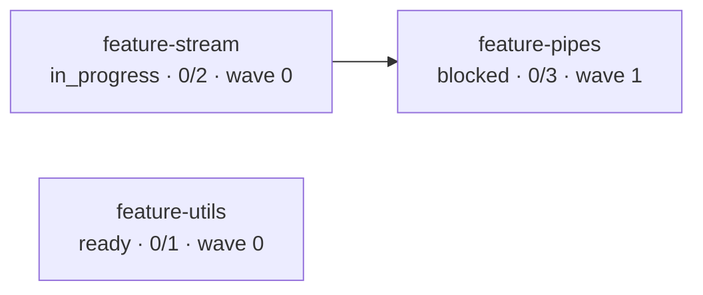

# Feature Management — Design Spec

**Date:** 2026-07-09
**Status:** Pending Review
**Scope:** Add first-class feature management surface to rdd-workflow (build, status, order, graph)
**Target Branch:** `master`

---

## 1. Background

`rdd-workflow` v2.0 ships a three-phase workflow (arch → plan → ship) that manages
individual OpenSpec changes. Each change goes through `propose → plan → execute → archive`
on its own. The dependency graph (file conflicts, ADR references, interface usage) is
computed in `skills/deps.md` at change granularity and persisted to
`.rddf/state/deps-analysis.json`.

In practice, projects ship a feature as a **bundle of related changes** (e.g. `feature-stream`
decomposes into `refactor-stream-base`, `add-m2sPipe`, `add-stream-tests`). Today the
project must track these bundles out-of-band — in heads, in a spreadsheet, or implicitly
via `feature-` name prefixes. The pieces for the data model already exist:

- `iteration.json` has a `parent_feature` field per change (schema v1)
- `iteration.derive_feature_name()` groups changes by explicit `parent_feature` or by
  the `feature-<name>-<part>` naming convention
- `guide-ship.md` uses `parent_feature` to drive worktree isolation and branch grouping
- Five unit tests already cover the derivation logic (`tests/unit/test_iteration.py` L537-644)

What's missing is the **management surface**: a single entry point that answers
"which changes belong to feature X, what's their status, what's the recommended order,
and what does the inter-feature dependency graph look like?"

This spec adds that surface as a thin, derived view — no new top-level entity, no schema
break, no migration.

## 2. Goals

1. Expose a new `feature` skill as the single entry point for feature-level views.
2. Compute four feature-level artifacts from existing per-change data:
   - **Summary table** — name, status, change count, archived count, wave, blocks/blocked-by
   - **Dependency graph** — Mermaid flowchart at feature granularity (not nested)
   - **Per-feature status** — drill into one feature's changes
   - **Execution order** — recommended wave ordering for shipping
3. Reuse the existing `parent_feature` + name-prefix derivation; do **not** introduce
   a new `feature.yaml` artifact.
4. Persist the derived view as a new `feature_view` node inside `iteration.json`,
   keyed by `schema_version` so future format changes are explicit.
5. Add a new `skills/_lib/feature_view.py` module: 5 pure step functions
   (Steps 1-5) plus one orchestrator (Step 6) that does IO. Pure steps are
   unit-testable in isolation; the orchestrator is covered by integration tests.
6. Add unit + integration tests covering the six-step pipeline and the four subcommands.

## 3. Non-Goals

- No new top-level feature entity (no `openspec/features/<name>/feature.yaml`).
- No cross-feature partial parallelism (only the conservative all-pairs hard-edge rule).
- No change of `parent_feature` derivation rules (keep `iteration.derive_feature_name()` as the single source of truth).
- No monitoring / live refresh — the view is recomputed on demand, not file-watcher-driven.
- No modification to `deps.md`, `status.md`, `propose.md`, `execute.md` bodies (they keep their current behavior; only their consumers change).
- No modification to existing `iteration.json` top-level fields; the `feature_view` is strictly additive.
- No CLI argument parser — subcommand dispatch is in the skill body via bash case statement.
- No new external dependencies (no `networkx`, no `graphviz`, no mermaid CLI).

## 4. Files In Scope

| File | Action | Notes |
|------|--------|-------|
| `skills/feature.md` | **Create** | New skill body, ~350 lines, frontmatter + 4 subcommand sections |
| `skills/_lib/feature_view.py` | **Create** | Pure-function Python module, ~250 lines, 6 step functions |
| `skills/_lib/schemas/feature_view_schema.json` | **Create** | JSON Schema v1 for the `feature_view` node |
| `tests/unit/test_feature_view.py` | **Create** | ~12 unit tests |
| `tests/integration/test_feature_skill.bats` | **Create** | ~6 integration tests |
| `skills/guide.md` | **Edit** | Add `feature` to recommender output list (1 line) |
| `skills/INSTALL.md` | **Edit** | Add `feature.md` to sub-skill list (1 line) |
| `README.md` | **Edit** | Add `feature` row to v2.0 new-features table (3 lines) |
| `AGENTS.md` | **Edit** | Add `feature.md` to `skills/` enumeration (1 line) |

Total: 5 created, 4 edited, 0 deleted.

**Not touched:** `deps.md`, `status.md`, `propose.md`, `execute.md`, `roadmap.md`,
`iteration.py`, `deps_output.py`, `iteration_schema.json`.

## 5. Architecture

```
┌─────────────────────────────────────────────────────────────────────┐
│                     User invokes feature skill                       │
│                                                                     │
│   skill_use("feature")              →  summary table (default)      │
│   skill_use("feature summary")      →  same as above                │
│   skill_use("feature graph")        →  Mermaid flowchart            │
│   skill_use("feature status <name>")→  per-feature change table     │
│   skill_use("feature order")        →  wave-grouped execution order │
└────────────┬────────────────────────────────────────────────────────┘
             │
             ▼
   skills/feature.md  (skill body, ~350 lines)
   - parses subcommand
   - calls feature_view.update_iteration_feature_view() to refresh
   - calls feature_view.render_*() to print
             │
             ▼
   skills/_lib/feature_view.py  (new, ~250 lines)
   ┌──────────────────────────────────────────────────────────┐
   │  Step 1  group_changes_by_feature(changes)               │
   │  Step 2  rollup_status(changes_in_feature)              │
   │  Step 3  compute_feature_edges(change_edges, groups)    │
   │  Step 4  compute_parallel_groups(edges, features)       │
   │  Step 5  render_mermaid(features, edges, conflicts, pg) │
   │  Step 6  update_iteration_feature_view(project_root)    │
   └──────────────────────────────────────────────────────────┘
             │                          │
             │ reads                    │ reads
             ▼                          ▼
   .rddf/state/iteration.json   .rddf/state/deps-analysis.json
   (changes + parent_feature)   (change-level deps + conflicts)
             │
             │ writes (atomic, FileLock, merge-on-save)
             ▼
   .rddf/state/iteration.json  (with new feature_view node)
```

**Reuse boundary (zero duplication):**
- `iteration.derive_feature_name(name, parent_feature)` — single source of truth for change→feature grouping
- `deps_output.load_analysis(project_root)` — reads deps-analysis.json
- `iteration.save(project_root, data)` — atomic write with FileLock, merge-on-save

**No-touch boundary:**
- `iteration.py` is not modified. `feature_view` is written via the existing
  `iteration.save()` API, so the lock, atomic write, and merge semantics are inherited
  without reimplementation.

## 6. Data Model

### 6.1 `iteration.json` extension (v1 additive)

```json
{
  "version": 1,
  "updated_at": "2026-07-09T12:34:56Z",
  "changes": { ... },
  "current_sprint": { ... },
  "feature_view": {
    "schema_version": 1,
    "updated_at": "2026-07-09T12:34:56Z",
    "features": {
      "feature-stream": {
        "name": "feature-stream",
        "status": "in_progress",
        "change_names": ["refactor-stream-base", "add-m2sPipe"],
        "change_count": 2,
        "archived_count": 0,
        "rollup_basis": "explicit",
        "depends_on": [],
        "blocks": ["feature-pipes"],
        "parallel_group": 0,
        "conflicts_with": []
      }
    },
    "execution_order": [
      ["feature-stream"],
      ["feature-pipes", "feature-utils"]
    ]
  }
}
```

### 6.2 Field reference

| Field | Type | Meaning |
|-------|------|---------|
| `schema_version` | int (=1) | Bumped on breaking changes |
| `updated_at` | ISO 8601 | When this view was last computed |
| `features` | dict[name, FeatureEntry] | One entry per feature |
| `FeatureEntry.name` | str | Feature name (kebab-case, same as derived from `derive_feature_name`) |
| `FeatureEntry.status` | enum | `blocked` \| `in_progress` \| `ready` \| `done` \| `ungrouped` |
| `FeatureEntry.change_names` | list[str] | Sorted change names belonging to this feature |
| `FeatureEntry.change_count` | int | len(change_names) |
| `FeatureEntry.archived_count` | int | Subset with status=archived |
| `FeatureEntry.rollup_basis` | enum | `explicit` (all from parent_feature) \| `name_prefix` (all from naming) \| `mixed` |
| `FeatureEntry.depends_on` | list[str] | Feature names that hard-block this one (all-pairs rule) |
| `FeatureEntry.blocks` | list[str] | Reverse edges for O(1) lookup |
| `FeatureEntry.parallel_group` | int | Wave index, 0 = first wave |
| `FeatureEntry.conflicts_with` | list[str] | Features with file-level conflicts (aggregated from deps-analysis.json) |
| `execution_order` | list[list[str]] | Wave-grouped topo sort; items at same index may run together |

### 6.3 Status enum semantics

| Status | Trigger |
|--------|---------|
| `blocked` | Any change has `status == "blocked_by"` |
| `in_progress` | Any change has `status in {"in_worktree", "in_progress"}` and none blocked |
| `ready` | All changes are in `proposed` / `planned` (and none in_worktree/blocked) |
| `done` | All changes have `status == "archived"` |
| `ungrouped` | Special: the synthetic `__ungrouped__` feature (changes with no parent_feature and no `feature-` prefix) |

Priority chain (first match wins): `blocked` > `in_progress` > `ready` > `done` > `ungrouped`.

### 6.4 Schema file

`skills/_lib/schemas/feature_view_schema.json` — JSON Schema Draft 2020-12, locks the
`feature_view` shape, referenced by `test_feature_view.py` for valid/invalid fixtures.
Bump `schema_version` on any breaking field change; consumers must reject `version=0`
payloads (mirrors `iteration_schema.json` convention).

## 7. Algorithm

### Step 1: `group_changes_by_feature(changes) -> dict[feature, list[change]]`

```python
def group_changes_by_feature(changes: list[dict]) -> dict[str, list[str]]:
    groups: dict[str, list[str]] = {}
    basis_per_feature: dict[str, set[str]] = {}  # track explicit vs prefix
    for ch in changes:
        feature = iteration.derive_feature_name(ch["name"], ch.get("parent_feature"))
        groups.setdefault(feature, []).append(ch["name"])
        # basis tracking: explicit if parent_feature field present
        basis = "explicit" if ch.get("parent_feature") else "name_prefix"
        basis_per_feature.setdefault(feature, set()).add(basis)
    # Post-process: mark rollup_basis per feature
    # ... (uniform → "explicit" or "name_prefix", mixed → "mixed")
    return groups
```

Changes with no `parent_feature` and no `feature-` prefix are bucketed into a
synthetic `__ungrouped__` feature (status=`ungrouped`).

### Step 2: `rollup_status(changes_in_feature) -> str`

```python
PRIORITY = ["blocked_by", "in_worktree", "in_progress", "proposed", "planned", "archived"]
# Map to feature status:
#   any blocked_by     → "blocked"
#   any in_worktree/in_progress → "in_progress"
#   all proposed/planned → "ready"
#   all archived       → "done"
```

Edge case: empty `__ungrouped__` is itself ungrouped by definition.

### Step 3: `compute_feature_edges(change_edges, feature_groups) -> list[tuple]`

```python
def compute_feature_edges(deps_analysis: dict, groups: dict) -> list[tuple[str, str, str]]:
    edges = []
    for fa, fa_changes in groups.items():
        for fb, fb_changes in groups.items():
            if fa >= fb:  # avoid duplicates and self
                continue
            # Count change-level hard edges from fa → fb
            n = 0
            for from_ch in fa_changes:
                info = deps_analysis.get("changes", {}).get(from_ch, {})
                blocker = info.get("blocker")
                if blocker in fb_changes:
                    n += 1
            m = len(fa_changes) * len(fb_changes)
            if m > 0 and n == m:
                edges.append((fa, fb, "hard"))
            # 0 < n < m → partial → no feature-level edge (conservative)
            # n == 0 → no edge
    return edges
```

Conflicts aggregated similarly from `deps_analysis.changes[*].conflicts`.

### Step 4: `compute_parallel_groups(edges, features) -> dict[str, int]`

BFS topological layering:

```python
def compute_parallel_groups(edges, features):
    in_degree = {f: 0 for f in features}
    for fa, fb, _ in edges:
        in_degree[fb] = in_degree.get(fb, 0) + 1
    wave = 0
    groups = {}
    remaining = set(features)
    while remaining:
        wave_features = [f for f in remaining if in_degree.get(f, 0) == 0]
        if not wave_features:
            raise FeatureCycleError(list(remaining))
        for f in wave_features:
            groups[f] = wave
            remaining.discard(f)
        # decrement in-degree for the next iteration
        for fa, fb, _ in edges:
            if fa in wave_features and fb in remaining:
                in_degree[fb] -= 1
        wave += 1
    return groups
```

Cycles raise `FeatureCycleError`; the caller catches it, marks
`feature_view.__cycle_warning__: true`, and renders the partial graph with a warning banner.

### Step 5: `render_mermaid(features, edges, conflicts, parallel_groups) -> str`

```python
def render_mermaid(features, edges, conflicts, pg):
    lines = ["flowchart LR"]
    for f, info in features.items():
        label = f"{info['name']}<br/>{info['status']} · {info['archived_count']}/{info['change_count']} · wave {info['parallel_group']}"
        lines.append(f'  {info["name"]}["{label}"]')
    for fa, fb, _ in edges:
        lines.append(f"  {fa} --> {fb}")
    for fa, fb in conflicts:
        lines.append(f"  {fa} -.->|冲突| {fb}")
    return "\n".join(lines)
```

**Scope:** feature-level topology only. No nested `subgraph` for inner changes (decision Q3).

### Step 6: `update_iteration_feature_view(project_root) -> int`

```python
def update_iteration_feature_view(project_root: str) -> int:
    data = iteration.load(project_root)
    if data is None:
        raise NoIterationError("iteration.json missing — run guide-plan first")
    changes = list(data.get("changes", {}).values())
    deps = deps_output.load_analysis(project_root) or {}
    groups = group_changes_by_feature(changes)
    features = {}
    for name, ch_names in groups.items():
        ch_records = [data["changes"][n] for n in ch_names]
        features[name] = {
            "name": name,
            "status": rollup_status(ch_records),
            "change_names": sorted(ch_names),
            "change_count": len(ch_names),
            "archived_count": sum(1 for c in ch_records if c.get("status") == "archived"),
            "rollup_basis": _compute_basis(ch_records),
            "depends_on": [],
            "blocks": [],
            "parallel_group": 0,  # filled below
            "conflicts_with": [],
        }
    edges = compute_feature_edges(deps, groups)
    pg = compute_parallel_groups(edges, features)
    for name in features:
        features[name]["parallel_group"] = pg[name]
    for fa, fb, _ in edges:
        features[fa]["blocks"].append(fb)
        features[fb]["depends_on"].append(fa)
    features = _attach_conflicts(features, deps)
    execution_order = _waves_to_order(pg)
    cycle_warning = False
    try:
        # Re-validate parallel groups after attaching conflicts/edges, in case
        # conflicts introduced a new cycle (the conflict edges are not in the
        # main graph but the user should be warned anyway).
        compute_parallel_groups(edges, features)
    except FeatureCycleError as exc:
        cycle_warning = True
        data.setdefault("__warnings__", {})["feature_cycle"] = list(exc.cycle)
    data["feature_view"] = {
        "schema_version": 1,
        "updated_at": _now_iso(),
        "features": features,
        "execution_order": execution_order,
    }
    if cycle_warning:
        data["feature_view"]["__cycle_warning__"] = True
    iteration.save(project_root, data)
    return len(features)
```

## 8. User Interface

### 8.1 `feature.md` skill frontmatter

```yaml
---
name: feature
description: View and manage features (groups of related changes). Lists feature status, renders Mermaid dependency graph, shows per-feature change status, and recommends execution order. Pure derived view from iteration.json + deps-analysis.json.
license: MIT
compatibility: Requires iteration.json (run guide-plan once first) and ideally deps-analysis.json (run deps first for full graph).
metadata:
  author: sisyphus
  version: "1.0"
  depends-on: [iteration, deps_output]
---
```

### 8.2 Subcommand dispatch

```bash
# Default: summary table
skill_use("feature") | skill_use("feature summary")

# Mermaid flowchart
skill_use("feature graph")

# Per-feature drill-down
skill_use("feature status feature-stream")

# Wave-ordered execution recommendation
skill_use("feature order")
```

### 8.3 Sample outputs

**`feature` (summary)**:

```markdown
| Feature | Status | Changes | Progress | Wave | Blocks | Blocked by |
|---------|--------|---------|----------|------|--------|------------|
| feature-stream | 🟡 in_progress | 2 | 0/2 (0%) | 0 | feature-pipes | — |
| feature-pipes | 🔴 blocked | 3 | 0/3 (0%) | 1 | — | feature-stream |
| feature-utils | 🟢 ready | 1 | 0/1 (0%) | 0 | — | — |

__ungrouped__: 1 change (fix-typo in README)
```

**`feature graph`**:



**`feature status feature-stream`**:

```markdown
## feature-stream

- **Status:** in_progress
- **Rollup basis:** explicit (all changes have parent_feature)
- **Change count:** 2 (archived: 0)
- **Wave:** 0 (no incoming edges)
- **Blocks:** feature-pipes

| Change | Status | Blocker | Phase | Category |
|--------|--------|---------|-------|----------|
| refactor-stream-base | in_worktree | — | phase-3 | feature |
| add-m2sPipe | ready | — | phase-3 | feature |
```

**`feature order`**:

```markdown
## Recommended execution order

- **Wave 0** (run in parallel):
  - feature-stream (in_progress · 0/2)
  - feature-utils (ready · 0/1)
- **Wave 1** (after wave 0):
  - feature-pipes (blocked · 0/3)
- **Wave 2** (after wave 1):
  - feature-tests (blocked · 0/2)
```

## 9. Error Handling

| Scenario | Behavior | Exit |
|----------|----------|------|
| `iteration.json` missing | Print "请先运行 `guide-plan` 至少一次" to stderr | 1 |
| `deps-analysis.json` missing | Skip edge/conflict computation; features + status still printed with hint | 0 |
| No `parent_feature` + no `feature-` prefix anywhere | Print empty table + hint to use naming or set `parent_feature` in proposal | 0 |
| Topological cycle | Set `__cycle_warning__: true`, list cycle members, still print partial output | 0 |
| `FileLock` timeout | Print lock-path + hint; suggest retry | 1 |
| Unknown subcommand | Print usage to stderr | 2 |
| `<name>` not found in `feature status <name>` | List all known features to stderr, suggest close matches | 1 |

**No uncaught exceptions** reach the user; all failures are caught at the skill-body
boundary and rendered as actionable messages.

## 10. Testing

### 10.1 Unit tests (`tests/unit/test_feature_view.py`, ~12 cases)

| Test | Asserts |
|------|---------|
| `test_group_explicit_parent_feature` | All changes have `parent_feature` → grouped by that field |
| `test_group_name_prefix` | No `parent_feature`, all `feature-stream-*` → grouped under `feature-stream` |
| `test_group_mixed` | Some explicit, some prefix → both in same feature, `rollup_basis="mixed"` |
| `test_group_ungrouped` | Change with neither → bucketed in `__ungrouped__` |
| `test_rollup_blocked_wins` | Feature with one blocked change → status `blocked` |
| `test_rollup_in_progress_next` | Feature with in_worktree + ready → status `in_progress` |
| `test_rollup_all_archived_is_done` | All archived → status `done` |
| `test_rollup_all_proposed_is_ready` | All proposed → status `ready` |
| `test_edge_all_pairs_hard` | 2×3 change pairs all present → 1 feature edge |
| `test_edge_partial_no_edge` | 3 of 6 pairs present → 0 feature edges (conservative) |
| `test_edge_disjoint_no_edge` | No change-level edges → 0 feature edges |
| `test_parallel_groups_diamond` | 4 features in diamond shape → 3 waves, wave 0 has 1 feature |
| `test_parallel_groups_cycle_raises` | Cycle raises `FeatureCycleError`, caller can catch |
| `test_mermaid_shape` | Output contains `flowchart LR`, one node per feature, edges rendered |
| `test_schema_validation` | Built `feature_view` passes `feature_view_schema.json` |
| `test_lock_save_atomic` | `update_iteration_feature_view` survives concurrent calls (mocked lock contention) |

### 10.2 Integration tests (`tests/integration/test_feature_skill.bats`, ~6 cases)

| Test | Asserts |
|------|---------|
| `feature summary populates iteration.json` | Run on a real project fixture, `feature_view` node present with all 4 fields |
| `feature graph emits mermaid block` | Output contains `mermaid` fence + all feature node names |
| `feature status <name> lists changes` | Output contains the feature's changes in a table |
| `feature order lists waves` | Output contains "Wave 0" / "Wave 1" headers |
| `empty project graceful output` | No changes → empty table + helpful hint, exit 0 |
| `missing deps-analysis.json still works` | features + status present, hint about running deps printed |

### 10.3 Contract tests

- `feature_view_schema.json` fixture tests: 6 cases (valid / missing field / wrong type / wrong version)
- Lock semantics: mirror `iteration.py` test pattern (concurrent save is safe)

### 10.4 CI constant-truth gate

`grep -rn "assert .* or True" tests/` must remain empty (project-wide CI rule).
All new tests use plain `assert` with informative messages.

## 11. Blast Radius (documentation touch-ups)

| File | Change |
|------|--------|
| `skills/guide.md` | Add `feature` to the recommender's output (one bullet in the suggested-skills list) |
| `skills/INSTALL.md` | Add `feature.md` to the sub-skill installation list (one bullet) |
| `README.md` | Add row to v2.0 new-features table (3 lines) |
| `AGENTS.md` | Add `skills/feature.md` to the directory tree (1 line) |

No behavioral changes to other skills; the new skill is a pure addition.

## 12. Migration & Compatibility

- **Backward compatible:** existing `iteration.json` files without `feature_view` are
  handled gracefully — the skill detects absence and computes on first run.
- **No data migration script:** the `feature_view` is purely derived and recomputed
  on demand.
- **No schema version bump of iteration.json:** the new field is additive under the
  existing `version: 1`. The `feature_view` itself has its own `schema_version: 1`
  so future format changes don't pollute the iteration schema.

## 13. Open Questions

None at spec time. All design decisions were resolved during brainstorming
(5 user-confirmed choices: data model on existing parent_feature, edge rule all-pairs-hard,
feature-only graph, priority status rollup, snapshot in iteration.json `feature_view`).

## 14. Out of Scope (explicit deferrals)

- Feature ownership / assignee fields
- Feature-level deadlines / time estimates
- Feature archive flow (changes archive individually; no "archive all of feature X" yet)
- File-watcher-driven live graph refresh
- Cross-feature partial parallelism (only the all-pairs-hard rule is supported)
- CLI flag integration with `openspec` CLI
