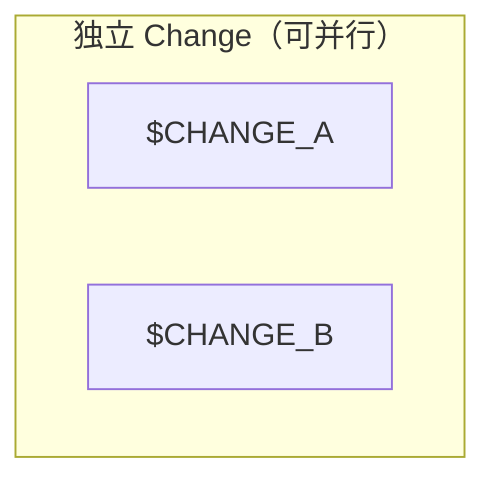
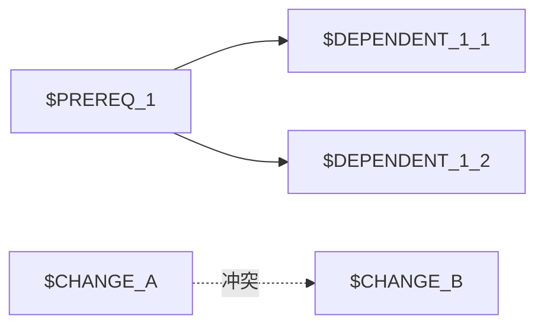

# OpenSpec 工作流 — 依赖分析 (Deps)

分析多个候选 change 之间的依赖关系，辅助 plan 阶段的选择决策。

> 🧪 **AI 语义分析为实验性功能** — 在 subagent 不可用时,deps.md 自动降级为静态三轴分析 (Step 2),功能行为不变.

## 工作流位置

```
propose → deps（本技能）→ plan Phase 1（携带依赖信息选择 change）
                              ↓
            worktree execute → merge → archive
```

## 输入

来自 plan Phase 0 的候选 change name 列表，以及每个 change 的 artifacts：

```
openspec/changes/<name>/
├── proposal.md          → 提取 In Scope 文件路径、ADR 引用
├── design.md            → 提取接口定义和接口使用
└── specs/*.md           → 提取规范引用
```

## 输出

```
┌─────────────────────────────────────────┐
│ 依赖图（Mermaid flowchart）              │
│ Change 状态表（ready/blocked/prereq）     │
│ 推荐执行顺序                              │
│ 冲突警告（同一文件的多 change 修改）      │
└─────────────────────────────────────────┘
```

---

## 流程

### Step 0：读取候选列表（来自 plan 的共享文件）

从 plan Phase 0.5 写入的 `.rddf/state/.deps-candidates.json` 文件读取候选 change name 列表。

```bash
PROJECT_ROOT=$(git rev-parse --show-toplevel 2>/dev/null || pwd)
DEPS_INPUT="$PROJECT_ROOT/.rddf/state/.deps-candidates.json"
DEPS_OUTPUT="$PROJECT_ROOT/.rddf/state/.deps-output.md"

if [ ! -f "$DEPS_INPUT" ]; then
  echo "❌ 找不到候选列表文件: $DEPS_INPUT"
  echo "请先运行 plan Phase 0.5 的 Step 1 生成该文件"
  exit 1
fi

# 从 JSON 读取候选 change name 列表
mapfile -t CANDIDATES < <(python3 -c "
import json, sys
with open('$DEPS_INPUT') as f:
    data = json.load(f)
for name in data.get('candidates', []):
    print(name)
")

echo "📋 读取到 ${#CANDIDATES[@]} 个候选 change："
for name in "${CANDIDATES[@]}"; do
  echo "  - $name"
  # 验证 change 目录存在
  if [ ! -d "$PROJECT_ROOT/openspec/changes/$name/" ]; then
    echo "    ❌ Change '$name' 目录不存在，跳过"
  fi
done
```

---

### Step 1：读取每个 change 的 artifact

对每个候选 change，提取三组关键信息。

#### 1a. 从 proposal.md 提取 In Scope 文件路径

```bash
if [ ! -f "$PROJECT_ROOT/openspec/changes/<name>/proposal.md" ]; then
  echo "  ⚠️  $name: skeleton change missing proposal.md — skipping"
  continue
fi
SCOPE_FILES=$(grep -E '^[ \t]*-[ \t]*(修改文件|文件|路径)：?' "$PROJECT_ROOT/openspec/changes/<name>/proposal.md" 2>/dev/null \
  | sed 's/.*：//; s/.*://; s/^[ \t]*-[ \t]*//' \
  | tr ',' '\n' \
  | sed 's/^[ \t]*//' \
  | grep -v '^$')
```

#### 1b. 从 proposal.md 提取 ADR 引用

```bash
ADR_REFS=$(grep -E 'ADR-[0-9]+' "$PROJECT_ROOT/openspec/changes/<name>/proposal.md" 2>/dev/null | grep -o 'ADR-[0-9]*' | sort -u)
```

#### 1c. 从 design.md 提取接口定义和接口使用

```bash
# 接口定义：查找函数/类声明模式
IFACE_DEF=$(grep -E '^[ \t]*(定义|接口|提供)：' "$PROJECT_ROOT/openspec/changes/<name>/design.md" 2>/dev/null \
  | sed 's/.*：//; s/.*://')

# 接口使用：查找依赖的外部接口
IFACE_USE=$(grep -E '^[ \t]*(使用|调用|依赖)：' "$PROJECT_ROOT/openspec/changes/<name>/design.md" 2>/dev/null \
  | sed 's/.*：//; s/.*://')
```

#### 1d. 汇总每个 change 的结构化数据

```yaml
# 用于后续分析的内部数据结构
<name>:
  files_in_scope: ["include/chlib/stream_operators.h", ...]
  adr_refs: ["ADR-022", "ADR-019"]
  interfaces_def: ["Stream::setBufferSize"]
  interfaces_use: ["MemoryPool::allocate"]
```

#### 1e. 读取 `roadmap-meta.yaml`（P1-9：阶段预检数据源）

> **为什么需要这一步**：`propose` 阶段会为每个新 change 写入
> `openspec/changes/<name>/roadmap-meta.yaml`，记录该 change 的
> `phase`（所属阶段）和 `category`（类型）。`deps` 必须读取它，
> 以便 Step 5 输出"阶段预检"表，提示用户该 change 是否在当前阶段内。
> 对于尚未生成 `roadmap-meta.yaml` 的旧 change，使用"compat 模式"
> 优雅降级（输出 `⚠️ 无 roadmap-meta`），不破坏现有流程。

```bash
# 1e. Read roadmap-meta.yaml for each candidate (if exists)
for name in "${CANDIDATES[@]}"; do
  meta_file="$PROJECT_ROOT/openspec/changes/$name/roadmap-meta.yaml"
  if [ -f "$meta_file" ]; then
    PHASE=$(grep -E "^\s*phase:" "$meta_file" | awk '{print $2}' | tr -d '"' | head -1)
    CATEGORY=$(grep -E "^\s*category:" "$meta_file" | awk '{print $2}' | tr -d '"' | head -1)
    # 保存为间接变量（兼容 bash 3.x / POSIX sh）
    eval "PHASE_$name=\"\$PHASE\""
    eval "CATEGORY_$name=\"\$CATEGORY\""
    echo "  $name → phase=$PHASE, category=$CATEGORY"
  else
    echo "  $name → (no roadmap-meta, compat mode)"
  fi
done
```

---

### Step 2：三轴依赖检测

#### 轴 1：文件冲突检测

对每对 change A 和 B，检查其 scope 文件列表是否有交集：

```bash
for a in $CANDIDATES; do
  for b in $CANDIDATES; do
    [ "$a" = "$b" ] && continue
    # 取交集（用 eval 实现间接变量展开，兼容 bash 3.x / POSIX sh）
    files_var_a="FILES_$a"
    files_var_b="FILES_$b"
    COMMON=$(comm -12 <(eval "echo \"\${$files_var_a}\"" | sort) <(eval "echo \"\${$files_var_b}\"" | sort))
    if [ -n "$COMMON" ]; then
      echo "⚠️  $a ←→ $b: 文件冲突 ($COMMON)"
    fi
  done
done
```

**判定规则**：

| 交集情况 | 判定 |
|----------|------|
| 无交集 | 无冲突，可并行 |
| 交集 ≠ ∅，且均为同一类型的"实现文件"（src/ 下） | 冲突，不能并行，建议合并或顺序执行 |
| 交集 ≠ ∅，一方是"头文件"（include/），另一方是"实现文件"（src/） | 依赖关系（头文件提供者优先） |

#### 轴 2：ADR 依赖链检测

ADR（Architecture Decision Record）是 change 之间的间接依赖纽带：

```bash
# 构建 ADR → Change 的映射（使用间接变量展开）
for name in $CANDIDATES; do
  adr_var="ADR_REFS_$name"
  for adr in $(eval "echo \${$adr_var}"); do
    echo "$adr ← $name"
  done
done
```

**判定规则**：

| ADR 引用情况 | 判定 |
|-------------|------|
| A 和 B 引用同一个 ADR | 共享同一架构决策，建议顺序执行（A→B 或 B→A 均可） |
| A 引用 ADR-N，B 的 scope 包含"实现 ADR-N" | B 是 A 的前置 |
| A 的 scope 包含"实现 ADR-N"，B 引用 ADR-N | B 依赖 A |

#### 轴 3：接口依赖检测

```bash
# 检查 A 定义了接口 X，B 使用了接口 X（使用间接变量展开）
# Skeleton 兼容: 跳过无 design.md 的 change（axis 3 需要 design.md 中的接口定义）
SKELETON_COUNT=0
for a in $CANDIDATES; do
  for b in $CANDIDATES; do
    [ "$a" = "$b" ] && continue
    iface_var_a="IFACE_DEF_$a"
    iface_use_var_b="IFACE_USE_$b"
    # 检查 a 是否有 design.md（skeleton change 没有）
    if [ ! -f "$PROJECT_ROOT/openspec/changes/$a/design.md" ]; then
      SKELETON_COUNT=$((SKELETON_COUNT + 1))
      continue
    fi
    for iface in $(eval "echo \${$iface_var_a}"); do
      if eval "echo \${$iface_use_var_b}" | grep -q "$iface"; then
        echo "📦 $b 依赖 $a (接口: $iface)"
      fi
    done
  done
done
if [ "$SKELETON_COUNT" -gt 0 ]; then
  echo "  ⏭️  Axis 3 (interface) skipped for $SKELETON_COUNT skeleton change(s)"
fi
```

**判定规则**：

| 接口关系 | 判定 |
|---------|------|
| A 定义 X，B 使用 X | B 依赖 A（B → A） |
| A 和 B 都定义 X | 可能重复，建议合并 |
| A 和 B 都使用 X（第三方） | 无关，可并行 |

---

### Step 3：调用子代理进行语义级依赖分析

#### 3a. 为什么要子代理

静态三轴分析（Step 2）基于 grep 模式匹配，能捕捉**显式依赖**（如 ADR 编号、文件路径），但无法识别**隐式依赖**：

| 依赖类型 | 静态分析 | 子代理分析 |
|---------|---------|-----------|
| 文件路径交集 | ✅ 可检测 | ✅ 可检测 |
| ADR 编号引用 | ✅ 可检测 | ✅ 可检测 + 理解语义 |
| 接口定义/使用 | ⚠️ 需设计.md 格式化 | ✅ 自然语言理解 |
| 语义重叠（如 A 的"数据流"和 B 的"数据管道"实为同一概念） | ❌ 无法检测 | ✅ 可识别 |
| change 粒度过大/过小 | ❌ 无法判断 | ✅ 可给出拆分/合并建议 |
| 缺失前置 change | ❌ 未记录的依赖 | ✅ 可基于领域知识推断 |

#### 3b. 子代理输入

为子代理准备以下上下文：

```markdown
---
## 当前项目上下文
- 项目类型: C++ 硬件描述语言 / Chisel / Verilog 生成
- 待分析的 change 列表: [refactor-stream-base, add-m2sPipe, fix-ns-pollution]

## 每个 change 的 artifacts

### refactor-stream-base
proposal.md 摘要:
  - 架构依据: ADR-022 §3.2, ADR-019 §4.1
  - In Scope: include/chlib/stream.h, src/chlib/stream.cpp
  - 关键场景: 重构 Stream 基类，添加虚接口
design.md 摘要:
  - 接口定义: Stream::setBufferSize(), Stream::getBufferSize()
  - 依赖: MemoryPool

### add-m2sPipe
proposal.md 摘要:
  - 架构依据: ADR-022 §3.2
  - In Scope: include/chlib/stream_operators.h
  - 关键场景: 实现 m2sPipe 操作符
design.md 摘要:
  - 接口使用: Stream::setBufferSize()
  - 依赖: Stream 基类

### fix-ns-pollution
proposal.md 摘要:
  - 架构依据: ADR-015
  - In Scope: include/utils/namespaces.h, src/utils/namespaces.cpp
  - 关键场景: 修复命名空间污染

---
## 静态分析结果（供参考）
- add-m2sPipe 引用 ADR-022，refactor-stream-base 也引用 ADR-022
- refactor-stream-base 和 add-m2sPipe 均涉及 Stream 相关文件
- fix-ns-pollution 涉及独立的命名空间模块
```

#### 3c. 子代理任务定义

```markdown
## 任务：分析这些 change 之间的依赖关系

请完成以下分析：

1. **依赖关系**：列出每对 change 之间的依赖方向（A 依赖 B / B 依赖 A / 无关）
   - 对每条依赖给出理由（引用 artifact 原文）
   - 置信度：高/中/低

2. **阻塞关系**：哪些 change 必须在前置完成后才能开始？
   - 直接阻塞（A 用了 B 的接口）
   - 间接阻塞（A 和 B 共享同一核心数据结构的修改）

3. **粒度评估**：每个 change 的范围是否合理？
   - 过大（应该拆分为多个子 change）
   - 过小（可以合并到其他 change）
   - 跨模块（核心逻辑 + 测试可以拆分）

4. **重组建议**：如果发现有粒度问题，给出具体建议
   - 拆分：X change 可以拆分为 [X-core, X-adapters, X-tests]
   - 拆分时请指定 parent_feature（即父 feature 名称，如 "feature-stream"）
   - 合并：[X, Y] 可以合并为一个 change（因为 X 和 Y 改同一核心）

5. **推荐执行顺序**：考虑依赖和冲突后的最优执行路径
   - 串行依赖链
   - 可并行部分
```

#### 3d. 子代理输出格式

```markdown
## 依赖分析报告

### 识别到的依赖
| Change A | Change B | 关系 | 理由 | 置信度 |
|----------|----------|------|------|--------|
| refactor-stream-base | add-m2sPipe | B 依赖 A | add-m2sPipe 使用了 Stream 基类接口（design.md: "依赖: Stream 基类"） | 高 |
| add-m2sPipe | add-s2mPipe | 冲突 | 修改同一文件 stream_operators.h，且一个的 output 是另一个的 input | 高 |
| fix-ns-pollution | (其他) | 无关 | 涉及 namespace 模块，与其他 change 无交互 | 高 |

### 粒度评估
- refactor-stream-base: ✅ 合理
- add-m2sPipe: ✅ 合理
- fix-ns-pollution: ✅ 合理

### 建议
- 建议先执行 refactor-stream-base，再执行 add-m2sPipe
- fix-ns-pollution 可与其他 change 并行
- **建议拆分**: add-stream-pipes 拆分为 [add-stream-pipe-core, add-stream-pipe-tests]
  - parent_feature: "feature-stream-pipes"
```

#### 3e. 子代理调用 (task API)

```python
# 实现：调用子代理读取每个 change 的 artifacts，返回语义级依赖分析
# subagent_type="general-purpose"：读+推理混合任务（不限于只读 explore）
# 失败时返回非零 → 见 Step 3f 降级路径
task(
    subagent_type="general-purpose",
    run_in_background=false,
    load_skills=[],
    prompt=f"""
        为以下 {CANDIDATES_COUNT} 个 OpenSpec change 做语义级依赖分析。
        每个 change 含 3 个 artifacts（必读）:
        - openspec/changes/<name>/proposal.md
        - openspec/changes/<name>/design.md
        - openspec/changes/<name>/tasks.md

        输出 JSON:
        {{
          "ai_deps": [{{"from": "<name>", "to": "<name>", "kind": "soft|hard", "reason": "..."}}],
          "suggestions": [{{"change": "<name>", "action": "split|merge|reorder", "parent_feature": "<feature-name>", "reason": "..."}}],
          "fallback": false
        }}
    """,
)
```

#### 3e+. 子代理调用方式（bash runtime 包装）

```bash
# 实际 bash runtime: 调用 task() 子代理, 写入 .rddf/state/.deps-ai-result.json
# 失败条件: subagent 未安装 / 返回非零 / 输出非 JSON / 超时 → 降级
echo "🤖 正在调用子代理进行语义级依赖分析..."
echo "   传递 $CANDIDATES_COUNT 个 change 的 artifacts 摘要"

AI_RESULT_FILE=".rddf/state/.deps-ai-result.json"
if [ -f "$AI_RESULT_FILE" ] && [ -n "${AI_RESULT_FILE:-}" ]; then
    # 成功路径: 子代理已写入结果
    echo "✅ AI 语义分析结果: $AI_RESULT_FILE"
else
    # 失败路径: 子代理不可用或返回失败 → 降级
    echo "⚠️ AI 子代理未启用, 使用静态三轴分析" >&2
    AI_RESULT_FILE=""
fi
```

> **执行契约**: 成功路径将 JSON 写入 `.rddf/state/.deps-ai-result.json`,失败路径将 `AI_RESULT_FILE` 置空。Step 5 heredoc 根据此变量决定 AI 建议章节内容。

#### 3f. 失败降级 (fallback)

**触发条件** (任一):
- 子代理未安装（`task` 子命令不可用）
- 子代理调用返回非零退出码
- 子代理输出不是合法 JSON
- 调用超时（> 60s）

**降级行为**:
- stderr 记录 `⚠️ Subagent call failed: <reason>`
- 置 `AI_RESULT_FILE=""`（空字符串）
- **不中断流程**: 继续进入 Step 4/5,使用 Step 2 静态三轴分析的结论
- 标记 `fallback: true`（供下游消费者检测）

**下游效应**: Step 5 heredoc 检测到空 `AI_RESULT_FILE` → 写入 `⚠️ **AI 语义分析未启用 (fallback)**` 标记,消费者可据此依赖静态三轴分析。

> 关键词 `降级` / `fallback` 出现在本节 + Step 5 输出,供 `test_deps_subagent.bats:降级|fallback` 锁测试。

---

### Step 4：综合分类标记（融合静态 + AI 结果）

融合 Step 2 的静态三轴分析 + Step 3 的子代理分析结果，为每个 change 打最终标记。

**融合策略**：

| 场景 | 静态分析判定 | AI 分析判定 | 最终判定 |
|------|-------------|------------|---------|
| 一致 | A 阻塞 B | A 阻塞 B | ✅ 采用，置信度叠加 |
| AI 补充 | 无依赖 | A 隐式依赖 B | ⚠️ 采用 AI 结果，标记为 low_conf |
| 静态补充 | A 依赖 B（文件交集） | 无依赖 | ✅ 采用静态结果（显式证据更可靠） |
| 冲突 | A 依赖 B | B 依赖 A | 🔴 标记为 cycle，提示人工排查 |
| AI 新发现 | — | 粒度建议（拆分/合并） | 📝 加入建议列表 |

```python
# 融合判定逻辑
for each change:
  # 基础分类（来自静态分析）
  status = initial_status_from_static
  blocks = []       
  blocked_by = []   
  conflicts = []    

  # 叠加 AI 结果
  if AI says "A blocks B":
    add_to_blocked(B, A)
  if AI says "粒度过大":
    add_suggestion("拆分")
  if AI signals "隐式依赖":
    mark_as_low_conf(dep)
  
  # 冲突处理
  if static_dep and ai_dep disagree:
    mark_as_cycle()
```

**输出标记**：

| 标记 | 含义 | 颜色 |
|------|------|------|
| ✅ `ready` | 无前置依赖，可直接 plan | 绿色 |
| 🥇 `prerequisite` | 是多个其他 change 的前置，建议优先 | 蓝色 |
| ⚠️ `blocked_by` | 被其他 change 阻塞 | 黄色 |
| 🔴 `conflict` | 与另一 change 有文件冲突 | 红色 |

---

### Step 5：生成输出并写入文件

将 5a-5e 的内容写入 `.rddf/state/.deps-output.md`，供 plan Phase 1 消费。

```bash
# P0-3: Step 5 重构 — 160 行 inline bash 块提取到 _lib/deps_render_report.sh
# 内部渲染逻辑已迁移到 _lib/deps_output.py::render_markdown_report (有 Python unit 覆盖).
# - Mermaid 依赖图 (skeleton changes 用 [[name]] 标记)
# - 阶段预检表 (in-phase / out-of-phase / missing-meta)
# - Change 状态表 (ready / blocked_by from AI hard deps)
# - 推荐执行顺序
# - 冲突警告占位符
# - AI 分析建议 (rich if ai_result_file exists, fallback otherwise)
source "${PROJECT_ROOT:-/nonexistent}/.opencode/skills/_lib/skill_root.sh" 2>/dev/null || source "$HOME/.agents/skills/_lib/skill_root.sh"
source "$(resolve_rdd_skill_dir deps)/scripts/deps_render_report.sh"
render_deps_report
```
**输出文件格式**（`.rddf/state/.deps-output.md` 包含以下 5 个章节，所有示例值为运行时注入的模板）：

#### 5a. 依赖图（Mermaid 格式）

<!-- TEMPLATE: 以下为示例，实际值由运行时分析结果注入 -->

**独立 Change（无依赖）正确画法**：


**有依赖关系的 Change 画法**：


**【重要】Mermaid 语法规范**：
- 独立 change **不要画箭头**，使用 `subgraph` 分组或 `&` 连接并行节点
- 有依赖的 change 用 `-->` 箭头表示
- 冲突用 `-.->|冲突|` 表示

#### 5b. Change 状态表

<!-- TEMPLATE: 以下为示例，实际值由运行时分析结果注入 -->
| Change | 状态 | 阻塞于 | 阻塞了谁 | 冲突 | 置信度 | 推荐 |
|--------|------|--------|---------|------|--------|------|
| change-A | 🥇 prerequisite | — | change-B | — | 高 | 第 1 优先 |
| change-C | ✅ ready | — | — | — | 高 | 第 2 |
| change-B | ⚠️ blocked_by | change-A | — | — | 高 | 等 A 完成后 |

（置信度列标注了静态/AI 混合分析的可信程度）

#### 5c. 推荐执行顺序

<!-- TEMPLATE: 以下为示例，实际值由运行时分析结果注入 -->
```
1. `change-A`              ← 所有 change 的前置
2. `change-C`              ← 与 1 无冲突，可并行
3. `change-B`              ← 阻塞于 change-A
```

#### 5d. 冲突警告摘要

<!-- TEMPLATE: 以下为示例，实际值由运行时分析结果注入 -->
```
🔴 文件冲突:
  change-B ←→ change-D: path/to/conflict_file.h
  建议：合并为一个 change，或顺序执行后人工解决冲突
```

#### 5e. 🧠 AI 分析建议（动态输出）

依赖 Step 3 的子代理调用结果，分两种输出模式：

- **成功路径** (子代理可用): 渲染 `.rddf/state/.deps-ai-result.json` 中的 `ai_deps` + `suggestions` 字段。
  消费者应将此视为**低置信度补充**，不可作为唯一决策依据。
- **失败 / 降级路径** (子代理不可用): 写入 `⚠️ **AI 语义分析未启用 (fallback)**` 标记。
  消费者应仅依赖 Step 2 静态三轴分析 (文件冲突 / ADR 引用 / 接口依赖)。

**缺失能力 (仅 fallback 路径)**:
- 语义依赖分析（隐式依赖推断）
- 粒度评估（过大/过小判定）
- 重组建议（合并/拆分/重排）

**参考**: 详见 Step 3e (子代理调用) + Step 3f (失败降级契约) + Step 5 heredoc (`AI_RESULT_FILE` 分支)。

---

## 输出格式（消费方指南）

本技能的全部输出写入 `.rddf/state/.deps-output.md`，由 plan Phase 1 读取消费。

输出文件包含以下数据：

1. **依赖图**（5a）：Mermaid flowchart，用于可视化展示 change 间关系
2. **阶段预检**（P1-9 新增）：基于 `roadmap-meta.yaml` 判断每个 change 是否在当前阶段内
   - 缺失 `roadmap-meta.yaml` 的 change 走 compat 模式，标注 ⚠️，不阻塞流程
   - 命中当前阶段（由环境变量 `ROADMAP_CURRENT_PHASE` 注入）→ ✅ 在阶段内
   - 未命中 → ⚠️ 不在当前阶段
3. **Change 状态表**（5b）：用于在用户选择时标记每个 change 的状态（ready/prerequisite/blocked_by）
   - `置信度` 列可用来决定是否强制建议（高置信度 → 强推荐，低置信度 → 仅提示）
4. **推荐执行顺序**（5c）：用于对候选列表重新排序（prerequisite 置顶）
5. **冲突警告**（5d）：用于在用户选择冲突的 change 时给出提示
6. **AI 分析建议**（5e）：**动态输出** (子代理成功时渲染 JSON 报告 / fallback 时输出 `AI 语义分析未启用 (fallback)` 标记)
   - 实际产出：成功路径 → 子代理识别的 `ai_deps` + `suggestions`；降级路径 → 仅声明 `AI 语义分析未启用 (fallback)` + 静态三轴结论
   - 缺失能力（待后续 change 实现）：
     - `语义依赖分析`：子代理识别到的隐式依赖
     - `粒度评估`：每个 change 的范围是否合理
     - `重组建议`：拆分/合并建议（触发 plan Phase 1 中的 🔀/🔄 操作选项）
     - `风险提示`：需要人工关注的潜在问题

---


## 关键约束

1. **不修改文件**：本技能是只读分析，不修改任何文件
2. **分析粒度**：目前仅分析 proposal.md 和 design.md 中的显式引用，不分析代码级依赖
3. **ADR 是关键线索**：建议在 propose 阶段写入完整的 ADR 引用链，以便依赖分析更准确

---

## Step 6（v2.0 新增）：同步 iteration.json

deps 的静态三轴 + AI 子代理分析结果，除了写到 `.deps-output.md`（人类可读）外，也同步到 `.rddf/state/iteration.json`（机器可读 / sprint 跟踪）。这让 `status` Mode E 和 `roadmap.md` AUTO-SPRINT 段能立即反映最新的 blocker / parallel_group / conflicts。

**触发位置**：Step 5 写完 deps-output.md **之后**。失败 graceful 退出（不阻塞 deps 主流程）。

**实现**：

```bash
# P3-4d: Step 6 重构 — 97 行 inline heredoc 提取到 _lib/deps_iteration_sync.sh
# 内部解析已迁移到 _lib/deps_output.py::parse_markdown_fallback (有 Python unit 覆盖).
source "${PROJECT_ROOT:-/nonexistent}/.opencode/skills/_lib/skill_root.sh" 2>/dev/null || source "$HOME/.agents/skills/_lib/skill_root.sh"
source "$(resolve_rdd_skill_dir deps)/scripts/deps_iteration_sync.sh"
deps_iteration_sync
```

**为什么放在 deps 而不是 propose**：deps 是 deps 信息的**权威源**（3 轴 + AI 子代理）。让 propose 也算一遍是重复计算。让 deps 写一次，下游所有读取（status Mode E、roadmap.md AUTO-SPRINT）都从同一处拿数据。

**降级行为**：
- `iteration` / `deps_output` 模块缺失 → 跳过（不报错）
- `deps-output.md` 不存在 → 跳过（deps 自身失败时也不影响）
- 解析失败 → 该 change 跳过，**不中断其他 change 的同步**
- iteration.json / deps-analysis.json 写入失败 → graceful 退出（不阻塞 deps 主流程）

**结构化输出 (deps-analysis.json)**：与 `iteration.json` 并列在 `.rddf/state/` 下的机器可读快照，schema 在 `skills/_lib/schemas/deps_analysis_schema.json`。下游消费者（未来的 planner、status 增强）应优先读此 JSON，markdown 仅用于人类阅读。

---

## 关键约束

1. **不修改 change artifacts**：本技能不修改 `openspec/changes/<name>/` 下的任何文件
2. **只写 `.rddf/state/` 派生文件**：本技能可写入 `deps-output.md` 和 `iteration.json`（view 层），不写入 source code / roadmap.md
3. **分析粒度**：目前仅分析 proposal.md 和 design.md 中的显式引用，不分析代码级依赖
4. **ADR 是关键线索**：建议在 propose 阶段写入完整的 ADR 引用链，以便依赖分析更准确
