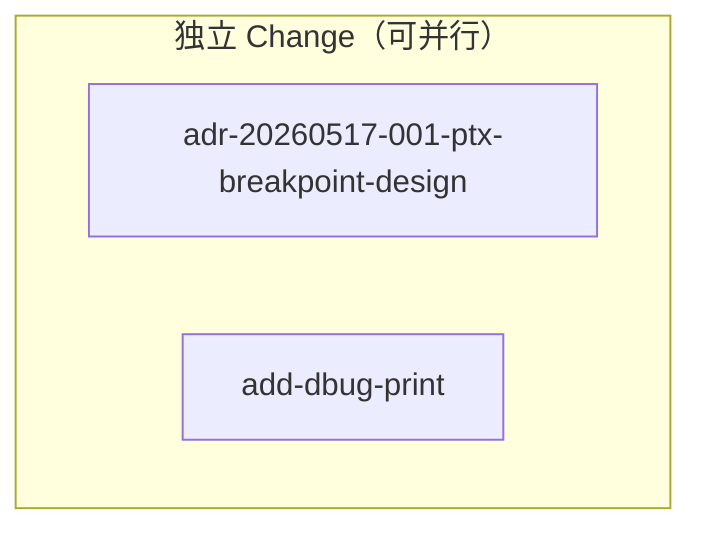

# OpenSpec 工作流交互指南

## 工作方式

本技能扮演**交互式向导**角色，遵循 planning-with-files 的设计理念：

- 所有状态持久化到 Markdown 文件（而非 JSON）
- 每个步骤用 Question 工具提供选项（最后一个选项是输入）
- 用户只能通过选择选项进行交互，不能指定参数
- 新 session 开始时自动检查并恢复进度

```
skill_use("spec-workflow-guide")   # 无参数版本
```

---

## 状态文件

| 文件 | 位置 | 用途 |
|------|------|------|
| `workflow-state.md` | 项目根目录（git 版本控制） | 主要状态文件，记录进度和变更信息 |
| `workflow-progress.md` | 项目根目录（git 版本控制） | 操作日志，记录每一步执行结果 |

---

### workflow-state.md 格式

```markdown
# OpenSpec 工作流状态

## 元信息
- **版本**: 1
- **创建时间**: 2026-05-18T10:00:00+08:00
- **最后更新**: 2026-05-18T10:30:00+08:00

## 工作流进度

### 阶段完成情况

| 阶段 | 状态 | 完成时间 |
|------|------|---------|
| setup | ✅ 完成 | 2026-05-18T10:00:00+08:00 |
| propose | 🔄 进行中 | 2026-05-18T10:15:00+08:00 |
| plan | ⏳ 未开始 | — |
| execute | ⏳ 未开始 | — |
| status_archive | ⏳ 未开始 | — |
| cleanup | ⏳ 未开始 | — |

## 当前状态

- **当前阶段**: propose
- **当前恢复点**: propose.scan_done

### Changes（支持多 change 并行）

| 变更名称 | Worktree | Artifacts | 执行状态 | 当前操作 |
|----------|----------|-----------|---------|---------|
| fix-ns-pollution | .zcf/fix-ns-pollution-wt | ✅ 已提交 | ⏳ 等待 | — |
| add-stream-pipes | — | ⏳ 未提交 | ⏳ 等待 | — |

### 恢复上下文

- **恢复点**: propose.scan_done
- **最后操作**: 扫描建议完成，等待用户选择
- **验证建议**:
  - [x] openspec CLI 可用
  - [x] git 工作区正常
  - [ ] propose artifacts 已创建（如需要）

- **活跃 Changes**: [fix-ns-pollution, add-stream-pipes]
- **当前焦点变更**: fix-ns-pollution
- **Worktree 映射**:
  - fix-ns-pollution → .zcf/fix-ns-pollution-wt (openspec/fix-ns-pollution)
  - add-stream-pipes → (未创建)

## 操作历史

| 时间 | 阶段 | 操作 | 结果 |
|------|------|------|------|
| 2026-05-18T10:00:00+08:00 | setup | env_check | ok |
| 2026-05-18T10:15:00+08:00 | propose | select_change | fix-ns-pollution |
```

---

### workflow-progress.md 格式

```markdown
# OpenSpec 工作流进度日志

## Session 信息
- **开始时间**: 2026-05-18T10:00:00+08:00
- **结束时间**: —
- **活跃 Changes**: fix-ns-pollution, add-stream-pipes

## 操作日志

### 2026-05-18T10:00:00+08:00 [setup / env_check]
**动作**: 检查环境
**结果**: ✅ openspec CLI 正常，git 工作区干净，build 目录存在

**下一步**: 进入 Propose 阶段

### 2026-05-18T10:15:00+08:00 [propose / create_change × 2]
**动作**: 创建多个 change
**结果**: ✅ fix-ns-pollution, add-stream-pipes 均已创建 artifacts

**下一步**: 决定是否为这些 change 创建 worktree（进入 Plan 阶段）
```

---

### 恢复点定义

恢复点使用 `{phase}.{state}` 格式，每个阶段定义 2-3 个状态：

| 阶段 | 恢复点 | 说明 | 验证项 |
|------|--------|------|--------|
| **setup** | `setup.env_check` | 环境检查完成 | openspec CLI 可用 |
| **propose** | `propose.scan_done` | 扫描建议完成 | proposal-suggestions.md 存在 |
| **propose** | `propose.change_selected` | change 已选择待创建 | change 目录存在 |
| **propose** | `propose.commit_pending` | 待提交 artifacts | — |
| **deps** | `deps.analysis_done` | 依赖分析完成 | .zcf/.deps-output.md 存在 |
| **plan** | `plan.worktree_ready` | worktree 创建完成 | worktree 目录存在 |
| **plan** | `plan.deps_review` | 等待 Deps 重组确认 | deps 输出存在 |
| **execute** | `execute.pending` | 等待选择执行方式 | worktree 存在 |
| **execute** | `execute.active` | 有 change 正在执行 | — |
| **status_archive** | `status.pending` | 等待归档 | worktree 存在 |
| **cleanup** | `cleanup.start` | 清理开始 | — |

**恢复点命名原则**：
- 使用**状态描述**而非操作名称（`pending` 而非 `select_target`）
- 同一阶段内状态数控制在 2-3 个
- 使用通用词汇（pending/active/done）便于扩展

---

## 入口流程

每次调用 `skill_use("spec-workflow-guide")` 时：

### 步骤 0：检查状态文件 + Git 仓库验证

```bash
# ============================================================
# P0 FIX: 约束在当前工作目录，不向上遍历到父目录
# 使用 pwd 作为项目根目录，然后验证当前目录是否为 git 仓库
# ============================================================
PROJECT_ROOT=$(pwd)

# 验证当前目录是 git 仓库（防止向上遍历到父目录的仓库）
if ! git rev-parse --git-dir > /dev/null 2>&1; then
    echo "━━━━━━━━━━━━━━━━━━━━━━━━━━━━━━━━━━━━"
    echo "❌ 错误：当前目录不是 git 仓库"
    echo ""
    echo "   当前目录: $PROJECT_ROOT"
    echo ""
    echo "   OpenSpec 工作流只能在 git 仓库内运行。"
    echo "   请切换到正确的项目目录后重试。"
    echo ""
    echo "   示例："
    echo "   cd /path/to/your/project"
    echo "   skill_use(\"spec-workflow-guide\")"
    echo "━━━━━━━━━━━━━━━━━━━━━━━━━━━━━━━━━━━━"
    exit 1
fi

# 额外安全检查：确保 .git 目录在 PROJECT_ROOT 内（防止跨文件系统误匹配）
GIT_DIR=$(git rev-parse --git-dir 2>/dev/null)
case "$GIT_DIR" in
    /*) ABS_GIT_DIR="$GIT_DIR" ;;
    *)  ABS_GIT_DIR="$PROJECT_ROOT/$GIT_DIR" ;;
esac

if [ ! -d "$ABS_GIT_DIR" ] || ! echo "$ABS_GIT_DIR" | grep -qF "$PROJECT_ROOT"; then
    echo "━━━━━━━━━━━━━━━━━━━━━━━━━━━━━━━━━━━━"
    echo "⚠️  警告：git 仓库根目录与当前目录不一致"
    echo ""
    echo "   当前目录:   $PROJECT_ROOT"
    echo "   Git 仓库:   $(dirname "$ABS_GIT_DIR")"
    echo ""
    echo "   为防止误操作，工作流仅在 git 仓库根目录运行。"
    echo "   请切换到正确的项目目录后重试。"
    echo "━━━━━━━━━━━━━━━━━━━━━━━━━━━━━━━━━━━━"
    exit 1
fi

STATE_FILE="$PROJECT_ROOT/workflow-state.md"
PROGRESS_FILE="$PROJECT_ROOT/workflow-progress.md"

if [ -f "$STATE_FILE" ]; then
    # 读取并展示当前状态（版本2格式）
    echo "📂 发现已保存的进度"
    CURRENT_PHASE=$(awk '/\*\*当前阶段\*\*/{getline; gsub(/^\*\*|\*\*$/,""); print}' "$STATE_FILE")
    RECOVERY_POINT=$(awk '/\*\*当前恢复点\*\*/{getline; gsub(/^\*\*|\*\*$/,""); print}' "$STATE_FILE")
    LAST_OPERATION=$(awk '/\*\*最后操作\*\*/{getline; gsub(/^\*\*|\*\*$/,""); print}' "$STATE_FILE")
    
    echo "━━━━━━━━━━━━━━━━━━━━━━━━━━━━━━━━━━━━"
    echo "🔄 从中断处恢复"
    echo "━━━━━━━━━━━━━━━━━━━━━━━━━━━━━━━━━━━━"
    echo "   当前阶段: $CURRENT_PHASE"
    echo "   恢复点: $RECOVERY_POINT"
    echo "   最后操作: ${LAST_OPERATION:-（无）}"
    echo ""
    # 展示阶段完成情况
    echo "已完成阶段:"
    grep "✅" "$STATE_FILE" | grep -oP '\| \K[^|]+' | head -5
    echo ""
    
    # 读取并显示 Changes 状态
    echo "📋 当前 Changes 状态:"
    awk '/^\| 变更名称/,/^[^|]/' "$STATE_FILE" | grep "^|" | grep -v "^| 变更名称" | while read line; do
        echo "   $line"
    done
    echo ""
    
    # 恢复确认
    echo "请选择:"
    echo "1. ✅ 继续恢复（跳转到恢复点）"
    echo "2. 🔄 重新开始（放弃当前进度）"
    echo "i. 其他输入（AI 解释）"
    echo "━━━━━━━━━━━━━━━━━━━━━━━━━━━━━━━━━━━━"
else
    echo "🆕 未发现已保存的进度，开始全新流程。"
    CURRENT_PHASE="setup"
    RECOVERY_POINT="setup.env_check"
fi
```

### 步骤 1：环境检查（setup 阶段）

执行环境检测，检查清单：

```bash
echo "🔍 环境检查..."
echo ""

# 1. openspec CLI
OPENSPEC_PATH=$(command -v openspec 2>/dev/null || echo "/home/ubuntu/.npm-global/bin/openspec")
if [ -x "$OPENSPEC_PATH" ]; then
    OPENSPEC_VER=$("$OPENSPEC_PATH" --version 2>/dev/null || echo "?")
    echo "✅ openspec CLI: $OPENSPEC_VER"
    OPENSPEC_OK=true
else
    echo "❌ openspec CLI 未找到"
    OPENSPEC_OK=false
fi

# 2. git 状态
GIT_CLEAN=$(git status --porcelain | wc -l)
if [ "$GIT_CLEAN" -eq 0 ]; then
    echo "✅ git 工作区干净"
else
    echo "⚠️  git 工作区有 $GIT_CLEAN 个未跟踪/修改文件"
fi

# 3. 当前分支
CURRENT_BRANCH=$(git branch --show-current)
echo "📌 当前分支: $CURRENT_BRANCH"

# 4. worktree 列表
echo "📂 Worktrees:"
git worktree list | sed 's/^/   /'

# 5. 构建目录
if [ -d "build" ]; then
    echo "✅ 构建目录存在 (build/)"
else
    echo "⚠️  构建目录不存在"
fi

# 6. 已有 change
ACTIVE=$(ls -d $PROJECT_ROOT/openspec/changes/*/ 2>/dev/null | grep -v archive/ | wc -l)
echo "📋 活跃 changes: $ACTIVE"
```

**展示环境状态 + 选项**：

使用 `question` 工具询问用户：

```
环境检查结果：

✅ openspec CLI: 1.3.1 (/home/ubuntu/.npm-global/bin/openspec)
✅ git 工作区干净
📌 当前分支: main
📂 Worktrees: (无)
✅ 构建目录存在
📋 活跃 changes: 0

当前状态: 未开始任何变更流程

请选择:
1. 继续 → 进入 Propose 阶段（扫描建议）
2. 修复 PATH（显示如何添加 openspec 到 PATH）
3. 重新检查（刷新环境状态）
0. 💾 保存并退出（下次 skill_use("spec-workflow-guide") 恢复）
i. 其他输入
```

### 步骤 2：进入对应阶段

根据当前阶段跳转到对应入口。

### 工作流状态恢复

当检测到已完成 setup 但有已创建的 worktree 时，自动判断当前状态：

```bash
# 检查是否有已创建的 worktree
WORKTREE_COUNT=$(git worktree list | grep "openspec/" | grep -c .)

if [ "$WORKTREE_COUNT" -gt 0 ]; then
    echo ""
    echo "━━━━━━━━━━━━━━━━━━━━━━━━━━━━━━━━━━━━"
    echo "📋 发现 $WORKTREE_COUNT 个 worktree 已就绪"
    echo ""
    echo "请选择:"
    echo "1. ✅ 进入 Execute 监控模式（监控所有 worktree 进度）"
    echo "2. 🔄 返回 Plan 阶段（查看或创建更多 worktree）"
    echo "3. ↩️ 返回 Propose 阶段（创建更多 change）"
    echo "i. 其他输入"
fi
```

---

## 阶段入口

### 阶段 1：`setup` — 环境检查

**入口条件**：首次调用或 state 文件不存在。

**环境检测命令**：

```bash
# openspec CLI 检测
OPENSPEC_PATH=$(command -v openspec 2>/dev/null || echo "/home/ubuntu/.npm-global/bin/openspec")

# git 状态
GIT_STATUS=$(git status --porcelain)

# 当前分支
CURRENT_BRANCH=$(git branch --show-current)

# worktree 列表
WORKTREE_LIST=$(git worktree list)

# 构建目录
BUILD_EXISTS=$([ -d "build" ] && echo "yes" || echo "no")

# 活跃 changes
ACTIVE_CHANGES=$(ls -d $PROJECT_ROOT/openspec/changes/*/ 2>/dev/null | grep -v archive/ | wc -l)
```

**菜单选项**：

```
环境检查完成。检测到：

  openspec CLI: ✅ 1.3.1
  git 工作区:  ✅ 干净
  当前分支:    main
  Worktrees:   无
  构建目录:    ✅ 存在
  活跃 changes: 0

请选择:
1. ✅ 继续 → 进入 Propose 阶段
2. 🔄 重新检查
i. 其他操作
```

---

### 阶段 1.5：`roadmap` — 路线图初始化/查看

**入口条件**：setup 已完成，且当前阶段为 roadmap 或 roadmap.md 需要初始化。

**行为**：

1. 检查是否存在 `roadmap.md`
2. 如果不存在，提示用户创建初始路线图
3. 如果存在，展示当前阶段和进度

**菜单示例**：

```
路线图状态

当前阶段: phase-1 (基础架构)
进度:
  - arch-design: 1/2 ✅
  - infra-setup: 0/1 ⏳
  - core-impl: 0/0

请选择:
1. ✅ 继续 → 进入 Propose 阶段（按当前阶段生成 change）
2. 📝 编辑路线图（修改阶段或任务分类）
3. 📊 查看阶段门控报告
4. ⏭️  强制进入下一阶段（如当前阶段已完成）
0. 💾 保存并退出
```

**与 propose 的衔接**：

用户选择「继续」后，guide 进入 propose 阶段。propose 技能会自动读取 roadmap.md，只生成当前阶段的 change。

---

### 阶段 2：`propose` — 扫描并创建 Change

**入口条件**：setup 已完成，且当前阶段为 propose。

**行为**：

本阶段所有扫描和创建逻辑委托给 `spec-workflow-propose` 技能。
guide 作为交互式向导，展示提议技能的结果，让用户选择，然后调用提议技能的创建逻辑。

**交互流程**：

1. **扫描阶段**：调用 `spec-workflow-propose` 执行扫描，生成/更新 `proposal-suggestions.md`
2. **选择阶段**：展示扫描结果（从 `proposal-suggestions.md` 读取），让用户选择
   - Roadmap 模式下，只展示当前阶段的 change
   - 非当前阶段的 change 可折叠或标记为「未来阶段」
3. **创建阶段**：用户选择后，调用 `spec-workflow-propose --create <name>` 执行创建
4. **循环**：创建后重新展示，用户可继续选或选「完成 Propose 阶段」

**注意**：guide 不直接调用 `openspec new`/`openspec propose` 命令。所有创建逻辑由 `spec-workflow-propose` 技能处理。

**显示与执行分离**：

guide 负责显示扫描结果和接收用户选择，但创建操作通过调用 `spec-workflow-propose` 技能完成。

```bash
# 展示当前活跃 changes
echo "📋 当前已创建的 Changes:"
ls -d "$PROJECT_ROOT"/openspec/changes/*/ 2>/dev/null | grep -v archive/ | while read -r dir; do
    name=$(basename "$dir")
    if git rev-parse --verify HEAD >/dev/null 2>&1; then
        committed=$(git show HEAD:"$PROJECT_ROOT/openspec/changes/$name/.openspec.yaml" > /dev/null 2>&1 && echo "✅" || echo "⏳")
    else
        committed="⏳"
    fi
    echo "  - $name  [Artifacts: $committed]"
done

# 检查建议列表
if [ -f "proposal-suggestions.md" ]; then
    echo ""
    echo "📂 已有的建议列表 (proposal-suggestions.md)"
    cat proposal-suggestions.md
else
    echo ""
    echo "🆕 开始扫描..."
    skill_use("spec-workflow-propose")
fi
```

**用户选择后的处理**：

当用户选择某个建议进行创建时，guide 调用 `spec-workflow-propose` 执行创建：

```bash
if [ "$choice" = "1" ]; then
    # 创建 fix-ns-pollution
    skill_use("spec-workflow-propose", "--create", "fix-ns-pollution")
elif [ "$choice" = "2" ]; then
    # 创建 add-stream-pipes
    skill_use("spec-workflow-propose", "--create", "add-stream-pipes")
fi
```

**建议列表选项**（每次创建后重新展示）：

```
建议列表（来自 ADR 扫描 + 代码 TODO）：

🔴 高优先级
1. fix-ns-pollution  — 修复命名空间污染 (ADR-033, 3 个任务)
2. add-stream-pipes  — 实现 Stream 管道操作符 (ADR-022, 5 个任务)

🟡 中优先级
3. add-cdc-support   — 跨时钟域支持 (架构差距分析)

当前已创建: fix-ns-pollution ✅

请选择:
1. 创建 fix-ns-pollution（已存在的跳过）
2. 创建 add-stream-pipes
3. 创建 add-cdc-support
4. ✅ 完成 Propose 阶段 → 进入 Plan 阶段
5. 📋 查看所有已创建的 change 详情
0. 💾 保存并退出（下次 skill_use("spec-workflow-guide") 恢复）
i. 手动输入 change 名称
```

**创建后重新进入此阶段**：

每次创建完成后，重新检查建议列表 + 活跃 changes，重新展示选项菜单（循环）。

**Propose 阶段完成条件**：

用户选择「4. 完成 Propose 阶段」后，验证至少有一个 change 的 artifacts 已提交，然后推进到 **deps 阶段**（依赖分析），最后才进入 plan。

**Propose → Deps → Plan 流程**：

```
用户选择「完成 Propose」
    ↓
验证 artifacts 已提交
    ↓
【自动执行】调用 deps.md 分析候选 change 依赖
    ↓
展示依赖图和推荐执行顺序
    ↓
推进到 plan 阶段
```

---

### 阶段 2.5：`deps` — 依赖分析（自动执行）

**入口条件**：propose 阶段完成，用户选择「完成 Propose 阶段」后自动触发。

**前置说明**：
本阶段自动执行，不需要用户交互。所有结果通过 deps.md 生成。

**行为**：

1. **生成候选列表**：读取所有已提交的 change，生成 `.zcf/.deps-candidates.json`
2. **执行依赖分析**：调用 deps.md 分析 change 间依赖
3. **输出依赖图**：生成 `.zcf/.deps-output.md`，包含 Mermaid 依赖图和推荐执行顺序
4. **展示结果**：展示依赖图、冲突检测、推荐顺序

**自动执行内容**：

```bash
# Step 1: 生成候选列表
mkdir -p "$PROJECT_ROOT/.zcf"
python3 -c "
import json, os

# 读取所有已提交的 change
changes_dir = '$PROJECT_ROOT/openspec/changes'
candidates = []
if os.path.isdir(changes_dir):
    for name in sorted(os.listdir(changes_dir)):
        change_path = os.path.join(changes_dir, name)
        openspec_yaml = os.path.join(change_path, '.openspec.yaml')
        # 检查 change 是否已提交（.openspec.yaml 在 HEAD 中存在）
        if os.path.isfile(openspec_yaml):
            candidates.append(name)

data = {'candidates': candidates}
with open('$PROJECT_ROOT/.zcf/.deps-candidates.json', 'w') as f:
    json.dump(data, f, indent=2)
print(f'生成候选列表: {candidates}')
"

# Step 2: 调用 deps.md 分析（内联执行）
# 读取每个 change 的 proposal.md 和 design.md
# 分析文件路径、ADR 引用、接口定义
# 生成依赖图和冲突检测
# 输出到 .zcf/.deps-output.md

# Step 3: 展示结果
echo "📊 依赖分析完成"
cat "$PROJECT_ROOT/.zcf/.deps-output.md"
```

**依赖图生成逻辑**：

```bash
# 从 proposal.md 提取 Impact 中的文件路径
SCOPE_FILES=$(grep -E '^[ \t]*-[ \t]*('src/|file:)' "$proposal_path" 2>/dev/null | ...)

# 检测文件路径冲突
CONFLICTS=$(find "$PROJECT_ROOT/openspec/changes/" -name "proposal.md" -exec grep ... {} \;)

# 生成 Mermaid 图
if [ "$独立" = true ]; then
    # P4 FIX: 独立 change 不画箭头，使用 subgraph 分组
    echo "flowchart TB"
    echo "    subgraph independent[\"独立 Change（可并行）\"]"
    for change in $CHANGES; do
        echo "        $(echo $change | sed 's/^/        A[/; s/$/ ]/')"
    done
    echo "    end"
else
    echo "flowchart LR"
    for dep in $DEPENDENCIES; do
        echo "    $dep"
    done
fi
```

**Mermaid 独立 change 正确画法**：



**【重要】Mermaid 语法修复**：
- 独立 change **不要画箭头**
- 使用 `&` 连接并行节点：`A[change1] & B[change2]`
- 或使用 subgraph 分组

**无用户交互**：本阶段自动完成，直接推进到 plan。

---

### 阶段 3：`plan` — Commit + Worktree + 计划

**入口条件**：deps 阶段完成（依赖分析已输出到 `.zcf/.deps-output.md`）。

**前置说明**：

每个 change 独立经历 plan→execute→archive。用户选择要处理的 change 后，为其创建 worktree 并生成计划。

**行为**：

1. 展示所有活跃 changes 的状态列表
2. 用户选择要处理的 change（或选「全部创建 worktree」）
3. 对选中的 change 执行 COMMIT GATE
4. 创建 branch + worktree
5. 在 worktree 内生成 Prometheus 计划
6. 更新 state 文件

**展示所有活跃 changes 的状态**：

```bash
echo "📋 所有活跃 Changes:"
echo ""
echo "| 变更 | Artifacts | Worktree | 计划文件 |"
echo "|-----|-----------|----------|---------|"
for name in $ACTIVE_CHANGES; do
    committed=$(git show HEAD:"$PROJECT_ROOT/openspec/changes/$name/.openspec.yaml" > /dev/null 2>&1 && echo "✅" || echo "⏳")
    wt_path="$PROJECT_ROOT/.zcf/${name}-wt"
    wt_exists=$([ -d "$wt_path" ] && git worktree list | grep -q "$wt_path" && echo "✅" || echo "❌")
    plan_exists=$([ -f "$wt_path/.sisyphus/plans/$name.md" ] 2>/dev/null && echo "✅" || echo "❌")
    echo "| $name | $committed | $wt_exists | $plan_exists |"
done
```

**步骤 0：展示 Deps 分析结果 + 重组确认**：

```bash
# 检查是否有 Deps 分析结果
if [ -f "$PROJECT_ROOT/.zcf/.deps-output.md" ]; then
    echo ""
    echo "━━━━━━━━━━━━━━━━━━━━━━━━━━━━━━━━━━━━"
    echo "📊 Deps 阶段分析结果"
    echo "━━━━━━━━━━━━━━━━━━━━━━━━━━━━━━━━━━━━"
    
    # 提取关键信息展示
    echo ""
    echo "【依赖图】（见下方 Mermaid）"
    
    # 提取重组建议（如果存在）
    if grep -q "💡 重组建议" "$PROJECT_ROOT/.zcf/.deps-output.md"; then
        echo ""
        echo "【重组建议】"
        # 提取建议部分（带格式框）
        awk '/💡 重组建议/,/⚠️ 注意：以上建议仅供参考/' "$PROJECT_ROOT/.zcf/.deps-output.md" | head -30
    fi
    
    echo ""
    echo "━━━━━━━━━━━━━━━━━━━━━━━━━━━━━━━━━━━━"
    echo "请选择："
    echo "1. ✅ 采纳重组建议（自动重排/合并/拆分）"
    echo "2. ❌ 拒绝，使用原始 change 列表"
    echo "3. 📋 查看详细分析（查看完整 .deps-output.md）"
    echo ""
    echo "注意：重组建议仅作参考，是否执行由您决定"
    echo "━━━━━━━━━━━━━━━━━━━━━━━━━━━━━━━━━━━━"
fi
```

**Deps 重组确认的用户交互流程**：

```
用户选择「1. 采纳重组建议」
    ↓
读取 .zcf/.deps-output.md 中的重组建议
    ↓
执行重组操作：
    - 合并：重命名/合并 change 目录，更新 proposal-suggestions.md
    - 拆分：创建新的 change 目录，拆分 tasks.md
    - 重排：更新候选列表顺序
    ↓
更新 .zcf/.deps-candidates.json
    ↓
继续展示重排后的 change 列表

用户选择「2. 拒绝」
    ↓
使用原始 change 列表
    ↓
继续展示原始 change 列表

用户选择「3. 查看详细分析」
    ↓
使用 less 或 cat 展示完整 .deps-output.md
    ↓
返回选择菜单
```

**选择要处理的 change**：

```
Plan 阶段

📋 活跃 Changes:
| 变更 | Artifacts | Worktree | 计划文件 |
|-----|-----------|----------|---------|
| fix-ns-pollution | ✅ | ❌ | ❌ |
| add-stream-pipes | ✅ | ❌ | ❌ |

请选择:
1. 为 fix-ns-pollution 创建 worktree + 生成计划
2. 为 add-stream-pipes 创建 worktree + 生成计划
3. 批量处理：全部为已提交的变化创建 worktree
4. 🔄 切换当前焦点变更（选择另一个变更作为焦点）
5. ↩️ 返回 Propose 阶段（创建更多 change）
0. 💾 保存并退出（下次 skill_use("spec-workflow-guide") 恢复）
i. 其他输入
```

**重构确认后的 change 选择菜单**（当用户选择"采纳重组建议"后）：

```
Plan 阶段（已采纳重组建议）

📋 重组后 Changes:
| 变更 | 状态 | 说明 |
|-----|------|------|
| add-stream (新) | ✅ 已合并 | add-stream-pipes + add-stream-base |
| fix-ns-pollution | ✅ | 无变化 |

请选择:
1. 为 add-stream 创建 worktree + 生成计划
2. 为 fix-ns-pollution 创建 worktree + 生成计划
3. 批量处理：全部为已提交的变化创建 worktree
0. 💾 保存并退出（下次 skill_use("spec-workflow-guide") 恢复）
i. 其他输入
```

**选项 1/2 执行内容**（以 fix-ns-pollution 为例）：

```bash
CHANGE_NAME="fix-ns-pollution"

# COMMIT GATE - 脏检测
if [ -n "$(git status --porcelain "$PROJECT_ROOT/openspec/changes/$CHANGE_NAME/")" ]; then
    echo "⚠️  检测到未提交的修改，提示用户提交或放弃"
fi

# COMMIT GATE - 是否已 commit
if ! git show HEAD:"$PROJECT_ROOT/openspec/changes/$CHANGE_NAME/.openspec.yaml" > /dev/null 2>&1; then
    echo "❌ Artifacts 尚未提交，请先提交"
    # 回到菜单
fi

# 创建 branch（如不存在）
if ! git branch --list "openspec/$CHANGE_NAME" | grep -q "openspec/$CHANGE_NAME"; then
    git branch "openspec/$CHANGE_NAME" HEAD
fi

# 创建 worktree（带目录冲突检测）
if [ -d "$PROJECT_ROOT/.zcf/${CHANGE_NAME}-wt" ]; then
    if git worktree list | grep -q "$PROJECT_ROOT/.zcf/${CHANGE_NAME}-wt"; then
        echo "⚠️  Worktree 已存在"
    else
        echo "❌ 目录冲突，请先清理: rm -rf $PROJECT_ROOT/.zcf/${CHANGE_NAME}-wt"
    fi
else
    git worktree add "$PROJECT_ROOT/.zcf/${CHANGE_NAME}-wt" "openspec/$CHANGE_NAME"
fi

# ============================================================
# WORKTREE VERIFICATION GATE (P0 FIX)
# 验证 worktree 是否正确关联到分支，防止 detached HEAD 问题
# ============================================================
WT_PATH="$PROJECT_ROOT/.zcf/${CHANGE_NAME}-wt"
WT_BRANCH=$(git worktree list --porcelain | awk -v path="$WT_PATH" '
    $1 == "worktree" && $2 == path { found=1; next }
    found && $1 == "branch" { print $2; exit }
    found && $1 == "detached" { print "DETACHED"; exit }
')

echo ""
echo "━━━━━━━━━━━━━━━━━━━━━━━━━━━━━━━━━━━━"
echo "🔍 Worktree 验证"
echo "━━━━━━━━━━━━━━━━━━━━━━━━━━━━━━━━━━━━"
echo "  Worktree 路径: $WT_PATH"
echo "  分支状态: ${WT_BRANCH:-未找到}"

if [ "$WT_BRANCH" = "DETACHED" ]; then
    echo "━━━━━━━━━━━━━━━━━━━━━━━━━━━━━━━━━━━━"
    echo "❌ 错误：Worktree 处于 detached HEAD 状态！"
    echo ""
    echo "  这通常意味着 worktree 分支创建失败。"
    echo "  新提交的代码将无法被 main 分支 merge。"
    echo ""
    echo "  请执行以下命令修复："
    echo "    cd $WT_PATH"
    echo "    git checkout openspec/$CHANGE_NAME"
    echo ""
    echo "  或删除 worktree 重新创建："
    echo "    git worktree remove $WT_PATH"
    echo "    git branch -D openspec/$CHANGE_NAME"
    echo "    skill_use(\"spec-workflow-guide\")  # 重新进入 Plan 阶段"
    echo "━━━━━━━━━━━━━━━━━━━━━━━━━━━━━━━━━━━━"
    exit 1
elif [ -z "$WT_BRANCH" ]; then
    echo "⚠️  警告：无法确定 worktree 分支状态"
fi

# 验证 worktree 分支是否指向 change 分支
EXPECTED_BRANCH="refs/heads/openspec/$CHANGE_NAME"
if [ "$WT_BRANCH" != "$EXPECTED_BRANCH" ] && [ "$WT_BRANCH" != "openspec/$CHANGE_NAME" ]; then
    echo "⚠️  警告：Worktree 分支 $WT_BRANCH 与预期不符"
fi

echo "✅ Worktree 验证通过"
```

**Worktree 创建完成 → 进入执行模式选择**：

```
${CHANGE_NAME} worktree 已就绪，请选择执行方式：

📋 ${CHANGE_NAME} 状态:
  Worktree: .zcf/${CHANGE_NAME}-wt
  计划文件: .sisyphus/plans/${CHANGE_NAME}.md
  任务数: $(grep -c '^- \[' "$wt/openspec/changes/$name/tasks.md" 2>/dev/null || echo '?')

请选择执行方式:
1. 🔒 在此 session 执行（阻塞）— 等待任务完成后返回
2. 🔓 分离执行（新终端）— 给出操作指引，立即返回
0. 💾 保存并退出（下次 skill_use("spec-workflow-guide") 恢复）
i. 其他输入
```

**选项 1（阻塞执行）执行内容**：

```bash
cd "$PROJECT_ROOT/.zcf/${CHANGE_NAME}-wt" || exit 1
skill_use("spec-workflow-execute")
cd "$PROJECT_ROOT" || exit 1
# execute 会阻塞直到所有任务完成
# 更新 state
```

**选项 2（分离执行）输出指引**：

```bash
echo ""
echo "🔓 分离执行指引"
echo ""
echo "为 ${CHANGE_NAME} 启动分离执行："
echo ""
echo "1. 在新终端中执行："
echo "   cd $(pwd)/$PROJECT_ROOT/.zcf/${CHANGE_NAME}-wt"
echo "   skill_use(\"spec-workflow-execute\")"
echo ""
echo "2. execute 结果会自动写入 tasks.md"
echo ""
echo "3. 完成后，在此 session 运行 guide 查看最新进度"
echo ""
echo "当前状态：${CHANGE_NAME} 等待分离执行"
```

**返回 Plan 前的检查 — 是否进入监控**：

```bash
# 检查所有已创建 worktree 的数量
WORKTREE_COUNT=$(git worktree list | grep "openspec/" | wc -l)

if [ "$WORKTREE_COUNT" -gt 0 ]; then
    echo ""
    echo "━━━━━━━━━━━━━━━━━━━━━━━━━━━━━━━━━━━━"
    echo "📋 发现 $WORKTREE_COUNT 个 worktree 已就绪"
    echo ""
    echo "请选择:"
    echo "1. ✅ 进入 Execute 监控模式（实时监控所有 worktree 进度）"
    echo "2. 🔄 继续返回 Plan 阶段（创建更多 worktree 或处理其他 change）"
    echo "i. 其他输入"
fi
```

---

### 阶段 4：`execute` — 监控与执行

**定位**：Execute 阶段是**监控模式**——读取 tasks.md 进度、显示所有 worktree 状态、提供执行入口。不是实际执行者。

**前置检测（每次入口执行）**：

```bash
# 读取所有 tasks.md 的实际进度，同步到 state
echo "📋 所有 Worktrees 实际进度:"

LAST_CHECK=$(date "+%Y-%m-%d %H:%M:%S")

for wt in $(git worktree list | grep "openspec/" | awk '{print $1}'); do
    branch=$(git worktree list | grep "$wt" | awk '{print $3}')
    name=$(echo "$branch" | sed 's|openspec/||')
    # P0 FIX: tasks.md 在 worktree 内的 openspec/changes/<name>/ 目录下
    # wt 已经是完整路径，不需要再拼接 PROJECT_ROOT
    tasks_file="$wt/openspec/changes/$name/tasks.md"

    if [ -f "$tasks_file" ]; then
        # P1 FIX: 正确统计 tasks.md 中所有 - [ ] 任务项（不分章节）
        total=$(grep -c '^- \[' "$tasks_file" 2>/dev/null || echo 0)
        done=$(grep -c '^- \[x\]' "$tasks_file" 2>/dev/null || echo 0)
        progress="${done}/${total}"
    else
        progress="? (文件不存在)"
    fi
    echo "  $name → $progress"
done

echo ""
echo "上次检测: $LAST_CHECK"
```

**菜单选项**：

```
Execute 阶段（监控模式）

📋 所有 Worktrees 状态:（实时读取 tasks.md）
| 变更 | Worktree | 进度 | 执行状态 |
|-----|----------|------|---------|
| fix-ns-pollution | .zcf/fix-ns-pollution-wt | 1/3 | 🔒 执行中 |
| add-stream-pipes | .zcf/add-stream-pipes-wt | 2/5 | 🔓 分离执行 |

上次检测: 2026-05-18 10:35:00

请选择:
1. 🔒 在此 session 执行 fix-ns-pollution（阻塞）
2. 🔓 分离执行 fix-ns-pollution（新终端）
3. 🔒 在此 session 执行 add-stream-pipes（阻塞）
4. 🔓 分离执行 add-stream-pipes（新终端）
5. 📋 查看任务列表（指定变更）
6. 🔧 运行构建验证（指定变更）
7. 🔄 刷新进度（重新读取所有 tasks.md）
8. ↩️ 返回 Plan 阶段（创建更多 worktree）
0. 💾 保存并退出（下次 skill_use("spec-workflow-guide") 恢复）
i. 其他输入
```

**选项 7（刷新进度）执行内容**：

```bash
# 重新读取所有 tasks.md 进度
echo "🔄 正在刷新进度..."
LAST_CHECK=$(date "+%Y-%m-%d %H:%M:%S")
# 重新显示表格
# 用户选择后继续循环
```

**选项 1/3（阻塞执行）执行内容**：

```bash
CHANGE_NAME="fix-ns-pollution"
WORKTREE_PATH="$PROJECT_ROOT/.zcf/${CHANGE_NAME}-wt"

cd "$WORKTREE_PATH"
skill_use("spec-workflow-execute")
# 阻塞等待所有任务完成
cd /workspace/project/CppHDL

# 更新 state 进度
# （execute 已更新 tasks.md，这里读取同步到 state）
```

**选项 2/4（分离执行）输出指引**：

```bash
echo ""
echo "🔓 分离执行指引"
echo ""
echo "为 ${CHANGE_NAME} 启动分离执行："
echo ""
echo "1. 在新终端中执行："
echo "   cd $(pwd)/$PROJECT_ROOT/.zcf/${CHANGE_NAME}-wt"
echo "   skill_use(\"spec-workflow-execute\")"
echo ""
echo "2. execute 结果会自动写入 tasks.md"
echo ""
echo "3. 完成后，在此 session 运行 guide 查看最新进度"
echo ""
echo "当前状态：${CHANGE_NAME} 🔓 分离执行中"
```

**状态更新**：将执行状态设为 🔓，下次入口时通过 tasks.md 同步实际进度。

**监控说明**：

- Guide 不执行任务，只监控
- 进度来自 tasks.md 的 `grep -c "^- \[x\]"`
- 执行状态列说明：
  - 🔒 执行中 — 此 session 正在阻塞执行
  - 🔓 分离执行 — 在新终端执行，不阻塞
  - ⏳ 等待 — 未开始
  - ✅ 完成 — 所有任务完成

---

### 阶段 5：`status_archive` — 状态检查与归档

**入口条件**：execute 已完成（所有 worktree 的任务都完成），或用户主动选择此阶段。

**前置说明**：

每个 change 独立归档。可以一次性归档所有已完成的 change，或逐个处理。

**展示所有 change 状态**：

```
Status 阶段

📋 所有 Changes 状态:
| 变更 | Worktree | 任务进度 | 状态 |
|-----|----------|---------|------|
| fix-ns-pollution | .zcf/fix-ns-pollution-wt | 3/3 ✅ | 可归档 |
| add-stream-pipes | .zcf/add-stream-pipes-wt | 2/5 🔄 | 进行中 |

请选择:
1. 归档 fix-ns-pollution（merge → archive → cleanup）
2. 归档 add-stream-pipes（需先完成所有任务）
3. 📊 全局概览（所有 change + worktree）
4. 🔍 详细检测（同步问题等）
5. ↩️ 返回 Execute 阶段
i. 其他输入
```

**归档流程（选项 1/2）**：

```bash
# 对选定的 change 执行归档
CHANGE_NAME="fix-ns-pollution"
WT_PATH="$PROJECT_ROOT/.zcf/${CHANGE_NAME}-wt"

# ============================================================
# MERGE VERIFICATION GATE (P0 FIX)
# 在 merge 前验证 worktree 分支是否包含新提交
# ============================================================
echo "🔍 验证 worktree 分支状态..."

# 检查 worktree 是否关联到正确分支（防止 detached HEAD）
WT_BRANCH=$(git worktree list --porcelain | awk -v path="$WT_PATH" '
    $1 == "worktree" && $2 == path { found=1; next }
    found && $1 == "branch" { print $2; exit }
    found && $1 == "detached" { print "DETACHED"; exit }
')

if [ "$WT_BRANCH" = "DETACHED" ]; then
    echo "❌ 错误：Worktree 处于 detached HEAD，无法 merge"
    echo "   请先切换到正确分支："
    echo "   cd $WT_PATH && git checkout openspec/$CHANGE_NAME"
    exit 1
fi

# 获取 merge 前 main 的最新 commit
BEFORE_MERGE=$(git rev-parse HEAD)

# 1. merge worktree → main
cd "$WT_PATH" || exit 1
git checkout main || { echo "❌ 切换 main 分支失败"; exit 1; }

if ! git merge --ff-only "openspec/$CHANGE_NAME" 2>/dev/null; then
    echo "⚠️ ff-only merge 失败，尝试普通 merge..."
    git merge "openspec/$CHANGE_NAME" || { echo "❌ merge 失败"; exit 1; }
fi

cd "$PROJECT_ROOT" || exit 1

# ============================================================
# POST-MERGE VERIFICATION GATE (P0 FIX)
# 验证 merge 是否真正产生了变更
# ============================================================
AFTER_MERGE=$(git rev-parse HEAD)

if [ "$BEFORE_MERGE" = "$AFTER_MERGE" ]; then
    # 进一步检查：分支是否包含 main 没有的提交
    if git merge-base --is-ancestor "openspec/$CHANGE_NAME" HEAD; then
        echo "⚠️  merge 完成但无新 commit（change 分支已是 HEAD 的祖先）"
    else
        echo "━━━━━━━━━━━━━━━━━━━━━━━━━━━━━━━━━━━━"
        echo "❌ Merge 验证失败！"
        echo ""
        echo "  可能原因："
        echo "  1. worktree 分支没有新提交"
        echo "  2. 新提交没有在预期文件中"
        echo ""
        echo "  请检查："
        echo "  - worktree 分支历史："
        echo "    git log openspec/$CHANGE_NAME --oneline -5"
        echo "  - worktree 新文件是否在分支上："
        echo "    git ls-tree --name-only openspec/$CHANGE_NAME | grep -E 'topology|parser'"
        echo ""
        echo "  诊断："
        echo "    git log openspec/$CHANGE_NAME --stat --name-only | head -30"
        echo "━━━━━━━━━━━━━━━━━━━━━━━━━━━━━━━━━━━━"
        exit 1
    fi
fi

# 2. archive
openspec archive "$CHANGE_NAME" --yes

# 3. cleanup
git worktree remove "$PROJECT_ROOT/.zcf/${CHANGE_NAME}-wt"
git branch -d "openspec/$CHANGE_NAME"

cd "$PROJECT_ROOT" || exit 1

echo "✅ $CHANGE_NAME 已归档"

# ============================================================
# P0 FIX: 归档后检查是否还有其他 change 需要处理
# ============================================================
# 使用 awk 检查分支名（第二列）而非路径，避免路径含 openspec/ 的误匹配
REMAINING_WT=$(git worktree list | awk '$2 ~ /^openspec\// {print $1}' | wc -l)
if [ "$REMAINING_WT" -gt 0 ]; then
    echo ""
    echo "📋 还有 $REMAINING_WT 个 worktree 正在进行"
    echo ""
    echo "请选择:"
    echo "1. 继续处理其他 worktree（进入 Execute 阶段）"
    echo "2. 返回 Plan 阶段（为其他 change 创建 worktree）"
    echo "i. 其他输入"
else
    # 没有更多 worktree，检查 proposal-suggestions.md
    echo ""
    echo "📋 所有 worktree 已处理完毕"
    if [ -f "proposal-suggestions.md" ]; then
        REMAINING_SUGGESTIONS=$(grep -c "status: 待创建" "proposal-suggestions.md" 2>/dev/null || echo "0")
        if [ "$REMAINING_SUGGESTIONS" -gt 0 ]; then
            echo "⚠️  proposal-suggestions.md 中还有 $REMAINING_SUGGESTIONS 个未创建的 change"
            echo ""
            echo "请选择:"
            echo "1. 回到 Propose 阶段（创建更多 change）"
            echo "2. 进入 Plan 阶段（为已创建的 change 创建 worktree）"
            echo "3. 完成 workflow"
            echo "i. 其他输入"
        else
            echo "✅ 所有建议已处理完毕"
            echo "请选择:"
            echo "1. 进入 cleanup 阶段"
            echo "2. 完成 workflow"
            echo "i. 其他输入"
        fi
    else
        echo "✅ 无剩余建议"
        echo "请选择:"
        echo "1. 进入 cleanup 阶段"
        echo "2. 完成 workflow"
        echo "i. 其他输入"
    fi
fi
```

**更新 state**：从活跃 changes 列表移除已归档的 change。

---

### 阶段 6：`cleanup` — 测试清理

**入口条件**：所有活跃 changes 均已归档后，或用户主动选择。

**菜单选项**：

```
清理选项

📋 Worktrees: (列出所有剩余 worktree)
📋 Branches: (列出所有 openspec/* branches)

请选择:
1. 🧹 清理指定 worktree + branch
2. 🗑️ 清理所有 worktree + openspec/* branches
3. 📝 输出测试总结报告（所有 changes 的执行记录）
4. ↩️ 返回上一阶段
i. 其他输入
```

**选项 1 执行**：

```
请选择要清理的 worktree:
1. fix-ns-pollution (.zcf/fix-ns-pollution-wt)
2. add-stream-pipes (.zcf/add-stream-pipes-wt)
```

**选项 2 执行**：

```bash
# 清理所有 worktree
for wt in $(git worktree list | grep "openspec/" | awk '{print $1}'); do
    git worktree remove "$wt" 2>/dev/null || true
done

# 清理所有 openspec/* branches
git branch | grep "openspec/" | while read branch; do
    git branch -d "$branch" 2>/dev/null || true
done

# 清理状态文件
rm -f $PROJECT_ROOT/workflow-state.md $PROJECT_ROOT/workflow-progress.md

echo "✅ 所有 worktree 和 openspec/* branches 已清理"
```

---

## 状态更新

每次操作后，使用 Write 工具更新文件：

### workflow-state.md 更新

每次操作后，更新 `workflow-state.md`。重点是 Changes 表格和恢复点：

```markdown
# OpenSpec 工作流状态

## 元信息
- **版本**: 2
- **创建时间**: 2026-05-18T10:00:00+08:00
- **最后更新**: 2026-05-18T10:30:00+08:00

## 工作流进度

### 阶段完成情况

| 阶段 | 状态 | 完成时间 |
|------|------|---------|
| setup | ✅ 完成 | 2026-05-18T10:00:00+08:00 |
| propose | 🔄 进行中 | — |
| plan | 🔄 进行中 | — |
| execute | ⏳ 未开始 | — |
| status_archive | ⏳ 未开始 | — |
| cleanup | ⏳ 未开始 | — |

## 当前状态

- **当前阶段**: plan
- **当前恢复点**: plan.deps_review
- **最后操作**: 等待用户确认 Deps 重组建议

### Changes（支持多 change 并行）

| 变更名称 | Worktree | Artifacts | 执行状态 | 当前操作 |
|----------|----------|-----------|---------|---------|
| fix-ns-pollution | .zcf/fix-ns-pollution-wt ✅ | ✅ 已提交 | ⏳ 等待 | — |
| add-stream-pipes | .zcf/add-stream-pipes-wt ✅ | ✅ 已提交 | ⏳ 等待 | — |

### 恢复上下文

- **恢复点**: plan.deps_review
- **最后操作**: Deps 分析完成，等待用户确认重组建议
- **验证建议**:
  - [x] setup 完成
  - [x] propose 完成
  - [x] deps 完成
  - [ ] plan 完成
```

### workflow-state.md 更新示例（版本2）

```markdown
# OpenSpec 工作流状态

## 元信息
- **版本**: 2
- **创建时间**: 2026-05-18T10:00:00+08:00
- **最后更新**: 2026-05-18T10:35:00+08:00

## 工作流进度

### 阶段完成情况

| 阶段 | 状态 | 完成时间 |
|------|------|---------|
| setup | ✅ 完成 | 2026-05-18T10:00:00+08:00 |
| propose | ✅ 完成 | 2026-05-18T10:10:00+08:00 |
| plan | ✅ 完成 | 2026-05-18T10:20:00+08:00 |
| execute | 🔄 进行中 | — |
| status_archive | ⏳ 未开始 | — |
| cleanup | ⏳ 未开始 | — |

## 当前状态

- **当前阶段**: execute
- **当前恢复点**: execute.active
- **最后操作**: 为 adr-20260517-001-ptx-breakpoint-design 创建 worktree 完成

### Changes（支持多 change 并行）

| 变更名称 | Worktree | Artifacts | 执行状态 | 当前操作 |
|----------|----------|-----------|---------|---------|
| adr-20260517-001-ptx-breakpoint-design | .zcf/adr-20260517-001-ptx-breakpoint-design-wt ✅ | ✅ 已提交 | 🔒 执行中 | 阻塞执行 |
| add-dbug-print | .zcf/add-dbug-print-wt ✅ | ✅ 已提交 | ⏳ 等待 | — |

### 恢复上下文

- **恢复点**: execute.active
- **最后操作**: 为 adr-20260517-001-ptx-breakpoint-design 创建 worktree 完成
- **验证建议**:
  - [x] setup 完成
  - [x] propose 完成
  - [x] deps 完成
  - [x] plan 完成（worktree 已创建）
  - [ ] execute 完成

- **执行状态**:
  - 🔒 执行中 — 在此 session 阻塞执行
  - 🔓 分离执行 — 在新终端执行，不阻塞
  - ⏳ 等待执行 — 未开始
  - ✅ 完成 — 所有任务完成
- **每个变更独立推进**：每个 change 各自经历 plan→execute→archive，可并行进行
```

### workflow-progress.md 更新示例

```markdown
### 2026-05-18T10:35:00+08:00 [execute / separate_spawn]
**动作**: 为 add-stream-pipes 启动分离执行
**结果**: 🔓 分离执行指引已输出，等待在新终端执行

**下一步**: 继续监控 fix-ns-pollution 执行进度，或返回 Plan 创建更多 worktree
```

---

## 状态推进规则

**重要说明**：阶段（roadmap/propose/plan/execute/status_archive）是**全局阶段**，表示整体向导进度。但每个 change 独立经历各自的 plan→execute→archive 流程。「当前焦点变更」表示用户当前正在操作的变更。

| 阶段完成条件 | 推进到 |
|-------------|-------|
| 环境检测完成（openspec 可用 + build 存在） | roadmap（如 roadmap.md 不存在则 propose） |
| roadmap 已定义且当前阶段已选择 | propose |
| 用户明确选择「完成 Propose 阶段」 | **deps**（自动执行依赖分析）→ plan |
| 为焦点变更创建了 worktree + 计划文件 | execute |
| **任何时候都可以返回 plan** 添加更多 worktree | plan |
| 焦点变更的所有任务完成（tasks 全部 [x]） | status_archive |
| 当前阶段所有 change 完成且门控通过 | 提示进入下一阶段（roadmap） |
| 所有活跃 changes 均完成或归档 | propose 或 cleanup |

---

## 全局导航

每个菜单最后都包含：

```
...
请选择:
1. [阶段相关选项]
2. [阶段相关选项]
i. 其他输入（AI 会解释收到输入后如何处理）
```

通用导航项（出现在每个菜单）：

| 选项 | 含义 |
|------|------|
| `i` | **最后一项**，接收用户自由输入。AI 收到后解释输入内容并执行相应操作，或引导用户回到适合的选项 |

---

## 错误处理

| 错误场景 | 响应 |
|---------|------|
| openspec CLI 不可用 | 提示安装，提供安装命令，选项 1 变为「修复后继续」 |
| artifacts 未提交 | 展示具体未提交文件，提供「现在提交」选项 |
| worktree 目录冲突 | 提示目录已存在，提供「清理后重试」选项 |
| 构建失败 | 记录到 progress.md，提供「查看错误详情」选项 |
| plan 文件不存在 | 提示先生成计划，提供相应选项 |
| roadmap.md 不存在 | 提示初始化路线图，提供「创建默认路线图」选项 |
| change 分类不匹配 | 提示重新定义分类或移到其他阶段 |
| 阶段门控未通过 | 展示未完成的 change 和检查项，提供「继续执行」选项 |

---

## 使用方式

```bash
# 启动向导（唯一方式）
skill_use("spec-workflow-guide")
```

**无参数版本**：不接受任何参数，每次调用从头开始检查状态并提供当前阶段合适的选项。
