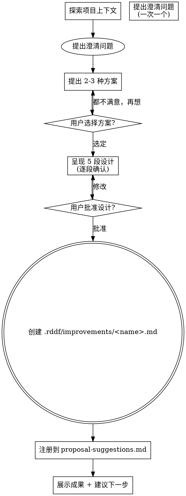

# RDD Workflow — Brainstorm 改进提案

帮助用户将改进想法转化为格式规范的 <a href=".rddf/improvements/<name>.md` 提案文件，通过自然对话逐步完善设计。

## 与通用 brainstorming 的关键区别

| 维度 | superpowers/brainstorming | rdd-workflow-brainstorm |
|------|--------------------------|-------------------------|
| **输出** | `docs/superpowers/specs/` 设计文档 | <a href=".rddf/improvements/<name>.md` 5 段提案 |
| **额外产出** | 无 | `proposal-suggestions.md` 索引行 |
| **探索范围** | 项目代码、功能需求 | ADR、现有提案、代码问题、工作流改进 |
| **设计结构** | 自由格式 | **固定 5 段**: 架构依据/范围/关键场景/技术约束/验收标准 |
| **最终步骤** | 调用 writing-plans | 创建提案文件 + 注册索引 |
| **用户画像** | 新功能开发 | rdd-workflow 改进提案 |

<HARD-GATE>
在用户批准设计之前，不得创建任何文件、写入任何提案、修改 proposal-suggestions.md 或采取任何实施行动。此规则适用于所有提案，无论看起来多么简单。
</HARD-GATE>

## Checklist

必须为以下每一项创建 todo 并按顺序完成：

1. **探索项目上下文** — 检查 ADR、现有 improvement 文件、proposal-suggestions.md、proposal-approved.md、项目当前状态
2. **提出澄清问题** — 一次一个，理解改进意图/范围/成功标准
3. **提出 2-3 种方案** — 含权衡分析和推荐
4. **呈现设计** — 按改进提案的 5 段结构逐段呈现，每段获得用户确认后再继续
5. **创建 <a href=".rddf/improvements/<name>.md`** — 包含完整的 5 段内容，前 5 行元数据准确
6. **注册到 `proposal-suggestions.md`** — 追加一行 Markdown 表格链接
7. **展示成果并建议下一步** — guide-arch Phase 5.5 审查

## 流程



**结束状态是创建提案文件并注册索引。** 不需要调用 writing-plans 或其他实施技能。

## 具体步骤

### 1. 探索项目上下文

检查以下内容以理解项目状态：
- `docs/adr/` — 现有架构决策，避免冲突
- <a href=".rddf/improvements/` — 已有提案，避免重复
- `proposal-suggestions.md` — 当前提案池
- `proposal-approved.md` — 已批准提案
- 项目根目录的 `roadmap.md`（如存在）
- 最近 git 提交日志（了解工作流方向）

在探索后给出简明摘要（哪些 ADR 相关、哪些提案已存在）。

### 2. 提出澄清问题

一次一个问题，聚焦：
- 要改进什么（具体问题或痛点）
- 为什么需要改进（业务/技术驱动）
- 范围边界（哪些包含、哪些排除）
- 优先级预期（P0/P1/P2）
- 来源引用（ADR、Oracle 审查、复盘等）

初始描述收集必须开放；后续澄清可选择题。一次只问一个问题。

**OPEN-PROMPT 触发条件**（以下场景必须使用开放 prompt，禁用 question 工具）：
- 无参数调用 skill
- 用户首次表达意图
- 初始需求收集阶段

### 3. 提出 2-3 种方案

用对话方式呈现 2-3 种不同方案，包含权衡分析。先推荐再解释原因。

示例框架：
> **推荐方案：B — 增量式重构**
> - 方案 A：整体重写 — 干净彻底但风险高，影响面大
> - 方案 B：增量重构 — 分 3 步迁移，每步可独立验证
> - 方案 C：最小修改 — 改动最小但遗留技术债

引导用户选择一种方案继续。

### 4. 呈现 5 段设计

按改进提案的固定格式逐段呈现，**每段获得用户确认后再继续**：

1. **架构依据** — 引用 ADR、代码审查结论、复盘总结
2. **范围** — In Scope / Out Scope 明确边界
3. **关键场景** — GIVEN / WHEN / THEN 格式
4. **技术约束** — MUST / MUST NOT / SHOULD
5. **验收标准** — 量化可验证指标

每个 section 完成后问"This section looks right?"，确认后进入下一段。

### 5. 创建 <a href=".rddf/improvements/<name>.md`

用户批准全部设计后，创建提案文件。

**格式要求：**

```markdown
# <kebab-case-name>

**优先级**: <P0|P1|P2> | **来源**: <来源>
**阶段**: <阶段ID 或 default> | **分类**: <分类>
**类型**: <functional|debt|refactor>

## 架构依据
...

## 范围
- **In Scope**: ...
- **Out Scope**: ...

## 关键场景
- GIVEN ... WHEN ... THEN ...

## 技术约束
- MUST ...
- MUST NOT ...
- SHOULD ...

## 验收标准
- ...
```

**命名规则**：kebab-case，如 `fix-silent-exception`、`add-config-validation`

**常用分类参考**（从现有提案中归纳）：
- `arch-design` — 架构设计
- `infra-setup` — 基础设施
- `core-impl` — 核心实现
- `core-test` — 测试改进
- `general` — 通用（fallback）

### 6. 注册到 `proposal-suggestions.md`

在 `proposal-suggestions.md` 的 Markdown 表格中追加一行：

```
| [<name>](.rddf/improvements/<name>.md) | <优先级> | <来源> | <添加时间 YYYY-MM-DD> |
```

用当前 UTC 日期作为添加时间。插入位置在表格末尾（`| 提案 | ... |` 表头后面任意位置均可）。

### 7. 展示成果并建议下一步

向用户展示最终输出，建议下一步：
- `guide-arch` Phase 5.5 审查提案
- 审批通过后进入 `guide-plan` 执行

## 关键原则

- **一次一个问题** — 不要同时抛出多个问题
- **选择题优先** — 方便用户回答
- **YAGNI 严格** — 去掉所有不必要的范围
- **探索替代方案** — 至少 2 种方案
- **增量确认** — 逐段呈现，确认后再继续
- **灵活回退** — 用户提出修改时，回到对应阶段